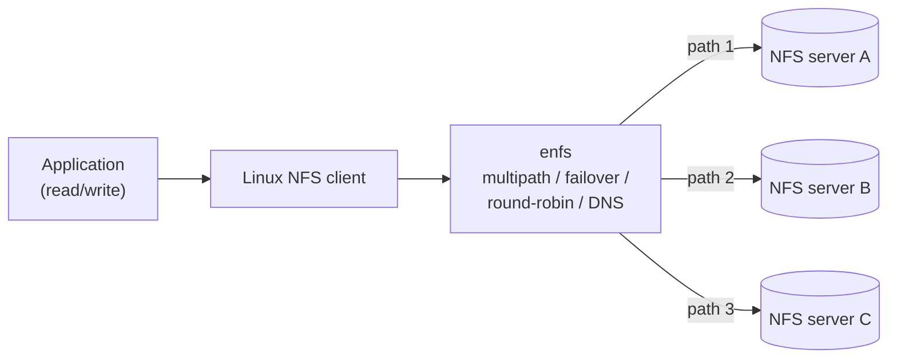
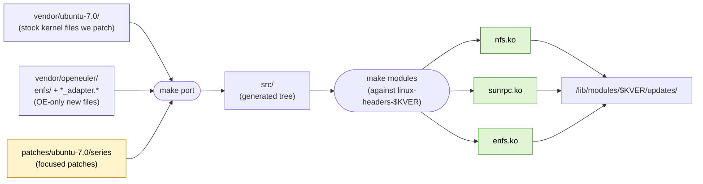

# enfs-dkms

[](https://github.com/darrenstarr/huaweienfs/actions/workflows/build.yml)
[](https://github.com/darrenstarr/huaweienfs/actions/workflows/lint.yml)

A DKMS-packaged port of the OpenEuler **enfs** (Enhanced NFS) module
to **Ubuntu 24.04 / 26.04 LTS** kernels.

## About the project

`enfs` lets a single NFS mount talk to a *cluster* of NFS server
addresses at the same time. RPCs round-robin across the live paths,
and if a server stops responding the others keep serving — without
the application noticing. You can edit the path list at runtime
through `/proc`.



This repository takes the OpenEuler implementation (which lives inside
their kernel tree at [`fs/nfs/enfs/`](https://gitee.com/openeuler/kernel/tree/OLK-6.6/fs/nfs/enfs))
and packages it as a DKMS module that builds against stock Ubuntu
kernel headers. Nothing in your kernel package gets touched — `dkms
remove` cleanly restores the in-tree NFS client.

Currently working end-to-end on:

| Ubuntu | Kernel       | Notes                              |
|--------|--------------|------------------------------------|
| 26.04  | 7.0.x        | GA target                          |
| 24.04  | 6.14 HWE     | works after one-time initramfs rebuild |
| 24.04  | 6.8 GA       | works                              |

## Quick start

If you just want to install it and mount something:

→ **[Quickstart: zero-to-mounted in 3 minutes](docs/user/00-quickstart.md)**
(5 commands, one reboot, one diagram).

If you want to hack on the port itself:

```bash
make help                # list every target with current variable values
make port                # materialise src/ from vendor + patches + compat
make modules             # build modules locally against your headers
make deb                 # build the .deb
```

The full developer workflow (sync to a test VM, smoke test, etc.) is
in [`docs/ARCHITECTURE.md`](docs/ARCHITECTURE.md).

## Credits

Almost the entire effort that produced this repository — the
architectural decisions, the patch series, the `__GENKSYMS__` CRC
trick that lets our patched `sunrpc.ko` interoperate with stock
`lockd` / `nfs_acl` / `nfsd`, the DKMS scaffolding, the `.deb`
packaging, the multi-server LXC test topology, the prose
documentation, and the verification that 1 MiB NFS reads round-robin
across 4 servers — was driven by
**[Claude](https://claude.com/) Opus 4.7 running in 1M-token context
mode**. A human (the repo owner) provided direction, reviewed
checkpoints, vetoed bad approaches, and supplied the test
infrastructure; the heavy lifting was the model.

The Anthropic API tokens for this work were generously paid for by the
**[University of Oslo](https://www.uio.no/english/)**. Many thanks.

### Liability

**We take NO responsibility for this code in any way.**

If it works for your storage system: AWESOME, please tell us.

If it doesn't: it's Claude's fault. Open an issue with the dmesg output
and we'll have a model fix the model's bugs.

If it eats your data, melts your kernel, or sets your servers on fire:
GPL-2.0 §15 ("NO WARRANTY") is exactly what it says, and `__GENKSYMS__`
gymnastics on a kernel module that *replaces* parts of the in-tree NFS
client stack is not something to deploy on production storage without
your own thorough validation. Use a non-critical staging mount first.

---

## Details and architecture

### Why DKMS

Stock Ubuntu kernels do not ship `enfs`, and the module is not a clean
out-of-tree drop-in: it requires patches inside `nfs.ko` and
`sunrpc.ko` as well. DKMS gives us:

- automatic rebuild against new Ubuntu kernel versions on `apt upgrade`,
- installation to `/lib/modules/$(uname -r)/updates/` (which `modprobe`
  prefers over `kernel/`), letting us *replace* the in-tree
  `nfs.ko` / `sunrpc.ko` without touching the kernel package, and
- a clean `dkms remove` rollback path that restores the stock modules.

### How the build works

Three input streams converge to produce the modules we ship. Stock
Ubuntu source is patched in place; the OpenEuler-only "new" files
(the enfs subsystem + adapter glue) are dropped in alongside as
additions.



`updates/` outranks `kernel/` in `depmod` order, so subsequent
`modprobe nfs` / `modprobe sunrpc` pick up our patched copies.

The same pipeline is parameterised by `TARGET=ubuntu-{6.8,6.14,7.0}`
so the matrix of supported kernels uses one set of scripts and one
set of OE source files; only the per-target `vendor/ubuntu-X.Y/` and
`patches/ubuntu-X.Y/` directories differ. `make port` auto-picks the
right target from the running kernel's version, or accept an
explicit `TARGET=` override.

### Layout

```
vendor/openeuler/         OpenEuler reference + the OE-only "new" files
                          (verbatim OpenEuler OLK-6.6 sources)
  fs/nfs/enfs/              the standalone enfs.ko sources [BUILT]
  fs/nfs/enfs_adapter.*     glue compiled into nfs.ko      [BUILT]
  net/sunrpc/sunrpc_enfs_adapter.c
                            glue compiled into sunrpc.ko   [BUILT]
  include/linux/sunrpc/sunrpc_enfs_adapter.h               [BUILT]
  fs/nfs/{super,fs_context,nfs3xdr,internal.h,Kconfig,Makefile}
  net/sunrpc/{clnt,xprt,Kconfig,Makefile}
  include/linux/{nfs_fs_sb,nfs_xdr}.h
  include/linux/sunrpc/{sched,clnt}.h
                            OE-modified copies, kept for reference / diff
  UPSTREAM-REVISION         pinned OpenEuler commit we vendored from

vendor/ubuntu-{6.8,6.14,7.0}/
                          Stock Ubuntu kernel files we patch (verbatim
                          from the named Ubuntu kernel package), with
                          original SPDX/copyright headers preserved.

patches/ubuntu-{6.8,6.14,7.0}/
  series                    ordered list applied by `make port`
  *.patch                   one focused patch per file/feature

src/                      Project sources after porting (generated; gitignored)
compat/                   Kernel-version compat shims
debian/                   dpkg packaging (enfs-dkms .deb)
scripts/                  Build / sync / VM-deploy helpers
docs/                     User docs + ARCHITECTURE / PORTING / DKMS notes
dkms.conf.in              DKMS manifest template
Kbuild                    Top-level out-of-tree build entry
Makefile                  `make help` lists targets
```

### Documentation map

- **User docs** — `docs/user/`:
  - **[00-quickstart.md](docs/user/00-quickstart.md) — start here**
  - [01-overview.md](docs/user/01-overview.md) — what enfs is, when to use it (and when not)
  - [02-installation.md](docs/user/02-installation.md) — long-form install reference
  - [03-mount-syntax.md](docs/user/03-mount-syntax.md) — `remoteaddrs=`, `localaddrs=`, `enfs_info=` reference
  - [04-operations.md](docs/user/04-operations.md) — `/proc/enfs/`, sysfs, live remount, DNS rebind, `tcpdump`
  - [05-troubleshooting.md](docs/user/05-troubleshooting.md) — symptom → cause → fix runbook
  - [06-uninstall.md](docs/user/06-uninstall.md) — clean rollback to stock NFS
- **Architecture** — `docs/ARCHITECTURE.md` (component map, hook sites)
- **Porting status** — `docs/PORTING-NOTES.md` (API drift table, work list)
- **DKMS internals** — `docs/DKMS-NOTES.md` (why three modules, install layout)
- **AI agent guidance** — `docs/ai-agent-guide.md` (rules for Claude/etc.)

### Development environment placeholders

The public docs use these placeholders; substitute your own values
(or override on the command line, e.g.
`make sync-vm VM_HOST=ubuntu@10.0.0.42`).

| Placeholder | What it is |
|---|---|
| `<BUILD_HOST>` | ssh-reachable libvirt host |
| `<KERNEL_WORK_PATH>` | scratch dir on `<BUILD_HOST>` for kernel sources |
| `<TEST_VM_HOST>` | `user@ip` of the Ubuntu test VM |
| `<VM_PATH>` | working dir on the test VM |

If you `git clone` this repo, create a `secrets/` directory locally
(it's `.gitignore`d) and put your real values in it.

### Upstream

- Repository: <https://gitee.com/openeuler/kernel>
- Branch: <https://gitee.com/openeuler/kernel/tree/OLK-6.6>
- enfs source dir:
  <https://gitee.com/openeuler/kernel/tree/OLK-6.6/fs/nfs/enfs>

The exact upstream commit we vendored is recorded in
`vendor/openeuler/UPSTREAM-REVISION`.

## License

GPL-2.0-only.

Vendored OpenEuler files retain their original SPDX/copyright headers
verbatim — see each file. Files genuinely authored by Huawei carry an
explicit `Copyright (c) Huawei Technologies` line; modified Linux
kernel files retain their original kernel-author copyrights (Rick
Sladkey, David Howells, Olaf Kirch, the SunRPC contributors, etc.).
The `debian/copyright` file enumerates this with file-glob stanzas.
