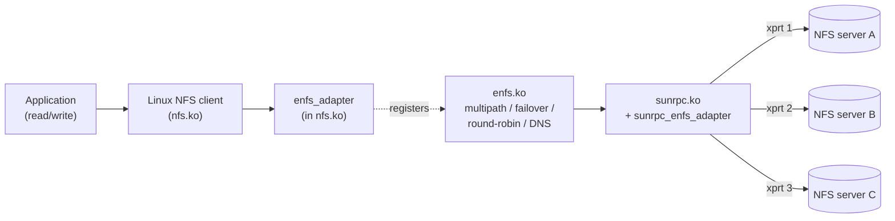
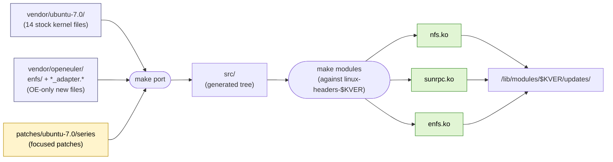

# enfs-dkms

A DKMS-packaged port of the OpenEuler **enfs** (Enhanced NFS) module to
the **Ubuntu 26.04 LTS** ("resolute") kernel (7.0.x).

`enfs` adds NFSv3/v4 client multipath, transport failover, round-robin
RPC dispatch and runtime path management on top of the in-tree Linux
NFS client. Upstream lives in `fs/nfs/enfs/` of the OpenEuler kernel
tree, branch `OLK-6.6`:

- Repository: <https://gitee.com/openeuler/kernel>
- Branch: <https://gitee.com/openeuler/kernel/tree/OLK-6.6>
- enfs source dir:
  <https://gitee.com/openeuler/kernel/tree/OLK-6.6/fs/nfs/enfs>
- Project Kconfig: see `vendor/openeuler/fs/nfs/Kconfig` (`config ENFS`)

The exact upstream commit we vendored is recorded in
`vendor/openeuler/UPSTREAM-REVISION`.

## Status

**Active porting.** Patches are landing in `patches/ubuntu-7.0/` and
the build pipeline is being wired up. The project follows
**Option B′**: vendor the 14 stock Ubuntu 7.0 kernel files we need
under `vendor/ubuntu-7.0/`, apply small focused patches on top, and
combine them with the OE-only "new" files under
`vendor/openeuler/{enfs/, *_adapter.*}` to produce `nfs.ko`,
`sunrpc.ko` and `enfs.ko` against the user's installed
`linux-headers-*`. See `docs/PORTING-NOTES.md` for the porting model
and per-patch index, and `docs/ARCHITECTURE.md` for the build
pipeline.

## What enfs does (one-page summary)



A single mount point uses several server addresses (or several local
source addresses) concurrently. RPCs round-robin across active
transports; if one transport stops responding, traffic moves to the
others. Server lists can be edited at runtime through `/proc`.

## Why DKMS

Stock Ubuntu kernels do not ship `enfs`, and the module is not a clean
out-of-tree drop-in: it requires patches inside `nfs.ko` and `sunrpc.ko`
as well. DKMS gives us:

- automatic rebuild against new Ubuntu kernel versions on `apt upgrade`,
- installation to `/lib/modules/$(uname -r)/updates/` (which `modprobe`
  prefers over `kernel/`), letting us *replace* the in-tree
  `nfs.ko` / `sunrpc.ko` without touching the kernel package, and
- a clean `dkms remove` rollback path that restores the stock modules.

## Layout

```
vendor/openeuler/         Reference + source for the OE-only "new" files
                          (verbatim OpenEuler OLK-6.6 sources)
  fs/nfs/enfs/              the standalone enfs.ko sources [BUILT]
  fs/nfs/enfs_adapter.*     glue compiled into nfs.ko      [BUILT]
  net/sunrpc/sunrpc_enfs_adapter.c
                            glue compiled into sunrpc.ko   [BUILT]
  include/linux/sunrpc/sunrpc_enfs_adapter.h               [BUILT]
  fs/nfs/{super,fs_context,nfs3xdr,internal.h,Kconfig,Makefile}
  net/sunrpc/{clnt,xprt,Kconfig,Makefile}
  include/linux/{nfs_fs_sb,nfs_xdr}.h
  include/linux/sunrpc/{sched,clnt}.h
                            OE-modified copies, kept for reference / diff
                            (NOT built directly under Option B′)
  UPSTREAM-REVISION         pinned OpenEuler commit we vendored from

vendor/ubuntu-7.0/        Stock Ubuntu 26.04 kernel files we patch
                          (verbatim from linux_7.0.0-14.14)
  fs/nfs/{super,fs_context,nfs3xdr,internal.h,Kconfig,Makefile}
  net/sunrpc/{clnt,xprt,Kconfig,Makefile}
  include/linux/{nfs_fs_sb,nfs_xdr}.h
  include/linux/sunrpc/{sched,clnt}.h
                            14 stock files; original SPDX/copyright
                            headers preserved verbatim
  UPSTREAM-REVISION         pinned Ubuntu kernel package

patches/ubuntu-7.0/       Patches applied on top of vendor/ubuntu-7.0/
  series                    ordered list applied by `make port`
  *.patch                   one focused patch per file/feature

src/                      Project sources after porting (generated; gitignored)
compat/                   Kernel-version compat shims
debian/                   dpkg packaging (enfs-dkms .deb)
scripts/                  Build / sync / VM-deploy helpers
docs/                     User docs + ARCHITECTURE / PORTING / DKMS notes
dkms.conf.in              DKMS manifest template
Kbuild                    Top-level out-of-tree build entry
Makefile                  `make help` lists targets
```

## How the build works

Under **Option B′**, three input streams converge to produce the three
`.ko` files we ship. Stock Ubuntu source is patched in place; the
OE-only "new" files (enfs subsystem + adapter glue) are dropped in
alongside as additions.



`updates/` outranks `kernel/` in `depmod` order, so subsequent
`modprobe nfs` / `modprobe sunrpc` pick up our patched copies.
See `docs/ARCHITECTURE.md` § Build pipeline for more detail and
`docs/PORTING-NOTES.md` for the per-patch index.

## Development environment (placeholders)

This project is developed against a libvirt host that hosts both the
kernel source workspace and the test VM. The public docs use these
placeholders; substitute your own values.

| Placeholder | What it is | This project's value |
|---|---|---|
| `<BUILD_HOST>` | ssh-reachable libvirt host | (see `secrets/beast.md` locally) |
| `<KERNEL_WORK_PATH>` | scratch dir on `<BUILD_HOST>` for kernel sources | (see `secrets/beast.md`) |
| `<TEST_VM_HOST>` | `user@ip` of the Ubuntu 26.04 test VM | (see `secrets/test-vm.md`) |
| `<VM_PATH>` | working dir on the test VM | `/home/<user>/enfs-dkms` |

If you `git clone` this repo, create a `secrets/` directory locally
(it's `.gitignore`d) and put your real values in it; or just override
on the command line:

```bash
make sync-vm  VM_HOST=ubuntu@10.0.0.42  VM_PATH=/home/ubuntu/enfs-dkms
```

The reference deployment for this project is documented in
`secrets/beast.md` and `secrets/test-vm.md` (local-only).

## Quick start

```bash
make help                # list all targets and current variable values
make port                # materialise src/ from vendor + compat + patches
make sync-vm             # rsync to the test VM (set VM_HOST first)
make build-on-vm         # build modules on the test VM against its headers
make smoke-on-vm         # build + dkms-install + modprobe enfs + dmesg tail
```

## Documentation map

- **Architecture** — `docs/ARCHITECTURE.md` (component map, hook sites)
- **Porting status** — `docs/PORTING-NOTES.md` (API drift table, work list)
- **DKMS internals** — `docs/DKMS-NOTES.md` (why three modules, install layout)
- **User docs** — `docs/user/`:
  - [01-overview.md](docs/user/01-overview.md) — what enfs is, when to use it (and when not)
  - [02-installation.md](docs/user/02-installation.md) — install from `.deb` or source, verify, load
  - [03-mount-syntax.md](docs/user/03-mount-syntax.md) — `remoteaddrs=`, `localaddrs=`, `enfs_info=` reference
  - [04-operations.md](docs/user/04-operations.md) — `/proc/enfs/`, sysfs, live remount, DNS rebind, `tcpdump`
  - [05-troubleshooting.md](docs/user/05-troubleshooting.md) — symptom -> cause -> fix runbook
  - [06-uninstall.md](docs/user/06-uninstall.md) — clean rollback to stock NFS
- **Stock-vs-eNFS diff report** — `docs/differences/` (planned)
- **AI agent guidance** — `docs/ai-agent-guide.md` (rules for Claude/etc.)

## License

GPL-2.0-only.

Vendored OpenEuler files retain their original SPDX/copyright headers
verbatim — see each file. Files genuinely authored by Huawei carry an
explicit `Copyright (c) Huawei Technologies` line; modified Linux
kernel files retain their original kernel-author copyrights (Rick
Sladkey, David Howells, Olaf Kirch, the SunRPC contributors, etc.).
The `debian/copyright` file enumerates this with file-glob stanzas.
