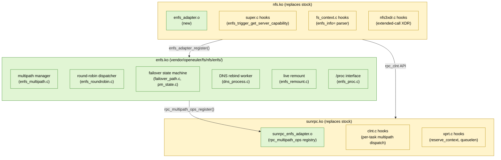
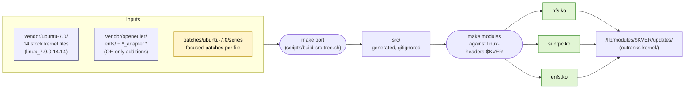
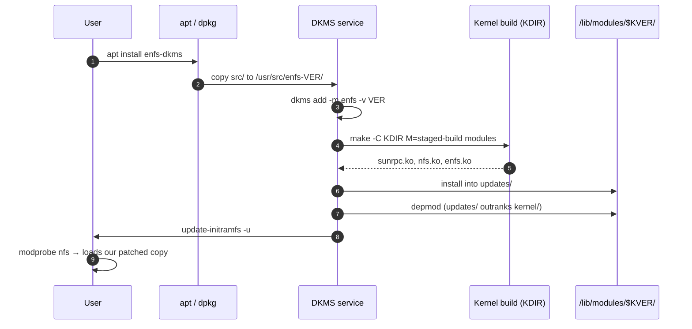

# Architecture

## What enfs is

`enfs` ("Enhanced NFS") is an OpenEuler-specific addition to the Linux NFS
client. It implements:

- **Multipath mounts** — a single NFS mount can use several server
  addresses (or several local source addresses) concurrently.
- **Round-robin RPC dispatch** across active transports.
- **Failover** when a transport stops responding, including server-side
  capability re-probing (`enfs_trigger_get_server_capability`).
- **Live remount** of the path list (add/remove server IPs without
  unmounting).
- **DNS-based path discovery** (re-resolve hostnames and re-add the
  resulting addrs to the multipath set).

Mount syntax (from `vendor/openeuler/fs/nfs/enfs/enfs_multipath_parse.c`):

```
mount -t nfs \
    -o enfs_info='remoteaddrs=192.0.2.10~192.0.2.11,localaddrs=192.0.2.100' \
    server.example.com:/export /mnt
```

(IPs in the `192.0.2.0/24` range are RFC 5737 documentation addresses
— substitute your own.)

## Three-module replacement (not a single drop-in)

A self-contained out-of-tree `enfs.ko` would be straightforward. The
OpenEuler design instead splits enfs across **three** kernel objects.
Installing this DKMS package replaces the host's NFS client stack with
the OpenEuler-modified equivalents — there is no coexistence with the
stock modules. Removing the package restores the stock modules.



Legend: green = files added by enfs; yellow = stock Linux files patched
by enfs.

## Build pipeline (Option B′)

We do **not** rebuild the OpenEuler-modified copies of the stock
NFS / SunRPC files. Instead we vendor the *stock Ubuntu 7.0* copies
under `vendor/ubuntu-7.0/` and apply small focused patches from
`patches/ubuntu-7.0/series` on top. The OE-only "new" files
(`fs/nfs/enfs/`, `fs/nfs/enfs_adapter.{c,h}`,
`net/sunrpc/sunrpc_enfs_adapter.c`,
`include/linux/sunrpc/sunrpc_enfs_adapter.h`) are dropped in alongside
as additions — they have no upstream conflict so they ride along
verbatim from `vendor/openeuler/`.



The user side only needs `linux-headers-$(uname -r)` — there is no
need for a full kernel source tree on the target box.

## DKMS strategy



`depmod` ranks `updates/` above `kernel/`, so subsequent `modprobe nfs`
/ `modprobe sunrpc` always pick up our patched copies as long as the
package is installed. `dkms remove` deletes from `updates/` and the
stock kernel modules become primary again — full rollback without a
kernel package change.

## Components in this repo

- `vendor/openeuler/` — verbatim OpenEuler 6.6 sources (pinned commit
  in `UPSTREAM-REVISION`). Under Option B′ this is **two things at
  once**:
  1. The **source we build from** for the OE-only "new" files —
     everything under `fs/nfs/enfs/`, the `*_adapter.{c,h}` pairs and
     the `sunrpc_enfs_adapter.h` header. These are pure additions and
     compile against the patched stock surface.
  2. **Reference** for the modified copies of stock NFS / SunRPC files
     (super.c, fs_context.c, nfs3xdr.c, clnt.c, xprt.c, headers,
     Kconfig/Makefile). Useful for diffing while writing patches; not
     built directly.

  Don't edit by hand; refresh via `scripts/sync-from-openeuler.sh`.
- `vendor/ubuntu-7.0/` — verbatim stock Ubuntu 7.0 copies of the 14
  files we patch. Pinned package recorded in `UPSTREAM-REVISION`
  (`linux_7.0.0-14.14`). This is the **source we patch** under
  Option B′. Don't edit by hand; refresh via
  `scripts/sync-ubuntu-source.sh`.
- `patches/ubuntu-7.0/` — quilt-style patches applied on top of
  `vendor/ubuntu-7.0/` during `make port`. Order in
  `patches/ubuntu-7.0/series`. See `docs/PORTING-NOTES.md` for the
  per-patch index.
- `compat/enfs_compat.h` — the only place where kernel-version drift
  shims live. Each `LINUX_VERSION_CODE` block documents what it is
  papering over.
- `src/` — generated. The output of `make port`. Built by Kbuild.
- `Kbuild` (top-level) — descends into `src/{net/sunrpc, fs/nfs,
  fs/nfs/enfs}` and adds `compat/` to the include path.
- `dkms.conf.in` — three `BUILT_MODULE_*` slots, all installed into
  `/updates`. Order: sunrpc → nfs → enfs.
- `debian/` — produces a single `enfs-dkms` binary package.
- `scripts/` — porting + deployment helpers.

## Test loop

1. Edit `compat/` or `patches/ubuntu-7.0/` (typical); `vendor/*` only
   when refreshing from upstream.
2. `make port` — regenerates `src/` from `vendor/ubuntu-7.0/` +
   `vendor/openeuler/{enfs,*_adapter.*}` + `patches/ubuntu-7.0/series`.
3. `make sync-vm` — pushes everything except `vendor/` to the test VM
   (`<TEST_VM_HOST>`).
4. `make build-on-vm` — runs `make modules` on the VM against its
   `linux-headers-$(uname -r)`.
5. `make smoke-on-vm` — DKMS-install + `modprobe enfs` + dump dmesg.
