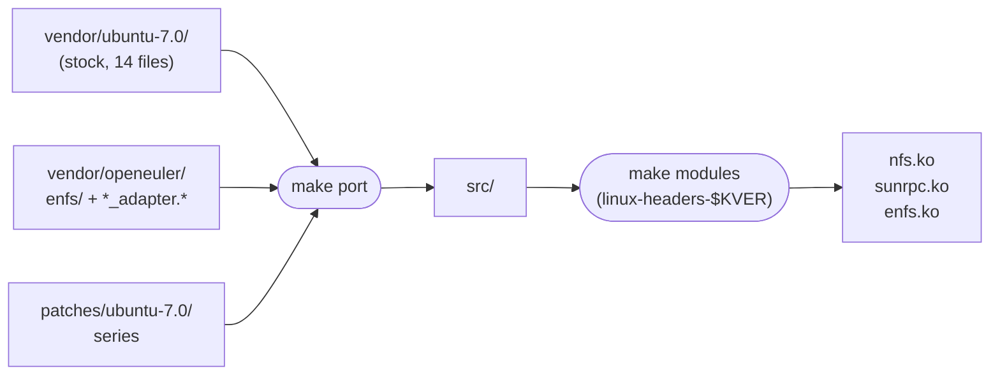

# Porting notes — OpenEuler OLK-6.6 → Ubuntu 26.04 (kernel 7.0)

## Porting model

We follow **Option B′**. The OpenEuler enfs feature is split into two
classes of file: (a) wholly new files that have no upstream equivalent
(`fs/nfs/enfs/`, `*_adapter.{c,h}`, `sunrpc_enfs_adapter.h`) and
(b) edits to existing stock kernel files (`super.c`, `fs_context.c`,
`nfs3xdr.c`, `internal.h`, `clnt.c`, `xprt.c`, the Kconfig/Makefile
glue, and a handful of headers). Class (a) is taken verbatim from
`vendor/openeuler/`. For class (b) we vendor the *stock Ubuntu 7.0*
copy under `vendor/ubuntu-7.0/` and apply small focused patches from
`patches/ubuntu-7.0/series` on top — never the OE copies. This keeps
each patch reviewable, keeps refresh against new Ubuntu ABIs cheap
(re-rebase the series), and means the user side only ever needs
`linux-headers-*`.

See `docs/ARCHITECTURE.md` § Build pipeline for the full diagram.

## Index of patches

Current `patches/ubuntu-7.0/` series (in apply order):

| # | Patch | Subject / purpose |
|---|---|---|
| 0001 | `0001-fs-nfs-Makefile-build-enfs.patch` | `fs/nfs/Makefile`: build `enfs_adapter.o` into `nfs.ko` and descend into `enfs/`. |
| 0002 | `0002-net-sunrpc-Makefile-build-sunrpc_enfs_adapter.patch` | `net/sunrpc/Makefile`: link `sunrpc_enfs_adapter.o` into `sunrpc.ko`. |
| 0003 | `0003-fs-nfs-Kconfig-add-CONFIG_ENFS.patch` | `fs/nfs/Kconfig`: add `CONFIG_ENFS` and `CONFIG_ENFS_KUNIT_TEST`. |
| 0004 | `0004-net-sunrpc-Kconfig-add-CONFIG_SUNRPC_ENFS.patch` | `net/sunrpc/Kconfig`: add `CONFIG_SUNRPC_ENFS` (selected by `CONFIG_ENFS`). |
| 0005 | `0005-include-sunrpc-clnt.h-add-multipath-fields.patch` | `include/linux/sunrpc/clnt.h`: add `cl_enfs` bitfield and `multipath_option` to `struct rpc_clnt`. |
| 0006 | `0006-include-sunrpc-sched.h-add-RPC_TASK_ENFS.patch` | `include/linux/sunrpc/sched.h`: add `RPC_TASK_ENFS` (`0x0008`) and `RPC_TASK_FIXED` (rebased to `0x0020` because `0x0040` is now `RPC_TASK_NETUNREACH_FATAL` in 7.0). |

Future patches will be appended here as they land. Keep one patch
per file/feature — easy to review, easy to drop.

## Surface that needs porting

### Files enfs adds (drop-in, no upstream conflict)

| File | Notes |
|---|---|
| `fs/nfs/enfs/` (~22 files / 10k LoC) | builds standalone `enfs.ko` |
| `fs/nfs/enfs_adapter.c`, `enfs_adapter.h` | linked into `nfs.ko` |
| `net/sunrpc/sunrpc_enfs_adapter.c` | linked into `sunrpc.ko` |
| `include/linux/sunrpc/sunrpc_enfs_adapter.h` | exported header |

### Files enfs *patches* in stock NFS (must replace `nfs.ko`)

| File | Hook sites in OE | Nature |
|---|---|---|
| `fs/nfs/super.c` | 2 (`#if IS_ENABLED(CONFIG_ENFS)`) | mount/remount paths; calls `enfs_trigger_get_server_capability` |
| `fs/nfs/fs_context.c` | many | adds `enfs_info=` mount option, parser glue |
| `fs/nfs/nfs3xdr.c` | 5 | XDR-level changes around extended call/`exten_call.c` |
| `fs/nfs/internal.h` | 2 | `void *enfs_option` field on `nfs_fs_context` and `nfs_parsed_mount_data` |
| `include/linux/nfs_fs_sb.h` | 3 | `enfs_flags` field on `nfs_server` |
| `include/linux/nfs_xdr.h` | 1 | extended-call XDR struct field |

### Files enfs *patches* in stock SunRPC (must replace `sunrpc.ko`)

| File | Hook sites | Nature |
|---|---|---|
| `net/sunrpc/clnt.c` | 8+ | `rpc_multipath_ops_*` hooks throughout `rpc_run_task`, `call_*` paths |
| `net/sunrpc/xprt.c` | 6+ | `rpc_multipath_ops_*` in transmit/queue/timeout paths, `xprt->reserve_context` |
| `include/linux/sunrpc/clnt.h` | 2 (`__GENKSYMS__` + per-CONFIG) | adds field on `rpc_clnt` |
| `include/linux/sunrpc/sched.h` | 1 | adds field on `rpc_task` |

## Drift we encountered while writing the patches (OLK-6.6 → 7.0.0-14)

Running record of API drift between OpenEuler's `OLK-6.6` enfs sources
(in `vendor/openeuler/`) and the Ubuntu 26.04 LTS kernel
(`linux 7.0.0-14`, vendored stock copies in `vendor/ubuntu-7.0/`).
Each row is something we ran into while writing a
`patches/ubuntu-7.0/*.patch` or a `compat/` shim. When you find new
drift, **add a row** here and (if needed) a shim block to
`compat/enfs_compat.h`. When you fix one, mark it ✅.

Source: diff between `vendor/openeuler/` and `vendor/ubuntu-7.0/` in
this tree, plus the live extracted Ubuntu kernel source on the build
host (see `secrets/beast.md`).

| Symbol / struct | OLK-6.6 | Ubuntu 7.0 | enfs impact | Status |
|---|---|---|---|---|
| `struct rpc_xprt_switch` | unchanged | unchanged | none | ✅ no shim needed |
| `struct nfs_fs_context` | (no `lock_status`) | `+ int lock_status;` | additive; enfs uses field by name only | ✅ no shim needed |
| `struct rpc_clnt` | 301-line header | 279-line header | most of OE's extra lines are CONFIG_SUNRPC_ENFS additions, not upstream drift | ⚠️ verify on first build |
| `struct rpc_task` | adds CONFIG_SUNRPC_ENFS field | upstream layout | enfs assumes the extra field — must be present in our patched sched.h | ⚠️ replicate from OE sched.h diff |
| `struct rpc_xprt::reserve_context` | added by enfs | not in upstream | covered by `xprt_get_reserve_context` / `xprt_set_reserve_context` in adapter | ⚠️ confirm |
| `nfs3xdr` v3 wire format | extended for `exten_call` | upstream | risk: NFSv3 servers without the OE extension may reject extended calls | 📝 needs runtime test |

## Outstanding work (rough order)

1. **Write `src/fs/nfs/Kbuild` and `src/net/sunrpc/Kbuild`** — restrict
   the build to objects that actually need to change; avoid rebuilding
   the entire NFS/SunRPC trees.
2. **Decide replacement scope** — do we ship a full replacement
   `nfs.ko` (recompiled from OE's modified sources) or only the *new*
   adapter `.o`s and `enfs.ko`? The latter requires the host kernel to
   already export `multipath_ops` etc., which Ubuntu's stock kernel does
   not. So: full replacement. Document this in DKMS-NOTES.md.
3. **Run `make build-on-vm`** — first compile against Ubuntu 26.04
   headers will surface the real drift list. Capture errors here.
4. **`compat/enfs_compat.h` shims per discovered drift item.**
5. **Smoke test:** `modprobe sunrpc nfs enfs`, then mount with
   `enfs_info=...` against a test NFS server.
6. **Debian packaging end-to-end:** `dpkg-buildpackage -us -uc -b`
   produces an installable `enfs-dkms_*.deb`.
7. **CI**: a script that does `make build-on-vm` against every
   Ubuntu 26.04 stable kernel as it's released, before users see it.
