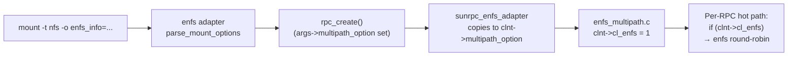

# 0005 — `include/linux/sunrpc/clnt.h`: add `cl_enfs` bit and `multipath_option`

Patch file: [`patches/ubuntu-7.0/0005-include-sunrpc-clnt.h-add-multipath-fields.patch`](../../patches/ubuntu-7.0/0005-include-sunrpc-clnt.h-add-multipath-fields.patch)

## What this change adds to stock Linux

Two new fields are added to `struct rpc_clnt`, both guarded by
`CONFIG_SUNRPC_ENFS`:

- `cl_enfs : 1` — a bitfield co-located with the existing
  `cl_noretranstimeo`, `cl_autobind`, `cl_chatty`, `cl_shutdown`,
  `cl_netunreach_fatal` bits. Set to `1` by enfs when this client
  has multipath enabled.
- `multipath_option` — an opaque `void *` appended at the end of the
  struct. enfs uses it to hang per-client multipath state (parsed
  `enfs_info=` arguments and live transport list) off the otherwise
  generic `rpc_clnt`.

**Before** (`include/linux/sunrpc/clnt.h`, Ubuntu 7.0 stock, around
the bitfield block and the tail of the struct):

```c
struct rpc_clnt {
        ...
                                cl_noretranstimeo: 1,/* No retransmit timeouts */
                                cl_autobind : 1,/* use getport() */
                                cl_chatty   : 1,/* be verbose */
                                cl_shutdown : 1,/* rpc immediate -EIO */
                                cl_netunreach_fatal : 1;
                                                /* Treat ENETUNREACH errors as fatal */
        struct xprtsec_parms    cl_xprtsec;     /* transport security policy */
        ...
        unsigned int            cl_max_connect;
        struct super_block      *pipefs_sb;
        atomic_t                cl_task_count;
};
```

**After**:

```c
struct rpc_clnt {
        ...
                                cl_noretranstimeo: 1,/* No retransmit timeouts */
                                cl_autobind : 1,/* use getport() */
                                cl_chatty   : 1,/* be verbose */
                                cl_shutdown : 1,/* rpc immediate -EIO */
#if IS_ENABLED(CONFIG_SUNRPC_ENFS)
                                cl_enfs     : 1,/* enfs multipath enabled */
#endif
                                cl_netunreach_fatal : 1;
                                                /* Treat ENETUNREACH errors as fatal */
        struct xprtsec_parms    cl_xprtsec;     /* transport security policy */
        ...
        unsigned int            cl_max_connect;
        struct super_block      *pipefs_sb;
        atomic_t                cl_task_count;
#if IS_ENABLED(CONFIG_SUNRPC_ENFS)
        void                    *multipath_option;
#endif
};
```

## Where it lives

- File: `include/linux/sunrpc/clnt.h`
- `cl_enfs`: inside the bitfield block in `struct rpc_clnt`,
  immediately after `cl_shutdown` and before `cl_netunreach_fatal`.
- `multipath_option`: at the very end of `struct rpc_clnt`, after
  `cl_task_count`.

## Why it's needed

`cl_enfs` is the cheap O(1) test that the SunRPC dispatch path uses
to ask "is this client multipath?" without dereferencing
`multipath_option`. It is read on every RPC submission. Concrete
sites in the OpenEuler tree that depend on this bit:

```c
/* vendor/openeuler/net/sunrpc/sunrpc_enfs_adapter.c:219 */
return clnt->cl_enfs ? true : false;

/* vendor/openeuler/fs/nfs/enfs/pm_ping.c:436 */
if (clnt->cl_enfs == 1) { ... }

/* vendor/openeuler/fs/nfs/enfs/enfs_roundrobin.c:266, 334 */
if (clnt->cl_enfs == 1) { ... }

/* vendor/openeuler/fs/nfs/enfs/failover_com.h:22 */
return target->cl_enfs == 1 ? true : false;

/* vendor/openeuler/fs/nfs/enfs/failover_path.c:266 */
parent_clnt->cl_enfs

/* vendor/openeuler/fs/nfs/enfs/enfs_proc.c:100, 498, 588, 597 */
clnt->cl_enfs
```

It is **set** in exactly one place — when enfs creates a multipath
client during mount:

```c
/* vendor/openeuler/fs/nfs/enfs/enfs_multipath.c:871 */
create_args->clnt->cl_enfs = 1;
```

`multipath_option` carries the parsed `enfs_info=` mount option (the
remote/local addr lists) from the mount-time parser into the
multipath client constructor:

```c
/* vendor/openeuler/net/sunrpc/sunrpc_enfs_adapter.c:137 */
if (args->multipath_option) {
        mops = rpc_multipath_ops_get();
        ...
}

/* vendor/openeuler/fs/nfs/enfs/enfs_multipath.c:830, 953 */
create_args->args->multipath_option;
thargs->data = args->multipath_option;
```

`rpc_create_args` (which is the public mount-time argument bundle)
carries a `multipath_option` slot of its own; the field added here is
the *post-create* copy on the live `rpc_clnt`, where the rest of the
enfs hot path can reach it without going back through the parser.

## Why this exact form

Two notable deviations from the literal OpenEuler 6.6 source:

1. **No KABI reservation slots.** OE 6.6 had `KABI_RESERVE(...)`
   placeholders in `struct rpc_clnt` and `struct rpc_xprt` that they
   consumed for `cl_enfs` and `multipath_option`. Ubuntu 7.0 has no
   such reservation infrastructure, so we just append the fields
   normally — `cl_enfs` into the existing bitfield word,
   `multipath_option` at the end of the struct. This grows the
   struct by one pointer (8 bytes on 64-bit). That growth is
   acceptable here because the DKMS package replaces `sunrpc.ko`
   wholesale; nothing in the rest of the kernel reads
   `struct rpc_clnt` by raw offset, and nothing in any other module
   should be linking against this struct out-of-tree on a stock
   Ubuntu kernel.
2. **Bitfield placement.** `cl_enfs` is inserted between
   `cl_shutdown` and `cl_netunreach_fatal` rather than at the end of
   the bitfield word. This keeps the order matching OE so that any
   backports / forward ports of OE patches into this tree apply
   cleanly. The relative position inside a single bitfield word has
   no ABI impact (the compiler packs them all into the same
   `unsigned int`).

## Observable effect for users



There is no direct user-visible effect of this patch alone. The new
fields are inert until the rest of the stack (`enfs_adapter`,
`rpc_multipath_ops`, the dispatcher hooks in patches 0013/0014) are
in place. A loaded `enfs.ko` will start setting `cl_enfs = 1` on
clients created from a multipath mount, and the read sites above
will then take the multipath branch.

The only side-channel observable for an admin is that `struct rpc_clnt`
grows by one pointer. Any tool that reads SunRPC client memory by
hard-coded offset (none we know of in mainline userspace) would need
to be rebuilt against the new headers.
