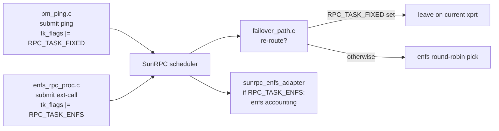

# 0006 — `include/linux/sunrpc/sched.h`: add `RPC_TASK_ENFS` and `RPC_TASK_FIXED`

Patch file: [`patches/ubuntu-7.0/0006-include-sunrpc-sched.h-add-RPC_TASK_ENFS.patch`](../../patches/ubuntu-7.0/0006-include-sunrpc-sched.h-add-RPC_TASK_ENFS.patch)

> **Reviewer alert.** The bit allocation in this patch has a known
> conflict with `RPC_CALL_MAJORSEEN` (also `0x0020`) in stock SunRPC.
> See [Why this exact form](#why-this-exact-form) below — this is the
> single highest-risk change in the series and must be re-verified
> before shipping.

## What this change adds to stock Linux

Two new `RPC_TASK_*` flag bits are defined in `tk_flags`, both
guarded by `CONFIG_SUNRPC_ENFS`:

- `RPC_TASK_ENFS` (`0x0008`) — marks an RPC task that was dispatched
  by the enfs subsystem (e.g. extended-call probes from
  `enfs_rpc_proc.c`).
- `RPC_TASK_FIXED` (`0x0020`) — marks an RPC task that is **pinned
  to its current transport** and must not be re-routed by enfs's
  failover machinery. Used by the path-monitor pings and by the
  failover state machine itself.

**Before** (`include/linux/sunrpc/sched.h`, Ubuntu 7.0 stock,
flag-bits block):

```c
#define RPC_TASK_NO_RETRANS_TIMEOUT  0x4000  /* wait forever for a reply */
#define RPC_TASK_CRED_NOREF          0x8000  /* No refcount on the credential */

#define RPC_IS_ASYNC(t)              ((t)->tk_flags & RPC_TASK_ASYNC)
```

**After**:

```c
#define RPC_TASK_NO_RETRANS_TIMEOUT  0x4000  /* wait forever for a reply */
#define RPC_TASK_CRED_NOREF          0x8000  /* No refcount on the credential */

#if IS_ENABLED(CONFIG_SUNRPC_ENFS)
#define RPC_TASK_FIXED               0x0020  /* enfs: pinned to its current xprt
                                                (rebased from OE's 0x0040 —
                                                collides w/ RPC_TASK_NETUNREACH_FATAL on 7.0) */
#define RPC_TASK_ENFS                0x0008  /* enfs: dispatched by the enfs subsystem */
#endif

#define RPC_IS_ASYNC(t)              ((t)->tk_flags & RPC_TASK_ASYNC)
```

## Where it lives

- File: `include/linux/sunrpc/sched.h`
- Insertion point: immediately after `RPC_TASK_CRED_NOREF` (`0x8000`)
  and before the first `RPC_IS_*` accessor macro.
- `tk_flags` is `unsigned short` (`include/linux/sunrpc/sched.h:89`),
  so all flag bits share the same 16-bit word.

## Why it's needed

### `RPC_TASK_ENFS`

The SunRPC adapter uses this bit to recognise tasks that originated
inside enfs and apply the enfs accounting / multipath rules to them
rather than the stock dispatch rules:

```c
/* vendor/openeuler/net/sunrpc/sunrpc_enfs_adapter.c:209 */
if (task->tk_flags & RPC_TASK_ENFS) { ... }
```

The bit is set at task-setup time when enfs submits its own internal
RPCs (e.g. the extended-call capability probes):

```c
/* vendor/openeuler/fs/nfs/enfs/enfs_rpc_proc.c:32 */
RPC_TASK_SOFTCONN | RPC_TASK_ENFS
```

### `RPC_TASK_FIXED`

This is the "do not move me" marker for tasks that the failover code
must leave on their current transport. Two independent subsystems
in enfs rely on it:

- **Path-monitor pings** (`pm_ping.c`) — these are the periodic
  liveness probes enfs sends to each transport in the multipath set.
  If the failover code re-routed a ping, the ping would lose its
  meaning ("is *this specific transport* alive?"). So the ping
  submission sets `RPC_TASK_FIXED`:

  ```c
  /* vendor/openeuler/fs/nfs/enfs/pm_ping.c:323, 569 */
  RPC_TASK_ASYNC | RPC_TASK_FIXED
  ```

- **Failover dispatcher** (`failover_path.c`) — the dispatcher reads
  `RPC_TASK_FIXED` and skips the re-route logic when it is set:

  ```c
  /* vendor/openeuler/fs/nfs/enfs/failover_path.c:136, 202 */
  if (task->tk_flags & RPC_TASK_FIXED)
          /* leave it alone */;

  /* vendor/openeuler/fs/nfs/enfs/failover_path.c:276 */
  if (... && !(task->tk_flags & RPC_TASK_FIXED) && ...) {
          /* re-route to a different transport */
  }
  ```

Without these two bits, `enfs.ko` would not build (the symbols are
referenced in `pm_ping.c`, `failover_path.c`, `enfs_rpc_proc.c`, and
`sunrpc_enfs_adapter.c`) and even if it did, the path monitor and
failover machinery would have no way to coordinate.

## Why this exact form

This is where we deviate most consequentially from OpenEuler. The
issue is the bit allocation for `RPC_TASK_FIXED`.

### What OpenEuler 6.6 had

```c
/* vendor/openeuler/include/linux/sunrpc/sched.h */
#define RPC_TASK_FIXED  0x0040
#define RPC_TASK_ENFS   0x0008
```

`0x0008` was — and still is — unused in mainline SunRPC, so we keep
it. `0x0040` was unused in 6.6 too.

### What changed in Ubuntu 7.0

Mainline post-6.6 added a new bit:

```c
#define RPC_TASK_NETUNREACH_FATAL  0x0040
```

Reusing `0x0040` for `RPC_TASK_FIXED` would silently OR enfs's "do
not re-route" semantics onto every task that asks for the new
fatal-network-unreachable behaviour, and vice versa. Two independent
features sharing one bit is a guaranteed memory-corruption-class bug
even though no memory is corrupted — it's just two callers stomping
each other's flag interpretation.

### What we did instead

The patch reassigns `RPC_TASK_FIXED` to `0x0020`. `0x0020` was free
in OE's `sched.h` at the line where the patch inserts.

> **Conflict to verify before shipping.** In the OpenEuler tree we
> vendored, `0x0020` is defined elsewhere as `RPC_CALL_MAJORSEEN`:
>
> ```c
> /* vendor/openeuler/include/linux/sunrpc/sched.h:140 */
> #define RPC_CALL_MAJORSEEN  0x0020  /* major timeout seen */
> ```
>
> `RPC_CALL_MAJORSEEN` is set on the same `tk_flags` word
> (`net/sunrpc/clnt.c` lines 2596, 2597, 2629, 2635), so on the OE
> tree these two bits already alias. If Ubuntu 7.0 inherited
> `RPC_CALL_MAJORSEEN` at `0x0020` (likely — it predates the period
> we're porting from), then the rebased `RPC_TASK_FIXED` collides
> with **it** instead of with `RPC_TASK_NETUNREACH_FATAL`. This
> needs to be confirmed by reading the actual Ubuntu 7.0
> `include/linux/sunrpc/sched.h` and either:
>
> - choosing a genuinely free bit (none look obviously available in
>   the low-bit space — `tk_flags` is only 16 bits), or
> - widening `tk_flags` (intrusive, ABI-breaking for `sunrpc.ko`),
>   or
> - documenting that `RPC_CALL_MAJORSEEN` and `RPC_TASK_FIXED` are
>   never set on the same task in practice and accepting the alias.
>
> The patch header's claim that "0x0020 is free in 7.0" needs to be
> re-checked against the actual Ubuntu 7.0 source tree before this
> module is shipped to a user. Do not skip this step.

Why the rebase is at least *internally* safe within enfs: every use
of `RPC_TASK_FIXED` in the enfs source is symbolic. We confirmed
this by grepping for the literal `0x0040` and `0x0020` under
`vendor/openeuler/fs/nfs/enfs/` — both return zero hits. So changing
the macro's value does not require touching any enfs `.c` file.

## Observable effect for users

None directly. These are internal RPC task flags; they never appear
in `/proc`, `dmesg`, or any mount option.

The indirect effect — once the rest of the stack is in place — is
that:

- Path-monitor pings stay on their target transport regardless of
  failover state (so liveness reports are accurate).
- Internal enfs RPCs are accounted to enfs, not charged against the
  generic SunRPC stats.



If the bit-allocation conflict above is **not** resolved before
shipping, the user-visible failure modes would include:

- false-positive "major timeout seen" log messages on every enfs
  ping (if `RPC_CALL_MAJORSEEN` aliases `RPC_TASK_FIXED`), and/or
- pings being inappropriately re-routed by failover (if some other
  code path clears `RPC_TASK_FIXED` thinking it cleared the other
  flag).

Neither corrupts data — both NFS and enfs are RPC-idempotent for the
operations involved — but both make diagnostics noisy and untrustworthy.
