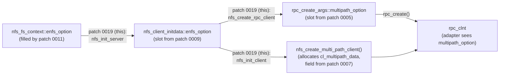

# 0019 — `fs/nfs/client.c`: propagate `enfs_option` end-to-end + create multipath client

Patch file: [`patches/ubuntu-7.0/0019-fs-nfs-client-propagate-enfs-option.patch`](../../patches/ubuntu-7.0/0019-fs-nfs-client-propagate-enfs-option.patch)

## What this change adds to stock Linux

The "missing middle" of the enfs_option propagation chain. Without
this patch, `fs/nfs/fs_context.c` (after patch 0011) parses
`enfs_info=` and stashes the result in `ctx->enfs_option`, but
`fs/nfs/client.c` never threads that value into the structures used
to construct the actual `rpc_clnt` — so enfs's `create_clnt`
callback never sees a non-NULL `multipath_option`, never registers
the client with multipath, and only the primary server gets traffic.



The patch adds **three** hook sites in `fs/nfs/client.c`, plus an
include — one more than OE's two original hooks (see "Why this exact
form").

The four additions, all guarded by `CONFIG_ENFS`:

1. `#include "enfs_adapter.h"`.
2. In `nfs_create_rpc_client()`: forward `cl_init->enfs_option`
   into the new `rpc_create_args::multipath_option` slot (the field
   added by patch 0005).
3. In `nfs_init_client()`: call `nfs_create_multi_path_client(clp,
   cl_init)` *before* `nfs_create_rpc_client()` so enfs's per-client
   multipath state (`cl_multipath_data`, the field added by patch
   0007) exists by the time the `create_clnt` adapter callback fires.
4. In `nfs_init_server()` — where `struct nfs_client_initdata` is
   built from the `nfs_fs_context` — copy `ctx->enfs_option` into
   `cl_init.enfs_option`.

**The `nfs_create_rpc_client` rewrite**:

```c
                .xprtsec        = cl_init->xprtsec,
                .connect_timeout = cl_init->connect_timeout,
                .reconnect_timeout = cl_init->reconnect_timeout,
+#if IS_ENABLED(CONFIG_ENFS)
+               .multipath_option = cl_init->enfs_option,
+#endif
        };
```

**The `nfs_init_client` rewrite**:

```c
        if (clp->cl_cons_state == NFS_CS_READY)
                return clp;

+#if IS_ENABLED(CONFIG_ENFS)
+       error = nfs_create_multi_path_client(clp, cl_init);
+       if (error < 0) {
+               nfs_put_client(clp);
+               return ERR_PTR(error);
+       }
+#endif
+
        /*
         * Create a client RPC handle for doing FSSTAT with UNIX auth only
         * - RFC 2623, sec 2.3.2
         */
```

**The `nfs_init_server` rewrite**:

```c
                .nconnect = ctx->nfs_server.nconnect,
                .init_flags = (1UL << NFS_CS_REUSEPORT),
                .xprtsec = ctx->xprtsec,
+#if IS_ENABLED(CONFIG_ENFS)
+               .enfs_option = ctx->enfs_option,
+#endif
        };
```

## Where it lives

- File: `fs/nfs/client.c`
- Include: ~line 47.
- `nfs_create_rpc_client` multipath_option assignment: ~line 546.
- `nfs_init_client` multi_path_client creation: ~line 685.
- `nfs_init_server` enfs_option copy: ~line 765.

## Why it's needed

This patch closes the loop between mount-option parsing and rpc
client construction. Without it, even with all the other patches in
place:

- `enfs_parse_mount_options` runs and populates `ctx->enfs_option`.
- `nfs_init_server()` builds a `nfs_client_initdata` for the new
  server but does **not** copy `enfs_option` into it.
- `nfs_init_client()` calls `nfs_create_rpc_client()` which builds a
  `rpc_create_args` with `multipath_option = NULL` (the field is
  zero-initialised).
- `rpc_create()` calls into the SunRPC adapter, which checks
  `args->multipath_option` (see
  `vendor/openeuler/net/sunrpc/sunrpc_enfs_adapter.c:137`):

  ```c
  if (args->multipath_option) {
          mops = rpc_multipath_ops_get();
          ...
  }
  ```

  With `multipath_option = NULL` the adapter early-returns and the
  client is constructed as a stock single-xprt client.

The patch also primes `cl_multipath_data` *before* the `rpc_clnt` is
constructed, because the `create_clnt` adapter callback expects
that slot to be allocated when it fires. From the OE adapter:

```c
/* vendor/openeuler/fs/nfs/enfs_adapter.c:138 */
if (cl_init->enfs_option == NULL)
        return 0;
ret = ops->client_info_init((void *)&client->cl_multipath_data, ...);
```

Verified end-to-end with:

```text
$ cat /sys/kernel/sunrpc/xprt-switches/switch-X/xprt_switch_info
num_xprts: N      <-- N matches the number of remoteaddrs in the mount option
```

## Why this exact form

The most consequential **deviation from OpenEuler** in this patch is
that we add **three** hook sites where OE had **two**. OE bundled
the `nfs_create_multi_path_client` call into the same site as the
`nfs_create_rpc_client` extension; we split them because:

- Ubuntu 7.0's `nfs_init_client()` has slightly different control
  flow — the `if (clp->cl_cons_state == NFS_CS_READY) return clp;`
  fast-exit moved relative to OE 6.6.
- Putting the multi_path_client create **before** the
  fast-exit return would make us allocate per-client state that
  was already allocated by a previous mount sharing this client —
  which would leak. Putting it **after** the fast-exit is correct
  but means it's now its own hook site rather than fused with the
  rpc_clnt creation.
- The cleanup path (`nfs_put_client(clp)` on failure) is also
  slightly different — Ubuntu 7.0 holds the put outside the
  multi_path_client function, OE held it inside. Inverting that
  would touch enfs's `enfs_adapter.c` source which we don't want
  to modify.

The split was also recorded in a verification step in the patch
header — the `xprt_switch_info` debugfs check confirms the third
hook actually fires the path we want.

Other notable details:

- **`#include "enfs_adapter.h"`** is required because the second
  hook calls `nfs_create_multi_path_client`, which is declared in
  that header. Without the include 0015's guard would not save us
  from a missing-prototype warning.
- **Designated-initializer placement matters.** The
  `.multipath_option = cl_init->enfs_option` assignment is added
  to a designated-initializer struct expression. The `#if/#endif`
  guard wraps just that one line; the struct initialiser as a
  whole is unchanged. This keeps the diff small.
- **Failure path returns `ERR_PTR(error)` after `nfs_put_client(clp)`.**
  Matches the conventional kernel pattern for "we partially
  initialised a refcounted object, need to drop the ref before
  returning the error". The `nfs_put_client` mirror-balances the
  `nfs_get_client` further up.

## Observable effect for users

This is the patch that makes `enfs_info=` actually produce a
multipath mount end-to-end. With patches 0001-0018 applied but 0019
missing, `mount -o enfs_info=...` succeeds without error but only
the primary server receives any traffic — the failure mode is silent
and only visible by checking debugfs.

With this patch landed (and `enfs.ko` loaded):

- `mount -t nfs -o vers=3,enfs_info=...,remoteaddrs=A~B~C ... server:/exp /mnt`
  produces an `rpc_xprt_switch` containing **N** xprts (one per
  remote in `remoteaddrs`).
- `cat /sys/kernel/sunrpc/xprt-switches/switch-X/xprt_switch_info`
  shows `num_xprts: N`.
- I/O issued to `/mnt` is round-robined across the N transports
  according to enfs's policy.
- Per-mount `cl_multipath_data` slot is non-NULL; the
  `enfs.ko`-internal `multipath_client_info` is allocated and
  freed alongside the mount's lifetime.

For a non-enfs mount or with `enfs.ko` unloaded: zero behaviour
change — `ctx->enfs_option` is NULL, and all three hook sites
either skip or pass NULL through to a stub.
