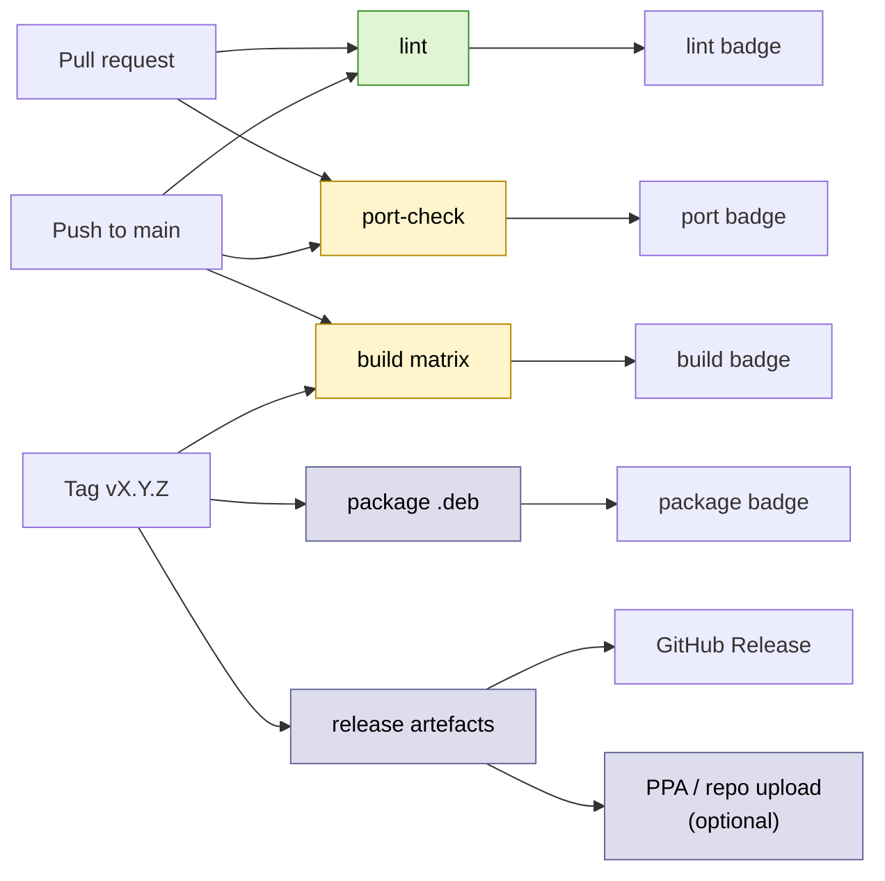

# CI / CD plan

GitHub Actions pipeline — full design now, staged rollout. Only the
`lint` workflow is enabled today (status: green badge). The build and
release workflows are documented and stubbed; we enable them as the
project crosses its quality gates.

## Pipeline overview



## Workflow inventory

| Workflow | File | Triggers | Purpose | Stage |
|---|---|---|---|---|
| `lint` | `.github/workflows/lint.yml` | PR, push to `main` | shellcheck on `scripts/`, markdownlint on `docs/`, basic `make help` smoke | **enabled now** |
| `port-check` | `.github/workflows/port-check.yml` | PR, push | `make port` succeeds against the vendored tree (no real kernel build) | enable when `apply-compat-shims.sh` is finished |
| `build` | `.github/workflows/build.yml` | PR, push, weekly cron | matrix build of `nfs.ko`/`sunrpc.ko`/`enfs.ko` against multiple Ubuntu kernel header packages | enable when first `make build-on-vm` succeeds |
| `package` | `.github/workflows/package.yml` | tag `v*` | `dpkg-buildpackage -us -uc -b`; lintian; upload `.deb` artefact | enable when first `apt install enfs-dkms` works on a clean Ubuntu 26.04 |
| `release` | `.github/workflows/release.yml` | tag `v*` (after `package` ok) | publish the `.deb` to the GitHub Release; optional PPA upload | golden-release only |
| `kunit` | `.github/workflows/kunit.yml` | PR, push | Tier-1 KUnit tests | enable alongside `build` |
| `e2e` | `.github/workflows/e2e.yml` | nightly cron, manual dispatch | Tier-3 multipath tests on a self-hosted runner | self-hosted; enable last |

## `lint` (enabled today)

Stays under 30 seconds. Fast feedback for trivial mistakes.

- `shellcheck` on every file under `scripts/` (severity: warning).
- `markdownlint-cli2` on `README.md`, `LICENSE`, `docs/**/*.md` with
  the project's `.markdownlint.json` config.
- `make help` runs and exits 0 (catches Makefile syntax errors).
- A guard step runs the same secret-leak grep that lives in
  `CLAUDE.md`'s top-priority section, against the working tree.

## `port-check`

`make port` materialises `src/` from `vendor/` + `compat/` +
`patches/`. CI verifies:

- the script exits 0,
- `src/` contains the expected file count (`find src -type f | wc -l`
  matches a recorded baseline),
- no patch in `patches/series` fails to apply.

No kernel headers needed. Runs on `ubuntu-latest`.

## `build` matrix

Real `make modules` against multiple kernels. GitHub-hosted runners
ship with a specific kernel, but we install whichever
`linux-headers-*` package matches what we want to test against.

```yaml
strategy:
  fail-fast: false
  matrix:
    kernel:
      - { ubuntu: 'resolute', headers: '7.0.0-14-generic' }
      - { ubuntu: 'resolute', headers: '7.0.0-15-generic' }   # -updates
      - { ubuntu: 'resolute', headers: 'generic' }            # latest in pocket
```

Each job:

1. Adds the Ubuntu archive matching the matrix entry.
2. `apt install build-essential dkms linux-headers-${{ matrix.kernel.headers }}`.
3. `make port` then `make modules KVER=${{ matrix.kernel.headers }} KDIR=/lib/modules/${{ matrix.kernel.headers }}/build`.
4. `modinfo` on each produced `.ko` (no execution).
5. Uploads `*.ko` as build artefacts (so reviewers can grab them).

If 26.04 isn't installable on `ubuntu-latest` runners directly, fall
back to `runs-on: ubuntu-24.04` with a debootstrap or an
`ubuntu:resolute` container.

## `package`

Tagged builds only. Runs `dpkg-buildpackage -us -uc -b`; runs
`lintian` on the produced `.deb` and fails on E:/W: lines that aren't
in `debian/lintian-overrides`. Uploads the `.deb` and `.changes` as
build artefacts.

## `release`

After `package` is green on a `v*` tag:

- creates a GitHub Release with the tag's annotated message as the
  body,
- attaches the `.deb` and a copy of `vendor/openeuler/UPSTREAM-REVISION`
  so users know which OpenEuler commit went into the release,
- optionally uploads to a Launchpad PPA (token in repo secrets:
  `LAUNCHPAD_TOKEN`).

## `kunit` (Tier 1)

Runs OpenEuler's `enfs_test.c` and any tests we add, using the
in-tree `kunit.py` runner against UML.

```yaml
- run: |
    git clone --depth 1 https://gitee.com/openeuler/kernel.git -b OLK-6.6 /tmp/oe
    cd /tmp/oe
    cp -r ${{ github.workspace }}/vendor/openeuler/fs/nfs/enfs fs/nfs/
    ./tools/testing/kunit/kunit.py run --kunitconfig=${{ github.workspace }}/tests/kunit.config
```

## `e2e` (Tier 3) — self-hosted runner

Tier-3 multipath tests need real LXD containers and a real bridge.
Use a self-hosted runner registered against this repo:

- runner machine: a small VM (or LXC container) on the build host
  with `lxd` group and access to `nfs-test-br0`,
- runner user: a dedicated `gh-runner` system user with sudo to the
  test commands only.

Workflow uses `runs-on: [self-hosted, lxd]`. Per-test cleanup is the
runner script's responsibility (`scripts/e2e/teardown-all.sh`).

## Secrets used by CI

All under github.com → repo settings → Secrets and variables → Actions.

| Secret | Used by | Notes |
|---|---|---|
| `LAUNCHPAD_TOKEN` | `release` | dput credentials for PPA upload |
| `SELF_HOSTED_TAG` | `e2e` | tag string for matching the runner |

We do NOT keep ssh keys for the build host or test VM in CI — those
operations stay on the developer's machine.

## Branch protection (when golden)

- `main` requires PRs (no direct push).
- Required checks: `lint`, `port-check`, `build`. Optional: `kunit`,
  `e2e`.
- Linear history preferred.
- No force-pushes to `main` after the project is marked golden;
  rewrite history on feature branches only.

## Stage gates

| Gate | What it unlocks | Criteria |
|---|---|---|
| **Alpha** | `port-check` enabled | `make port` reliably produces `src/` |
| **Beta**  | `build`, `kunit` enabled | `make build-on-vm` clean on at least one Ubuntu 26.04 kernel |
| **RC**    | `package` enabled | `apt install enfs-dkms` works end-to-end on a clean Ubuntu 26.04 VM |
| **Golden** | `release`, `e2e`, branch protection | all Tier-3 scenarios pass; signed tag |

## Cost / runner notes

- GitHub-hosted Ubuntu runners are free for public repos within
  the free-tier minutes. The build matrix above is well under that.
- Self-hosted runner for `e2e` is free (we already have the build
  host); just don't expose it to the public web.
- Cron-driven `build` (weekly, against the latest `linux-headers`
  in `resolute-updates`) catches Ubuntu kernel ABI breakage early.
