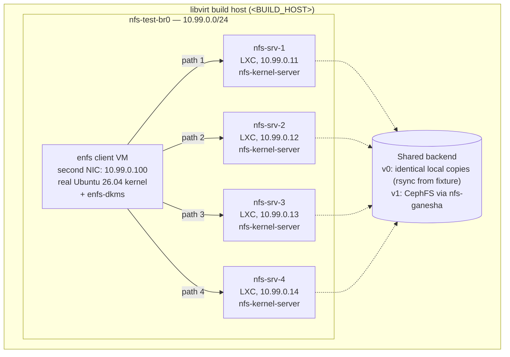
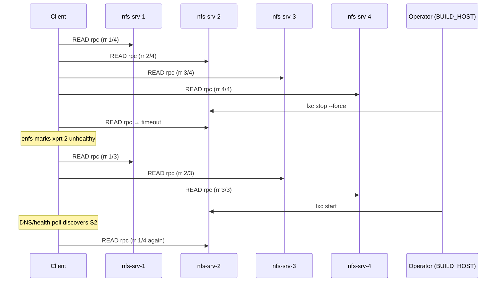

# End-to-end (Tier 3) test topology

Canonical reference for the multi-server NFS-multipath test bed used by
Tier 3 of `docs/testing-plan.md`. This document is concrete enough that
a human (or a CI runner) can stand the topology up after substituting
the placeholders documented in `README.md` § "Development environment".

## 1. Goal

We are proving that an `enfs`-mounted NFS share, given four backend
server addresses, **actually distributes RPC traffic across all four**,
**transparently fails over** when a server disappears, and **reabsorbs
a returning server** without an unmount/remount. Tier 1 (KUnit) and
Tier 2 (BATS) cannot prove this: KUnit exercises selector logic in a
mocked transport graph, and Tier 2 only loads/unloads the module on a
single host with no real RPC traffic. We need real `nfs-kernel-server`
peers, a real bridge, and a real client kernel with our DKMS modules
installed before we can claim the multipath datapath works.

## 2. Topology

Four LXC containers act as NFS servers on a private bridge
`nfs-test-br0` (10.99.0.0/24). One full VM acts as the enfs client —
it must be a real VM (not a container) because we install our DKMS
package and replace `nfs.ko`/`sunrpc.ko` against its installed
kernel-headers; LXC containers share the host kernel and cannot do
that.



The client mounts with:

```bash
mount -t enfs \
  -o vers=4.1,enfs_info='remoteaddrs=10.99.0.11~10.99.0.14' \
  10.99.0.11:/srv/enfs-test  /mnt/enfs
```

The `~` syntax is the OpenEuler-documented address-range form for
`enfs_info=remoteaddrs=`; it expands to the four explicit addresses
.11, .12, .13, .14.

## 3. Backend choices

The four servers must serve **byte-identical content** for read tests
to be meaningful (otherwise different reads from different servers
would race). Trade-offs:

| Backend | Setup time | Realism | When to use |
|---|---|---|---|
| **identical-local-copies** (rsync from a fixture, each LXC has its own copy) | minutes | low — diverges on writes, no real shared-state semantics | **day 1, v0**: read-only scenarios, deterministic, no extra moving parts |
| **nfs-ganesha against shared CephFS** | ~1 hour (3-node Ceph quorum or single-node test cluster) | high — real distributed FS, real cache-coherence | when adding write-heavy tests in v1 |
| **nfs-kernel-server against shared GlusterFS** | ~30 min | high — real distributed FS, simpler than Ceph | lighter alternative if Ceph footprint is too heavy |
| **nfs-kernel-server against iSCSI shared block + GFS2** | ~1 hour | highest — closest to a real production multi-head NAS | when we need to validate behaviour under shared-block semantics (v1+) |

**Recommendation:** identical-local-copies for v0 (which is what the
provisioning script in § 5 sets up). Move to CephFS-backed nfs-ganesha
for v1 when we add the write-heavy fio scenarios.

## 4. Pass criteria

Each scenario asserts on counters from `ip -s link`, packet counts
from `tcpdump`, and SNMP-style counters from `nstat`. All commands run
on a server unless prefixed `(client)`.

### 4.1 Sanity: total bytes accounted for

After the client reads `N` MB sequentially:

```bash
# on each server, sample before and after
ip -s -j link show dev eth0 | jq '.[0].stats64.tx.bytes'
```

Sum the four `(after - before)` deltas. Must be within +5%/-0% of
`N` MB (the +5% allows for TCP/RPC/NFS framing overhead; under is a
fail because reads must cross the wire).

### 4.2 Load is spread within ±15%

Per-server delta must be within ±15% of `N/4`:

```bash
for i in 1 2 3 4; do
  lxc exec nfs-srv-$i -- ip -s -j link show dev eth0 \
    | jq '.[0].stats64.tx.bytes'
done
```

±15% (not ±5%) because the round-robin selector dispatches per-RPC,
not per-byte, and small `READ` RPCs under read-ahead can land
asymmetrically. Tighten this number once we measure baseline jitter.

### 4.3 Failover: kill server-2 mid-test

Run a 60 s sustained read on the client. At t=20 s, on `<BUILD_HOST>`:

```bash
lxc stop nfs-srv-2 --force
```

Assertions:

- `tcpdump -i nfs-test-br0 'host 10.99.0.12'` shows zero packets
  to/from `.12` within **5 s** of the kill.
- The remaining three servers' TX-byte rates rise; total client-side
  read throughput recovers to within 90 % of pre-kill rate within
  **30 s** (measured by `nstat -a Tcp10sInSegs` deltas on the client,
  or just `iostat -mx 1` on the test mount).

Measurement command on the client (foreground, capture before/after):

```bash
nstat -r ; sleep 30 ; nstat | grep -E 'TcpInSegs|IpInOctets'
```

### 4.4 Failback: bring server-2 back

After § 4.3, on `<BUILD_HOST>`:

```bash
lxc start nfs-srv-2
```

Within **60 s**, server-2's TX-byte rate must rise above zero again,
and per-server share must return to within ±15 % of the four-way
split. The 60 s allows for: container boot (~10 s), nfsd ready (~5 s),
the enfs DNS/health-check process discovering the path is alive
(default poll interval 30 s; tunable via `/proc/enfs/.../config`).

### 4.5 Sequence diagram (failover round)



## 5. Provisioning

Two scripts (specs below — they don't exist yet, this document is the
spec).

### 5.1 `scripts/e2e/provision-servers.sh`

Sets up the bridge and the four LXC containers. Idempotent (each step
checks first):

```bash
#!/usr/bin/env bash
set -euo pipefail

BR=nfs-test-br0
SUBNET=10.99.0.0/24
GATEWAY=10.99.0.1
FIXTURE=tests/fixtures/exports
EXPORT_DIR=/srv/enfs-test

# 1. Bridge — created with no upstream NAT (test traffic only).
if ! lxc network show "$BR" >/dev/null 2>&1; then
  lxc network create "$BR" \
    ipv4.address="${GATEWAY}/24" \
    ipv4.nat=false \
    ipv6.address=none
fi

# 2. Containers
for i in 1 2 3 4; do
  name="nfs-srv-$i"
  ip="10.99.0.1${i}"
  if ! lxc info "$name" >/dev/null 2>&1; then
    lxc launch ubuntu:24.04 "$name" --network "$BR"
    lxc config device set "$name" eth0 ipv4.address "$ip"
    lxc restart "$name"
  fi

  # 3. NFS server install
  lxc exec "$name" -- bash -c '
    export DEBIAN_FRONTEND=noninteractive
    apt-get update -qq
    apt-get install -y -qq nfs-kernel-server
    mkdir -p '"$EXPORT_DIR"'
    chown nobody:nogroup '"$EXPORT_DIR"'
  '

  # 4. Fixture (identical copies for v0).
  lxc file push --recursive "$FIXTURE/" "$name$EXPORT_DIR/"

  # 5. Export and reload.
  lxc exec "$name" -- bash -c "
    echo '$EXPORT_DIR  10.99.0.0/24(rw,sync,no_subtree_check,no_root_squash,fsid=1)' \
      > /etc/exports
    exportfs -ra
    systemctl restart nfs-kernel-server
    exportfs -v
  "
done

# 6. Sanity: each server should answer showmount.
for i in 1 2 3 4; do
  showmount -e "10.99.0.1${i}"
done
```

Teardown counterpart (`scripts/e2e/teardown-servers.sh`) just runs
`lxc delete --force nfs-srv-{1..4}` and leaves the bridge in place.

### 5.2 `scripts/e2e/provision-client.sh`

The client is a heavier asset — it's the existing test VM (referenced
as `<TEST_VM_HOST>` in public docs; real values in
`secrets/test-vm.md`). This script does not create it; it attaches a
second NIC on `nfs-test-br0` and installs the package.

```bash
#!/usr/bin/env bash
set -euo pipefail

# Run on <BUILD_HOST>:
VM_NAME=enfs-dev      # libvirt domain name; see secrets/test-vm.md
BR=nfs-test-br0

# 1. Hot-attach a second NIC bridged onto nfs-test-br0.
if ! virsh domiflist "$VM_NAME" | grep -q "$BR"; then
  virsh attach-interface "$VM_NAME" \
    --type bridge --source "$BR" \
    --model virtio --config --live
fi

# 2. Inside the VM, configure the new interface and install the package.
ssh "<TEST_VM_HOST>" bash <<'EOS'
  set -euo pipefail
  IFACE=$(ip -j link | jq -r '.[] | select(.address|startswith("52:54")) | .ifname' \
            | tail -n 1)
  sudo tee /etc/netplan/60-nfs-test.yaml >/dev/null <<NETPLAN
  network:
    version: 2
    ethernets:
      $IFACE:
        addresses: [10.99.0.100/24]
        dhcp4: false
NETPLAN
  sudo chmod 600 /etc/netplan/60-nfs-test.yaml
  sudo netplan apply
  sudo apt-get install -y nfs-common fio tcpdump nftables jq
  # Install the freshly-built enfs-dkms .deb from the rsync drop.
  sudo apt-get install -y "<VM_PATH>/dist/enfs-dkms_*_all.deb"
  sudo modprobe enfs
  lsmod | grep enfs
EOS

# 3. Sanity: client can reach all four servers.
ssh "<TEST_VM_HOST>" -- bash -c '
  for i in 1 2 3 4; do
    rpcinfo -T tcp 10.99.0.1$i nfs 4 || exit 1
  done
'
```

## 6. Test scenarios

Expansion of the nine-row table from `docs/testing-plan.md` § Tier 3.
Each subsection lists the exact command sequence; substitute
`<TEST_VM_HOST>`, `<NFS_SRV_1>` … `<NFS_SRV_4>`, `<BUILD_HOST>` for
your environment.

### 6.1 Round-robin distribution

```bash
# (client)
sudo mount -t enfs \
  -o vers=4.1,enfs_info='remoteaddrs=10.99.0.11~10.99.0.14' \
  10.99.0.11:/srv/enfs-test /mnt/enfs

# Snapshot per-server TX bytes.
ssh <BUILD_HOST> 'for i in 1 2 3 4; do
  lxc exec nfs-srv-$i -- cat /sys/class/net/eth0/statistics/tx_bytes
done' > /tmp/tx-before

# 1000 small reads (4 KiB each).
for i in $(seq 1 1000); do
  dd if=/mnt/enfs/4k of=/dev/null bs=4k count=1 status=none
done

ssh <BUILD_HOST> 'for i in 1 2 3 4; do
  lxc exec nfs-srv-$i -- cat /sys/class/net/eth0/statistics/tx_bytes
done' > /tmp/tx-after

paste /tmp/tx-before /tmp/tx-after | awk '{print $2 - $1}'
# assert: each delta within ±15% of mean
```

### 6.2 Failover on hard kill (drop traffic)

```bash
# (client)  start a 60 s sustained read in the background.
dd if=/mnt/enfs/64m of=/dev/null bs=1M iflag=direct &
DDPID=$!
sleep 20

# (build host)  drop server-2 traffic with nft.
ssh <BUILD_HOST> '
  lxc exec nfs-srv-2 -- nft add table inet block
  lxc exec nfs-srv-2 -- nft add chain inet block input \
    "{ type filter hook input priority 0 ; }"
  lxc exec nfs-srv-2 -- nft add rule inet block input drop
'
wait $DDPID
# assert: dd exited 0; tcpdump on bridge shows no packets to/from .12 after t=20.
```

### 6.3 Failover on slow path

```bash
ssh <BUILD_HOST> '
  lxc exec nfs-srv-3 -- tc qdisc add dev eth0 root netem delay 500ms loss 1%
'
# Re-run the workload from § 6.1 and assert that .13's share drops
# significantly below 25%.
```

### 6.4 Runtime path add

```bash
# (client) mount with one path.
sudo mount -t enfs \
  -o vers=4.1,enfs_info='remoteaddrs=10.99.0.11' \
  10.99.0.11:/srv/enfs-test /mnt/enfs

# Add a second path at runtime.
echo 'add 10.99.0.12' | sudo tee /proc/enfs/$(mountpoint -d /mnt/enfs)/paths
# assert: subsequent read traffic splits ~50/50 across .11 and .12.
```

### 6.5 Runtime path remove

```bash
echo 'remove 10.99.0.12' | sudo tee /proc/enfs/$(mountpoint -d /mnt/enfs)/paths
# assert: traffic returns to .11 only.
```

### 6.6 DNS rebind

```bash
# (build host)  run a local coredns with the test zone.
ssh <BUILD_HOST> 'docker run -d --name e2e-dns --network=host \
  -v $PWD/tests/fixtures/dns:/etc/coredns coredns/coredns -conf /etc/coredns/Corefile'

# (client)  point resolv.conf at it; mount by name.
sudo mount -t enfs \
  -o vers=4.1,enfs_info='remotehosts=nfs.test.local' \
  nfs.test.local:/srv/enfs-test /mnt/enfs

# (build host)  edit the zone to add a new A record; HUP coredns.
ssh <BUILD_HOST> 'docker kill -s HUP e2e-dns'

# (client)  trigger the enfs DNS process.
echo 1 | sudo tee /proc/enfs/$(mountpoint -d /mnt/enfs)/dns_kick
# assert: /proc/enfs/.../paths grows the new address.
```

### 6.7 Server vanish + return

```bash
ssh <BUILD_HOST> 'lxc stop nfs-srv-2'
# assert (per § 4.3): traffic to .12 stops within 5 s; throughput recovers in 30 s.
ssh <BUILD_HOST> 'lxc start nfs-srv-2'
# assert (per § 4.4): .12 is back in the rotation within 60 s.
```

### 6.8 NFSv3 + NFSv4 matrix

Re-run § 6.1, § 6.2, § 6.4 with `-o vers=3` instead of `vers=4.1`
(the patches in `vendor/openeuler/fs/nfs/nfs3xdr.c` mean v3 has its
own RPC dispatch path and must be exercised separately).

### 6.9 Concurrency

```bash
# (client)  fio with 256 outstanding async reads.
fio --name=enfs-conc --filename=/mnt/enfs/64m --rw=randread \
    --bs=4k --iodepth=256 --ioengine=libaio --runtime=60 --time_based --direct=1 &

sleep 20
# Fire § 6.2 mid-run and assert no client hang; fio must complete cleanly.
```

## 7. GitHub Actions integration

This workflow MUST run on a self-hosted runner. Reasons:

1. **Nested KVM is not reliable on GitHub-hosted runners.** Our client
   is a libvirt VM with a real Ubuntu 26.04 kernel; even when nested
   virt is technically available on the hosted runner image, it is
   not contractually supported and tends to break silently.
2. **Kernel-module installation violates GitHub-hosted policy.** We
   `dkms install` `enfs.ko`, `nfs.ko` and `sunrpc.ko` into the runner
   kernel. Hosted runners are ephemeral but the policy still applies,
   and any kernel-load failure on a shared image is hard to debug.
3. **The bridge and the LXC containers live on `<BUILD_HOST>`** and
   we don't want to move that infrastructure into the cloud.

### 7.1 Self-hosted runner setup on `<BUILD_HOST>`

Done once, manually:

```bash
# As root on <BUILD_HOST>:
useradd -r -m -s /bin/bash gh-runner
usermod -aG lxd gh-runner
usermod -aG kvm gh-runner          # so it can talk to libvirt for the client VM

# Sudoers entry — narrow allowlist, NOT general sudo.
cat >/etc/sudoers.d/gh-runner-e2e <<'SUDO'
gh-runner ALL=(root) NOPASSWD: \
  /usr/sbin/exportfs, \
  /usr/sbin/nft, \
  /usr/sbin/tcpdump, \
  /usr/bin/virsh attach-interface *, \
  /usr/bin/virsh detach-interface *
SUDO
chmod 0440 /etc/sudoers.d/gh-runner-e2e

# Install the runner under gh-runner's home, register against this repo
# with labels: self-hosted, linux, x64, lxd, libvirt, enfs-e2e
sudo -u gh-runner bash -c '
  cd ~ && mkdir actions-runner && cd actions-runner
  curl -O -L https://github.com/actions/runner/releases/latest/download/actions-runner-linux-x64.tar.gz
  tar xzf actions-runner-linux-x64.tar.gz
  ./config.sh --url https://github.com/<OWNER>/enfs --token <REGISTRATION_TOKEN> \
              --labels self-hosted,lxd,libvirt,enfs-e2e --unattended
'
# Install as a systemd service.
cd /home/gh-runner/actions-runner && sudo ./svc.sh install gh-runner && sudo ./svc.sh start
```

### 7.2 Workflow

`.github/workflows/e2e.yml` (sketch — the workflow itself is tracked
in `docs/ci-cd-plan.md` § "e2e (Tier 3) — self-hosted runner"):

```yaml
name: e2e
on:
  schedule:
    - cron: '0 3 * * *'      # nightly 03:00 UTC
  workflow_dispatch: {}

jobs:
  multipath:
    runs-on: [self-hosted, lxd, libvirt, enfs-e2e]
    timeout-minutes: 60
    steps:
      - uses: actions/checkout@v4
      - run: scripts/e2e/provision-servers.sh
      - run: scripts/e2e/provision-client.sh
      - run: scripts/e2e/run-all-scenarios.sh
      - if: always()
        run: scripts/e2e/teardown-servers.sh
```

Cross-reference: `docs/ci-cd-plan.md` § "e2e (Tier 3) — self-hosted
runner" lists this workflow in the workflow inventory and ties it to
the Golden stage gate.

## 8. What we'll add later (v1+)

Placeholders so reviewers know these are conscious deferrals, not
oversights.

### 8.1 CephFS-backed shared backend

Replace § 3's identical-local-copies with a 3-node CephFS test cluster
(also LXC-hosted) fronted by `nfs-ganesha` on each of the four server
nodes. Required before any write-heavy test can be meaningful.

### 8.2 Full NFSv3 + NFSv4 matrix

Currently § 6.8 covers v3 only for three of the nine scenarios. v1
runs all nine for both versions, and adds NFSv4.2 (server-side copy,
holes) once we confirm the OE patches don't break it.

### 8.3 Write-heavy fio scenarios

After § 8.1: mixed `randrw` at varying iodepths, with verification
(`--verify=crc32c`) to catch any data-integrity regression caused by
RPC dispatch across paths.

### 8.4 Fault injection matrix

Beyond § 6.2 (`nft drop`) and § 6.3 (`tc netem delay`), add:

- packet reordering (`tc netem reorder`),
- duplicate packets (`tc netem duplicate`),
- partial-blackhole (drop only NFS port, not ICMP — tests TCP-vs-RPC
  timeout interaction),
- MTU mismatch (one server at 9000, others at 1500 — tests PMTU
  discovery on a per-path basis).

Each becomes a new `tests/e2e/NN-<name>.sh` file driven from
`run-all-scenarios.sh`.
