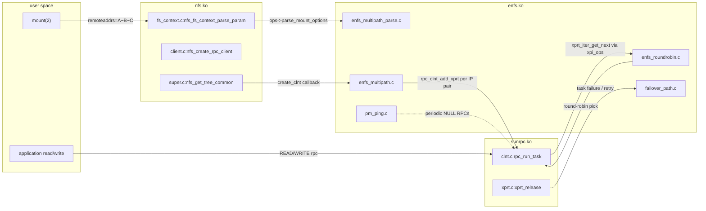

# Chapter 1 — Architecture overview

## 1.1 What this chapter establishes

By the end of this chapter the reader should be able to:

- Name the three kernel modules this package builds, what each one is
  responsible for, and why the work was not consolidated into a
  single out-of-tree `enfs.ko`.
- Describe the *adapter-registration* pattern that lets `nfs.ko`
  reach into `enfs.ko` without a hard link dependency at module-load
  time.
- Map any file in the repository to the build artefact it ends up in,
  starting from a fresh clone.
- Recognise the relationship between `vendor/`, `patches/`, `compat/`
  and the generated `src/` tree.
- Understand at a high level why the package replaces stock NFS /
  SunRPC modules rather than patching the kernel, and why the
  replacement does not break stock `lockd`, `nfs_acl` or `nfsd`.

The deeper *how* of the multipath dispatch lives in
[chapter 2](./02-rpc-multipath.md); the mount path lives in
[chapter 3](./03-nfs-mount-flow.md); the CRC compatibility trick gets
a chapter of its own ([chapter 9](./09-genksyms-crc.md)).

## 1.2 The three-module stack

Stock Ubuntu ships an NFS client made of two relevant kernel
modules — `sunrpc.ko` (the RPC plumbing) and `nfs.ko` (the file system
itself, plus a thin protocol-version dispatcher). A self-contained
out-of-tree multipath module would have been the simplest packaging,
but `enfs` is not architected that way: it relies on hooks inside
`sunrpc.ko` (per-task transport selection, per-xprt accounting,
per-clnt callbacks at create/release time) and inside `nfs.ko`
(parsing new mount options, propagating an opaque `enfs_option`
through the mount context, triggering server-capability probes after
mount). Those hooks cannot live in a third module without first
existing as exported call sites in the modules being patched.

The OpenEuler design chose, instead, to split the work three ways and
have the multipath module *register* itself with the patched
modules at load time. This package follows that split exactly:

```text
+-----------------------------------------------------------+
|  enfs.ko    (vendor/openeuler/fs/nfs/enfs/, ~22 files)    |
|             multipath manager, round-robin policy,        |
|             failover state machine, pm_ping path monitor, |
|             /proc interface, live remount, DNS rebind     |
+----------------------------+------------------------------+
                             |
              registers struct enfs_adapter_ops with
              registers struct rpc_multipath_ops    with
                             |
                             v
+--------------------------+    +--------------------------+
|  nfs.ko  (stock + glue)  |    |  sunrpc.ko (stock + glue)|
|  fs/nfs/enfs_adapter.c   |    |  net/sunrpc/             |
|  + 7 patched stock files |    |    sunrpc_enfs_adapter.c |
|  - super.c, fs_context.c |    |  + 6 patched stock files |
|  - client.c, internal.h  |    |  - clnt.c, xprt.c        |
|  - nfs3xdr.c, headers    |    |  - xprtmultipath.c       |
+--------------------------+    +--------------------------+
```

The arrows go *upward*: the adapter glue inside the patched modules
reaches into `enfs.ko` through registered ops vectors. `nfs.ko` and
`sunrpc.ko` have no compile-time symbol dependency on `enfs.ko`; they
work fine when `enfs.ko` is absent (in which case multipath is just a
no-op), and the kernel's normal module unload behaviour cleans the
registration up.

The build outputs land in:

| Module       | Source family                              | Where it goes |
|--------------|--------------------------------------------|---------------|
| `sunrpc.ko`  | stock SunRPC + `sunrpc_enfs_adapter.o`     | `/lib/modules/$(uname -r)/updates/net/sunrpc/` |
| `nfs.ko`     | stock NFS client + `enfs_adapter.o`        | `/lib/modules/$(uname -r)/updates/fs/nfs/`     |
| `enfs.ko`    | OpenEuler `fs/nfs/enfs/` (additive only)   | `/lib/modules/$(uname -r)/updates/fs/nfs/enfs/`|

Three further modules — `nfsv3.ko`, `lockd.ko`, `nfs_acl.ko` — are
also rebuilt and shipped, even though they contain no enfs hooks.
They are along for the ride because they have to match the symbol
CRCs of our patched `sunrpc.ko` and `nfs.ko`. The mechanism behind
that — `__GENKSYMS__`-guarded struct additions — is the subject of
[chapter 9](./09-genksyms-crc.md). For now treat it as: *we replace
five modules in `/lib/modules/.../updates/`, and depmod ranks
`updates/` above `kernel/`, so subsequent `modprobe nfs` picks up
our copies*.

## 1.3 The adapter pattern

The adapter glue is the only part of the design that benefits from a
worked example, because it is the same pattern repeated twice (once
per patched module).

### 1.3.1 The NFS-side adapter

`fs/nfs/enfs_adapter.c` defines and exports two kinds of API. First,
the *registration* surface used by `enfs.ko`:

[`vendor/openeuler/fs/nfs/enfs_adapter.c:19`](../../vendor/openeuler/fs/nfs/enfs_adapter.c)

```c
static struct enfs_adapter_ops __rcu *enfs_adapter;
static DEFINE_MUTEX(enfs_module_mutex);

int enfs_adapter_register(struct enfs_adapter_ops *ops)
{
        struct enfs_adapter_ops *old;
        old = cmpxchg((struct enfs_adapter_ops **)&enfs_adapter,
                      NULL, ops);
        if (old == NULL || old == ops)
                return 0;
        ...
}
EXPORT_SYMBOL_GPL(enfs_adapter_register);
```

A single `__rcu`-protected global pointer, set with `cmpxchg`, gets
filled in when `enfs.ko` calls `enfs_adapter_register` from its
`module_init`. The mutex guards a single thing: a `request_module`
during option parsing (see below).

Second, the *consumer* surface used by patched stock NFS code.
Every site in `nfs.ko` that needs to talk to enfs goes through one of
the wrapper helpers in this file: `enfs_parse_mount_options`,
`enfs_free_mount_options`, `nfs_create_multi_path_client`,
`nfs_remount_iplist`, `nfs_multipath_set_mount_data`,
`enfs_trigger_get_server_capability`, `enfs_check_have_lookup_cache_flag`,
and so on. Each follows the same pattern:

```c
ops = nfs_multipath_router_get();   /* RCU + try_module_get */
if (ops != NULL && ops->some_callback != NULL)
        ops->some_callback(...);
nfs_multipath_router_put(ops);      /* module_put */
```

Two important properties fall out of this:

1. **`enfs.ko` can be unloaded at any time.** The wrappers tolerate
   `ops == NULL` (it just means *enfs is not loaded right now*) and
   the `try_module_get` inside `nfs_multipath_router_get` prevents the
   module from being removed mid-callback.
2. **`nfs.ko` does not link against `enfs.ko`.** All cross-module
   calls are indirect through the function pointer table. The
   compile-time relationship is the other way round: `enfs.ko`
   imports `enfs_adapter_register` / `nfs_create_multi_path_client`
   / `nfs_remount_iplist` from `nfs.ko`'s exported symbols.

The first call into `enfs_parse_mount_options` doubles as the trigger
that loads `enfs.ko`:

[`vendor/openeuler/fs/nfs/enfs_adapter.c:80`](../../vendor/openeuler/fs/nfs/enfs_adapter.c)

```c
int enfs_parse_mount_options(enum nfsmultipathoptions option, char *str,
                             struct nfs_fs_context *mnt, struct fs_context *fc)
{
        ops = nfs_multipath_router_get();
        if (ops == NULL) {
                mutex_lock(&enfs_module_mutex);
                rc = request_module("enfs");
                mutex_unlock(&enfs_module_mutex);
                if (rc) return -EOPNOTSUPP;
                ops = nfs_multipath_router_get();
        }
        ...
        rc = ops->parse_mount_options(option, str, &mnt->enfs_option,
                                      fc->net_ns);
        nfs_multipath_router_put(ops);
        return rc;
}
```

So a user typing `mount -t nfs -o remoteaddrs=...` is what causes
`enfs.ko` to autoload — there is no `modprobe enfs` baked into the
package. The mutex around `request_module` exists to serialise
concurrent first-mount attempts so that only one of them races to
load the module.

### 1.3.2 The SunRPC-side adapter

The SunRPC-side glue is structurally identical, in
`vendor/openeuler/net/sunrpc/sunrpc_enfs_adapter.c`. A single
`multipath_ops __rcu *` pointer holds a `struct rpc_multipath_ops`
(declared in `vendor/openeuler/include/linux/sunrpc/sunrpc_enfs_adapter.h:21`).
Where the NFS adapter dealt in mount-option parsing and per-client
state, the SunRPC adapter deals in *per-RPC* events:

```c
struct rpc_multipath_ops {
        struct module *owner;
        void (*create_clnt)(...);
        void (*releas_clnt)(struct rpc_clnt *clnt);
        void (*create_xprt)(struct rpc_xprt *xprt);
        void (*destroy_xprt)(struct rpc_xprt *xprt);
        void (*xprt_iostat)(struct rpc_task *task);
        void (*failover_handle)(struct rpc_task *task);
        void (*adjust_task_timeout)(struct rpc_task *task, void *condition);
        void (*init_task_req)(struct rpc_task *task, struct rpc_rqst *req);
        bool (*prepare_transmit)(struct rpc_task *task);
        void (*set_transport)(struct rpc_task *task, struct rpc_clnt *clnt);
        void (*inc_queuelen)(struct rpc_xprt *xprt);
        void (*dec_queuelen)(struct rpc_xprt *xprt);
        void (*get_rpc_program)(struct rpc_task *task, u32 *program,
                                u32 *version);
        bool (*task_need_call_start_again)(struct rpc_task *task);
};
```

`enfs.ko` populates exactly one such struct in
[`vendor/openeuler/fs/nfs/enfs/enfs_multipath.c:1035`](../../vendor/openeuler/fs/nfs/enfs/enfs_multipath.c)
and registers it from `enfs_multipath_init` (line 1083) which itself
runs out of the module's `module_init`. From the moment that
`rpc_multipath_ops_register` returns, every `rpc_run_task` in the
kernel has a chance of being intercepted by enfs — but the
intercepts are no-ops unless the rpc_clnt in question has its
`cl_enfs` bit set, which only happens for clients created out of an
enfs mount (see [chapter 2 §2.3](./02-rpc-multipath.md#23-the-cl_enfs-bit)).

### 1.3.3 Why two adapters and not one

Conceptually the two adapter structs do similar things and could
share a registration mechanism. They are kept separate because
`nfs.ko` and `sunrpc.ko` have entirely independent module lifecycles
and entirely independent symbol namespaces. `sunrpc.ko` is loaded by
`lockd`, `nfsv4`, `rpcsec_gss_*` and lots of other consumers that
have no opinion about NFS-level mount options; pushing
`enfs_adapter_ops` into `sunrpc.ko` would mean every kernel that
loads SunRPC for any reason would carry enfs-shaped vtable plumbing,
even if `nfs.ko` is not loaded. The split keeps each adapter scoped
to the layer that owns the data it operates on.

## 1.4 Three runtime arrows

The adapter-registration story above is *static* — what happens at
module-load time. The runtime story has three distinct arrows
crossing module boundaries; understanding which arrow lives where is
the most useful thing this chapter can give the reader.



The three arrows in plain words:

- **Mount-time arrow** (left half of the diagram). The user's
  `mount(2)` syscall enters `nfs.ko`'s fs_context machinery; enfs
  options are forwarded into `enfs.ko`'s parser; once the rpc_clnt
  exists, enfs's `create_clnt` callback fires and walks the parsed
  IP list to attach extra transports. This entire arrow runs once
  per mount. See [chapter 3](./03-nfs-mount-flow.md).
- **Per-RPC dispatch arrow** (top right). Each `rpc_run_task`
  caller — an `nfs_read`, `nfs_write`, getattr, whatever — eventually
  reaches `rpc_task_set_transport` in `sunrpc.ko/clnt.c`. Stock
  SunRPC calls `xprt_iter_get_next(&clnt->cl_xpi)`, which dispatches
  through `xpi_ops->xpi_next`. enfs's contribution here is to
  install its own `rpc_xprt_iter_ops` (`enfs_xprt_iter_roundrobin`,
  defined in
  [`vendor/openeuler/fs/nfs/enfs/enfs_roundrobin.c:272`](../../vendor/openeuler/fs/nfs/enfs/enfs_roundrobin.c)),
  whose `xpi_next` skips inactive transports and balances by
  per-xprt queue length. See [chapter 2](./02-rpc-multipath.md).
- **Path-monitor arrow** (bottom right). A workqueue inside
  `enfs.ko` (`pm_ping.c`) periodically issues NULL RPCs against each
  attached transport. Successful pings push the path's state toward
  `PM_STATE_NORMAL`; failures push it to `PM_STATE_FAULT`, which
  causes the round-robin iterator to skip it. Failures observed by
  in-flight RPCs (rather than by the prober) take the *failover
  arrow* via `failover_handle`, which marks the xprt faulty and
  reselects. See chapters [4](./04-pm-ping-state.md) and
  [5](./05-failover.md).

The key intuition: the *structures* (rpc_xprt_switch, rpc_xprt_iter,
rpc_xprt) all live in `sunrpc.ko`. enfs supplies a different *policy*
(the iterator ops and the per-xprt context attached via
`xprt_get_reserve_context`) without owning the data structures.

## 1.5 Why DKMS instead of an in-tree patch

The upstream-ish answer is: this code has not been submitted to
mainline. Until it is, distributing it as a DKMS package is the
least invasive option. Two practical reasons reinforce that:

1. **Per-kernel rebuilds without shipping a kernel.** DKMS rebuilds
   the modules whenever the running kernel changes (apt upgrades,
   new HWE rolls, etc.). Shipping a custom kernel package for every
   Ubuntu point release would multiply the maintenance load by the
   number of supported kernels, *and* would force users onto a
   non-standard kernel.
2. **Trivial rollback.** `dkms remove` deletes our modules from
   `/lib/modules/$KVER/updates/` and `depmod` falls back to the
   stock `kernel/`-tree copies on the next `modprobe`. There is no
   "uninstall the patch" surgery on the kernel image; the stock
   modules were never displaced from `kernel/`, only outranked by
   our copies in `updates/`.

The README's *Why DKMS* section ([`README.md:100`](../../README.md))
covers this in user-facing language. It is repeated here because the
choice flows directly into the file-layout decisions described in the
next section.

## 1.6 Where each file lives

A reader landing on the repo for the first time benefits from a tour
of how the input files flow into the build:

```text
vendor/openeuler/                  upstream OpenEuler OLK-6.6 (verbatim)
  fs/nfs/enfs/                     ── source of enfs.ko (additive, no
                                      conflict; copied through to src/)
  fs/nfs/enfs_adapter.{c,h}        ── compiled into nfs.ko
  net/sunrpc/sunrpc_enfs_adapter.c ── compiled into sunrpc.ko
  include/linux/sunrpc/sunrpc_enfs_adapter.h
                                   ── exported header, copied through
  fs/nfs/{super,client,fs_context, ── OE-modified copies of stock
       internal,nfs3xdr}.{c,h}        files; KEPT FOR REFERENCE,
  net/sunrpc/{clnt,xprt}.c            NEVER BUILT directly. Useful
  include/linux/{nfs_fs_sb,nfs_xdr,    when writing a patch — diff
       sunrpc/clnt,sunrpc/sched}.h     against vendor/ubuntu-7.0/
                                       to see what to port.
  UPSTREAM-REVISION                ── pinned commit:
                                      OLK-6.6 5078a3a23a1e (vendored 2026-04-30)

vendor/ubuntu-7.0/                 stock Ubuntu kernel files we patch
  fs/nfs/*, net/sunrpc/*,          ── verbatim copies from
  include/linux/sunrpc/*, etc.        linux_7.0.0-14.14 source package
  MANIFEST                         ── one path per file, lazy-fetched
                                      by scripts/fetch-vendor-ubuntu.sh
  UPSTREAM-REVISION                ── ARCHIVE_URL + SRC_VERSION pin
  .pin-stamp                       ── (created on fetch) recording the
                                      exact source-package revision

patches/ubuntu-7.0/
  series                           ── 20-line ordered list, applied
                                      top-to-bottom by build-src-tree.sh
  0001..0020-*.patch               ── one focused patch per file/feature

compat/
  enfs_compat.h                    ── force-included into every TU,
                                      holds version-drift shims and the
                                      forward declarations for symbols
                                      that crossed module boundaries
                                      after we added EXPORT_SYMBOL_GPL

src/                               GENERATED, gitignored
                                   the output of `make port`
Kbuild                             top-level: descends into src/ and
                                   spells out every .o explicitly,
                                   because out-of-tree builds don't
                                   see CONFIG_NFS_FS etc.
```

The build pipeline `make port` materialises `src/` from those three
inputs by:

1. Copying every path under `vendor/ubuntu-7.0/` into `src/`.
2. Copying the additive paths from `vendor/openeuler/` (everything
   under `fs/nfs/enfs/`, the two `*_adapter.{c,h}` pairs, and the new
   sunrpc header) into `src/`. These paths do not overlap with the
   Ubuntu copies.
3. Applying every patch from `patches/ubuntu-7.0/series` against the
   in-place stock Ubuntu copies in `src/`. The patch files are
   small, focused, and named for the file they touch — anyone reading
   `0010-fs-nfs-super-add-enfs-hooks.patch` knows exactly which file
   in `vendor/ubuntu-7.0/fs/nfs/super.c` is about to be modified.
4. Dropping the top-level `Kbuild` (this repo's, not the kernel's)
   into `src/Kbuild` so the resulting tree builds out-of-tree against
   `linux-headers-$(uname -r)`.

The OE-modified copies under `vendor/openeuler/` (super.c,
fs_context.c, clnt.c, xprt.c, etc.) are *not* built. They exist as
the gold reference: when writing a new patch in `patches/ubuntu-7.0/`,
the workflow is `diff vendor/ubuntu-7.0/X vendor/openeuler/X`
followed by manual port of the diff into the Ubuntu file's idioms.
This is documented in [`docs/PORTING-NOTES.md`](../PORTING-NOTES.md).

## 1.7 The patch series at a glance

Twenty patches make up the entire delta this package introduces on
top of stock Ubuntu 7.0 NFS / SunRPC. The full index lives in
[`patches/ubuntu-7.0/series`](../../patches/ubuntu-7.0/series); the
forensic per-patch annotations live in [`docs/PORTING-NOTES.md`](../PORTING-NOTES.md).
For orientation, the patches fall into four buckets:

- **Build-system glue** (0001-0004): teach `fs/nfs/Makefile`,
  `net/sunrpc/Makefile`, and the two Kconfigs about the new objects
  and the `CONFIG_ENFS` / `CONFIG_SUNRPC_ENFS` symbols. None of
  these change runtime behaviour.
- **Struct additions, hidden from genksyms** (0005-0009): add
  `cl_enfs`, `multipath_option`, `enfs_option`, `cl_multipath_data`,
  `enfs_flags` and friends to the relevant structs, all wrapped in
  `#if !defined(__GENKSYMS__)` so the symbol CRCs that other
  modules link against stay byte-identical to stock. This is the
  CRC trick referenced in [chapter 9](./09-genksyms-crc.md).
- **Hook sites** (0010-0014): wire the existing
  `enfs_adapter_*` / `rpc_multipath_ops_*` calls into the patched
  files at the right places. Eight hook sites in `clnt.c`, six in
  `xprt.c`, three in `super.c`, three in `client.c`, the option
  parser in `fs_context.c`, and so on.
- **Visibility flips** (0015-0020): drop `static`, add
  `EXPORT_SYMBOL_GPL`, and (in the case of 0020) reintroduce one
  helper that OpenEuler kept but upstream Linux removed
  (`rpc_clnt_test_xprt`). These are two- or three-line patches each.

The dividing line between the second and third buckets matters:
patches 0005-0009 *make space in the structs* for new fields without
changing the symbol CRCs, while patches 0010-0019 *use* those
fields. A reader scanning the series for the first time can stop
worrying about the genksyms guards once they understand they exist
to keep stock `lockd` / `nfs_acl` / `nfsd` loading against our
patched `nfs.ko` and `sunrpc.ko` — this is covered in detail in
chapter 9.

## 1.8 Reading the rest of this book

Each subsequent chapter assumes the reader has internalised the
following from this chapter:

- The names `enfs.ko`, `nfs.ko`, `sunrpc.ko` and what each contains.
- That `enfs_adapter_ops` is registered into `nfs.ko` and
  `rpc_multipath_ops` is registered into `sunrpc.ko`, both by
  `enfs.ko`'s `module_init`.
- That every cross-module call into `enfs.ko` is gated by an RCU
  pointer + `try_module_get`, so the absence of `enfs.ko` is benign.
- That the source the build *actually compiles* lives in
  `src/` after `make port`, and that `vendor/openeuler/`'s patched
  stock copies are reference-only.
- That the kernel-version drift between OE OLK-6.6 and Ubuntu 7.0 is
  absorbed by `patches/ubuntu-7.0/` plus `compat/enfs_compat.h`,
  and recorded in [`docs/PORTING-NOTES.md`](../PORTING-NOTES.md).

[Chapter 2](./02-rpc-multipath.md) opens the lid on `sunrpc.ko` and
walks through the `rpc_xprt_switch` data structure, the iterator,
and how a single RPC ends up dispatched to a specific transport.
