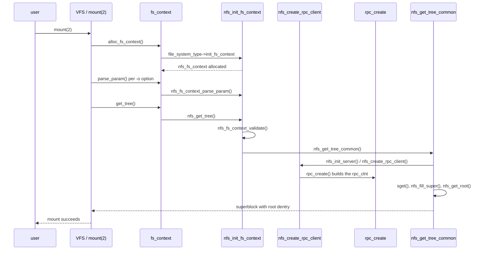

# Chapter 3 — The NFS mount flow

## 3.1 What this chapter covers

[Chapter 2](./02-rpc-multipath.md) ended with a runtime trace of a
single RPC, but it took for granted that an enfs-managed `rpc_clnt`
already existed: that `cl_enfs` was set, that `xps_iter_ops` pointed
at `enfs_xprt_iter_roundrobin`, and that the transport list under
`xps_xprt_list` already held more than one entry. This chapter
explains how all of that came to be — what happens between the user
typing

```text
mount -t nfs -o vers=3,remoteaddrs=192.0.2.10~192.0.2.11~192.0.2.12 \
    server.example.com:/export /mnt
```

and the `rpc_clnt` arriving in its enfs-managed steady state.

The flow has three structural pieces:

1. The Linux NFS mount path itself, `mount(2)` →
   `nfs_init_fs_context` → option parsing → `nfs_get_tree`. This is
   stock kernel plumbing; enfs intercepts at well-defined points
   without changing the high-level shape.
2. The propagation of an opaque `enfs_option` pointer from the
   fs_context into `nfs_client` and on into `rpc_create_args`. Five
   patches contribute to this chain (0009, 0010, 0011, 0019).
3. The post-construction work where `enfs.ko`'s `create_clnt`
   callback sets `cl_enfs`, walks the parsed IP lists, attaches a
   transport per (local, remote) pair, and finally installs the
   round-robin iterator policy that chapter 2 described.

## 3.2 The Linux NFS mount path at 30,000 ft

A bird's-eye view of the unmodified flow, before enfs touches it:



The user-facing relevant points: `init_fs_context` runs once per
mount and allocates the per-mount `nfs_fs_context` (defined in
`fs/nfs/internal.h`); `parse_param` runs once per `-o` option;
`get_tree` runs once after all options have been parsed and is
responsible for actually building the rpc_clnt and superblock.
Failures at any step bubble back to `mount(2)` as `-EINVAL` /
`-ENOMEM` / etc.

The two structures that matter for enfs:

- `struct nfs_fs_context` — the *transient* per-mount state, lives
  for the duration of `mount(2)`. enfs adds a `void *enfs_option`
  field to it (patch 0009).
- `struct nfs_client` — the *persistent* per-server state, shared
  across all mounts of the same server in the same network
  namespace. It owns the rpc_clnt. enfs adds a `void
  *cl_multipath_data` field to it (patch 0007), which the adapter
  layer populates from `nfs_client_initdata::enfs_option`
  (patch 0019).

## 3.3 Option parsing: where enfs interposes

Stock Ubuntu ships
[`vendor/ubuntu-7.0/fs/nfs/fs_context.c`](../../vendor/ubuntu-7.0/fs/nfs/fs_context.c)
with an `Opt_*` enum (around line 96) and a `nfs_fs_parameters[]`
table (around line 210) listing every `-o`-recognised name.
Patch 0011 adds five new tokens to the enum, all under
`#if IS_ENABLED(CONFIG_ENFS)`:

```c
Opt_remote_addrs,
Opt_local_iplist,
Opt_enfs_info,
Opt_slookupcache,
Opt_alookupcache,
```

and matching `fsparam_string` entries to the parameters table:

```c
fsparam_string("localaddrs",   Opt_local_iplist),
fsparam_string("remoteaddrs",  Opt_remote_addrs),
fsparam_string("enfs_info",    Opt_enfs_info),
fsparam_string("slookupcache", Opt_slookupcache),
fsparam_string("alookupcache", Opt_alookupcache),
```

The `Opt_*` token chosen by the parser is then looked up in the big
switch inside `nfs_fs_context_parse_param`. Patch 0011 inserts
five new cases:

```c
#if IS_ENABLED(CONFIG_ENFS)
case Opt_local_iplist:
case Opt_remote_addrs:
        switch (enfs_parse_mount_options(getNfsMultiPathOpt(opt),
                                         param->string, ctx, fc)) {
        case 0:        break;
        case -ENOMEM:  goto out_nomem;
        case -ENOSPC:  goto out_limit;
        case -EINVAL:  goto out_invalid_address;
        case -EOPNOTSUPP: goto out_invalid_address;
        }
        break;
case Opt_enfs_info:
case Opt_slookupcache:
case Opt_alookupcache:
        break;
#endif
```

Two things are happening here:

- `Opt_local_iplist` and `Opt_remote_addrs` are forwarded to
  `enfs_parse_mount_options`, the adapter wrapper in
  [`vendor/openeuler/fs/nfs/enfs_adapter.c:80`](../../vendor/openeuler/fs/nfs/enfs_adapter.c).
  That wrapper is where `enfs.ko` is autoloaded if it isn't already
  present (`request_module("enfs")` — see chapter 1 §1.3.1). Once
  the module is loaded it dispatches to
  `nfs_multipath_parse_options`
  ([`enfs_multipath_parse.c:605`](../../vendor/openeuler/fs/nfs/enfs/enfs_multipath_parse.c)),
  which allocates a `struct multipath_mount_options` on first call
  and populates either `local_ip_list` or `remote_ip_list`
  depending on the `enum nfsmultipathoptions` argument
  (`LOCALADDR` or `REMOTEADDR`).
- `Opt_enfs_info`, `Opt_slookupcache` and `Opt_alookupcache` are
  *accepted but ignored* at parse time. The fall-through `break`
  is deliberate — the tokens exist so old `mount.nfs` invocations
  using the legacy `enfs_info=` syntax aren't rejected, but the
  actual semantic content is in `remoteaddrs=` / `localaddrs=`.

The `getNfsMultiPathOpt` helper, also added by patch 0011, is the
small bridge that maps the parser's opcode back to the enum the
adapter expects:

```c
enum nfsmultipathoptions getNfsMultiPathOpt(int token)
{
        switch (token) {
        case Opt_remote_addrs:    return REMOTEADDR;
        case Opt_local_iplist:    return LOCALADDR;
        default:                  break;
        }
        return INVALID_OPTION;
}
```

(`enum nfsmultipathoptions` is declared in
[`vendor/openeuler/fs/nfs/enfs_adapter.h:15`](../../vendor/openeuler/fs/nfs/enfs_adapter.h):
`REMOTEADDR`, `LOCALADDR`, `REMOTEDNSNAME`, `REMOUNTREMOTEADDR`,
`REMOUNTLOCALADDR`, `INVALID_OPTION`. `REMOUNT*` and `REMOTEDNSNAME`
are reserved for the live-remount and DNS-rebind flows in
[chapter 10](./10-remount-procfs-dns.md) and don't appear in the
parse-time switch.)

### 3.3.1 The `enfs_info=` no-op

It surprises new readers that `enfs_info=` is a documented syntax
([`docs/user/03-mount-syntax.md`](../user/03-mount-syntax.md)) and
yet has no parser action. The history is: in OpenEuler, the
original mount syntax was

```text
mount -t nfs -o enfs_info='remoteaddrs=A,localaddrs=B' ...
```

— a single option whose value carried a sub-syntax. The current
code splits that out into top-level `remoteaddrs=` / `localaddrs=`
options, so the parser sees them as ordinary `fsparam_string`
parameters. The `enfs_info` token is kept in the table purely so
old `/etc/fstab` lines and old `mount.nfs` shell wrappers don't
fail with "unknown option". The block of options that used to live
inside `enfs_info='...'` is now split up by the user-space tooling
or by the user, and only the specific keys we care about
(`remoteaddrs`, `localaddrs`) actually do anything.

## 3.4 The `enfs_option` propagation chain

The pointer hops three structs on its way from the mount-syscall
context to the rpc_clnt's `create_clnt` callback. Each hop is one
or two lines added by a patch:

```mermaid
flowchart LR
    P[mount(2) parser] --> CTX[ctx->enfs_option<br/>nfs_fs_context]
    CTX -->|patch 0019: nfs_init_server| INIT[cl_init->enfs_option<br/>nfs_client_initdata]
    INIT -->|patch 0019: nfs_create_rpc_client| ARGS[args.multipath_option<br/>rpc_create_args]
    ARGS -->|patch 0013: rpc_multipath_ops_create_clnt| CB[enfs_create_multi_xprt]
    CB --> CL[clnt->cl_enfs = 1]
```

The lifetime story:

- **Allocation** happens inside
  `nfs_multipath_parse_options`, which calls
  `nfs_multipath_alloc_options` to `kzalloc` a
  `struct multipath_mount_options` plus its inner
  `nfs_ip_list` / `enfs_route_dns_info` blocks. The pointer is
  written through to `*enfs_option`, where the caller is
  `&ctx->enfs_option` from inside the adapter wrapper.
- **First hop**, `ctx → cl_init`: patch 0019 adds, in the struct
  initialiser inside `nfs_init_server`:

  ```c
  struct nfs_client_initdata cl_init = {
          ...
          #if IS_ENABLED(CONFIG_ENFS)
          .enfs_option = ctx->enfs_option,
          #endif
  };
  ```

- **Second hop**, `cl_init → args`: patch 0019 also adds, in the
  initialiser inside `nfs_create_rpc_client`:

  ```c
  struct rpc_create_args args = {
          ...
          #if IS_ENABLED(CONFIG_ENFS)
          .multipath_option = cl_init->enfs_option,
          #endif
  };
  ```

- **Third hop**, `args → enfs.ko`: when SunRPC finishes constructing
  the rpc_clnt, the patched `clnt.c` runs

  ```c
  rpc_multipath_ops_create_clnt(args, clnt);
  ```

  (patch 0013, line 489 of clnt.c). The adapter
  ([`sunrpc_enfs_adapter.c:132`](../../vendor/openeuler/net/sunrpc/sunrpc_enfs_adapter.c))
  inspects `args->multipath_option` and only invokes enfs if it
  is non-NULL — so the cost on a non-enfs mount is one branch.

- **Per-client backing object**: patch 0019 also calls
  `nfs_create_multi_path_client(clp, cl_init)` in
  `nfs_init_client`, *before* `nfs_create_rpc_client`. That
  adapter call ([`enfs_adapter.c:132`](../../vendor/openeuler/fs/nfs/enfs_adapter.c))
  asks enfs to allocate `clp->cl_multipath_data` (a per-server
  blob distinct from the per-mount `enfs_option`). The
  `cl_multipath_data` pointer is what survives across multiple
  mounts of the same server.

- **Free** happens through one of two paths:
  - Normal teardown: the fs_context is destroyed via
    `nfs_fs_context_free` (patch 0011 adds an
    `enfs_free_mount_options(ctx)` call before `kfree(ctx)`).
  - Remount failure: `nfs_reconfigure` (patch 0010) calls
    `enfs_free_mount_options(ctx)` if `nfs_remount_iplist` returns
    an error.

  Both paths funnel into `nfs_multipath_free_options`
  ([`enfs_multipath_parse.c:653`](../../vendor/openeuler/fs/nfs/enfs/enfs_multipath_parse.c)),
  which frees the inner lists and then the wrapping struct.

A subtle invariant: *the pointer is shared, not duplicated*. The
fs_context, the nfs_client_initdata, and the rpc_create_args all
hold the same pointer. Whoever frees first wins. In practice the
fs_context is the canonical owner — its lifetime is the mount
syscall, and enfs's `create_clnt` callback consumes the pointer
synchronously inside `rpc_create`, before the syscall returns. By
the time `nfs_fs_context_free` runs, enfs has already extracted
everything it needs.

## 3.5 Hooks inside `super.c`

Patch 0010 adds three hooks in `fs/nfs/super.c`. Each is small but
consequential.

The first is the include:

```c
#if IS_ENABLED(CONFIG_ENFS)
#include "enfs_adapter.h"
#endif
```

The second is in `nfs_reconfigure`, the remount handler. Stock
NFS would skip option-revalidation early if
`ctx->skip_reconfig_option_check` is set; patch 0010 inserts, just
after that early-exit, the call:

```c
#if IS_ENABLED(CONFIG_ENFS)
if (ctx->enfs_option) {
        int error = nfs_remount_iplist(nfss->nfs_client, ctx->enfs_option);
        if (error) {
                enfs_free_mount_options(ctx);
                return error;
        }
}
#endif
```

This is the live-remount entry point: the user runs `mount -o
remount,remoteaddrs=A~B~D /mnt` to add server D and drop server C,
the parser writes a fresh `multipath_mount_options` into
`ctx->enfs_option`, this hook hands it to enfs which diffs against
the currently-attached transports. Detail in
[chapter 10](./10-remount-procfs-dns.md).

The third is in `nfs_get_tree_common`, just after `s->s_flags |=
SB_ACTIVE`:

```c
#if IS_ENABLED(CONFIG_ENFS)
if (server)
        enfs_trigger_get_server_capability(server);
#endif
```

This kicks off an asynchronous EXTEND-op probe — enfs's NFSv3
extension that asks the server for its multipath/DNS/load-balance
capabilities. The result populates `server->enfs_flags` and is
covered in [chapter 6](./06-extend-op.md). For the mount path the
relevant fact is that this hook is one-shot, fire-and-forget, and
runs after the superblock is otherwise complete.

## 3.6 The mount-time hostname hook

There is one further hook, in `fs_context.c` itself, that doesn't
fit cleanly under "option parsing":

```c
#if IS_ENABLED(CONFIG_ENFS)
nfs_multipath_set_mount_data(&ctx->enfs_option, ctx->nfs_server.hostname);
#endif
```

(Patch 0011, inside `nfs_validate_text_mount_data` after
`nfs_parse_source` has populated `ctx->nfs_server.hostname`.) This
exists for the case where the user mounts using *only* a hostname
(no `remoteaddrs=`), and the global enfs config has DNS-based
auto-multipath enabled. The implementation is in
[`enfs_multipath_parse.c:695`](../../vendor/openeuler/fs/nfs/enfs/enfs_multipath_parse.c):

```c
void enfs_set_mount_data(void **enfs_option, const char *hostname)
{
        if (!enfs_get_config_dns_auto_multipath_resolution() ||
            !enfs_valid_dns(hostname) || is_valid_ip_address(hostname) ||
            *enfs_option) {
                return;
        }
        error = nfs_multipath_alloc_options(enfs_option);
        ...
        opt->pRemoteDnsInfo->dnsNameCount = 1;
        strscpy(opt->pRemoteDnsInfo->routeRemoteDnsList[0].dnsname,
                hostname, MAX_DNS_NAME_LEN);
}
```

So if the system administrator has flipped on
`dns_auto_multipath_resolution` and the user mounts
`server.example.com:/export` *without* `remoteaddrs=`, enfs
synthesises an `enfs_option` with the hostname as a single DNS
entry. The DNS rebind worker
([`dns_process.c`](../../vendor/openeuler/fs/nfs/enfs/dns_process.c))
will later resolve that to a list of IPs and add transports for
each.

If the global config has the feature off (the default), or the
user did supply `remoteaddrs=`, this is a no-op.

## 3.7 Walking through one full mount

Imagine the user runs:

```text
mount -t nfs -o vers=3,nconnect=1,\
remoteaddrs=192.0.2.10~192.0.2.11~192.0.2.12 \
  server.example.com:/export /mnt
```

(The `~` is the IP-list separator enfs uses.) Step by step:

1. **`mount(2)` → `nfs_init_fs_context`**. The kernel allocates a
   `struct nfs_fs_context`. Patch 0011 added `ctx->enfs_option =
   NULL` to the constructor (the hunk lands inside
   `nfs_init_fs_context`'s field-by-field zero-init block).
2. **Per-option `parse_param`**. The first time `Opt_remote_addrs`
   is seen, the patched switch calls `enfs_parse_mount_options`
   ([`enfs_adapter.c:80`](../../vendor/openeuler/fs/nfs/enfs_adapter.c)).
3. **First call: `enfs.ko` autoload**. The adapter sees its `__rcu`
   pointer is NULL, takes the `enfs_module_mutex`, calls
   `request_module("enfs")`. depmod has already been refreshed by
   DKMS-install so this finds `/lib/modules/$KVER/updates/.../enfs.ko`,
   `enfs.ko`'s `init_enfs`
   ([`enfs_init.c:91`](../../vendor/openeuler/fs/nfs/enfs/enfs_init.c))
   runs and registers `enfs_adapter_ops` (the NFS side) and
   `rpc_multipath_ops` (the SunRPC side, from
   `enfs_multipath_init` at
   [`enfs_multipath.c:1083`](../../vendor/openeuler/fs/nfs/enfs/enfs_multipath.c)).
4. **`nfs_multipath_parse_options(REMOTEADDR, "192.0.2.10~192.0.2.11~192.0.2.12", &ctx->enfs_option, net_ns)`**.
   Allocates a fresh `multipath_mount_options` and writes the
   pointer back through `ctx->enfs_option`. Then enters
   `enfs_parse_remoteaddrs`
   ([`enfs_multipath_parse.c:451`](../../vendor/openeuler/fs/nfs/enfs/enfs_multipath_parse.c)),
   which decides between IP-list and DNS-list parsing — for our
   input, IP-list. `nfs_multipath_parse_ip_list` then splits on
   `~`, validates each address with `rpc_pton`, and appends to
   `options->remote_ip_list->address[]`. After three addresses,
   `options->remote_ip_list->count == 3`.
5. **`nfs_get_tree`**. Validates options
   (`nfs_fs_context_validate`), inside which
   `nfs_validate_text_mount_data` runs the
   `nfs_multipath_set_mount_data` hook (no-op here because
   `*enfs_option` is already non-NULL).
6. **`nfs_get_tree_common`** in super.c. Reaches
   `nfs_init_server`, which builds a `struct nfs_client_initdata`.
   Patch 0019's hunk copies `ctx->enfs_option` into
   `cl_init.enfs_option`.
7. **`nfs_get_client(&cl_init, ...)`** finds-or-creates a
   `struct nfs_client`. If creating, `nfs_init_client` is called,
   which (per patch 0019) calls `nfs_create_multi_path_client(clp,
   cl_init)`. The adapter asks `enfs.ko`'s
   `nfs_multipath_client_info_init`
   ([`enfs_multipath_client.c`](../../vendor/openeuler/fs/nfs/enfs/enfs_multipath_client.c))
   to allocate `clp->cl_multipath_data` based on the parsed IP
   list.
8. **`nfs_create_rpc_client`** is called; patch 0019's hunk threads
   `cl_init->enfs_option` into the `rpc_create_args.multipath_option`
   field.
9. **`rpc_create`** in `sunrpc.ko/clnt.c` builds the rpc_clnt and
   the initial `rpc_xprt`. The "main" xprt is created using just
   the original mount address (the result of
   `nfs_server.hostname` resolution); enfs has not added the extras
   yet.
10. **Patched `clnt.c`** calls `rpc_multipath_ops_create_clnt(args,
    clnt)`. The SunRPC adapter sees a non-NULL
    `args->multipath_option` and forwards to enfs's
    `enfs_create_multi_xprt`.
11. **`enfs_create_multi_xprt`**
    ([`enfs_multipath.c:919`](../../vendor/openeuler/fs/nfs/enfs/enfs_multipath.c))
    runs:
    - If `args->version == 4` it returns immediately — NFSv4 has
      its own session multipath model and enfs's NFSv3 round-robin
      doesn't apply. For our example `version == 3` so we
      continue.
    - Allocates a deep copy of the `rpc_create_args` and a
      `xprts_options_and_clnt` wrapper.
    - Calls `alloc_main_xprt_multicontext` to attach an
      `enfs_xprt_context` to the existing `clnt->cl_xprt` (the
      main xprt) and sets its `path_state` to `PM_STATE_NORMAL` —
      this is the second of the two `PM_STATE_NORMAL` callsites
      from chapter 2 §2.6.
    - Calls `enfs_multipath_create_thread` (despite the name, it
      runs synchronously in the mount context; the name is a
      historical artefact).
12. **`enfs_multipath_create_thread`**
    ([`enfs_multipath.c:823`](../../vendor/openeuler/fs/nfs/enfs/enfs_multipath.c)):
    - If `mount_options->pRemoteDnsInfo->dnsNameCount != 0`, runs
      DNS resolution to expand any DNS entries into IPs. Our input
      had no DNS entries so this is skipped.
    - Calls `enfs_config_xprt_create_args` to populate an
      `xprt_create` struct from the rpc_create_args.
    - Calls `enfs_fill_empty_iplist` — if `local_ip_list` is empty
      (it is, in our example), and `enfs_get_config_ip_filters_count`
      is non-zero, enumerates local interfaces with
      `find_fill_local_addr` to auto-populate the list. With the
      default config and a single-NIC test machine the list ends
      up with one local address.
    - Calls `enfs_proc_create_clnt` to register a `/proc/enfs/`
      entry for this client (chapter 10).
    - **Sets `create_args->clnt->cl_enfs = 1`** at line 871 — the
      single bit-set that everything in chapter 2 was waiting for.
    - Calls `enfs_xprt_ippair_create`
      ([`enfs_multipath.c:638`](../../vendor/openeuler/fs/nfs/enfs/enfs_multipath.c)),
      which dispatches to either `enfs_combine_addr` (when local
      addresses were given) or `enfs_combine_addr_with_no_local`.
13. **`enfs_combine_addr` or `enfs_combine_addr_with_no_local`**.
    The "combine" function walks the (local × remote) Cartesian
    product (or just remotes when there is no local list),
    skipping pairs that don't match address family or that
    duplicate an already-existing xprt. For each survivor it
    calls `enfs_configure_xprt_to_clnt`
    ([`enfs_multipath.c:315`](../../vendor/openeuler/fs/nfs/enfs/enfs_multipath.c)),
    which calls `rpc_clnt_add_xprt` with `enfs_add_xprt_setup` as
    the per-add callback. `enfs_add_xprt_setup`
    ([`enfs_multipath.c:283`](../../vendor/openeuler/fs/nfs/enfs/enfs_multipath.c))
    initialises the new xprt's `enfs_xprt_context` (sets
    `path_state = PM_STATE_INIT`), then queues an asynchronous
    ping via `pm_ping_rpc_test_xprt_with_callback`. The setup
    callback returns 1 to *stop* `rpc_clnt_add_xprt` from doing the
    actual switch-add — enfs will do that itself once the ping
    callback fires and confirms the path is reachable.
14. **`enfs_combine_addr` waits** on a `wait_queue_head_t` until
    every queued ping has called the callback (decrementing an
    atomic). The callback (`pm_xprt_ping_callback`,
    [`enfs_multipath.c:275`](../../vendor/openeuler/fs/nfs/enfs/enfs_multipath.c))
    just decrements and wakes; the actual state update happens
    inside `pm_ping_call_done`
    ([`pm_ping.c`](../../vendor/openeuler/fs/nfs/enfs/pm_ping.c)).
15. **`enfs_add_xprts_to_clnt`** is then called
    ([`enfs_multipath.c:440`](../../vendor/openeuler/fs/nfs/enfs/enfs_multipath.c)),
    which iterates the now-pinged xprts. For each one whose
    `pm_get_path_state` returns a connected state and which fits
    under the per-mount link-count limit
    (`enfs_get_config_link_count_per_mount`), it calls
    `enfs_xprt_switch_add_xprt`
    ([`enfs_multipath.c:410`](../../vendor/openeuler/fs/nfs/enfs/enfs_multipath.c))
    which takes `xps->xps_lock` and runs
    `xprt_switch_add_xprt_locked` (one of the helpers exported by
    patch 0017).
16. **`enfs_lb_set_policy(clnt, NULL)`**
    ([`enfs_roundrobin.c:264`](../../vendor/openeuler/fs/nfs/enfs/enfs_roundrobin.c))
    runs at the very end of `enfs_xprt_ippair_create`. With
    `cl_enfs == 1` (set in step 12) it installs
    `enfs_xprt_iter_roundrobin` as `xps->xps_iter_ops`. From this
    moment the rpc_clnt is in the steady state chapter 2
    described.
17. **`nfs_get_tree_common` continues**: `nfs_fill_super`,
    `nfs_get_root` resolve the root dentry. `s->s_flags |=
    SB_ACTIVE` runs; immediately afterwards the patched code calls
    `enfs_trigger_get_server_capability(server)`, which queues an
    asynchronous EXTEND op on the now-multipath rpc_clnt. The
    EXTEND op result populates `server->enfs_flags` (chapter 6).
18. **`mount(2)` returns** to the user. The mount is live; the
    rpc_clnt has 4 transports attached (the original + 3 from
    `remoteaddrs=`); subsequent NFSv3 RPCs round-robin across
    them via the path traced in chapter 2.

The total elapsed time is dominated by step 14's wait for ping
completion — typically a few hundred milliseconds on a healthy LAN.
Failures along the way: a remote IP that times out gets
`PM_STATE_FAULT` set in step 15 and is skipped (step 15 won't add
it to the switch), so a typo'd IP in `remoteaddrs=` doesn't fail
the mount, it just produces a lower-fanout multipath set.

## 3.8 The transport-attach loop in detail

A common confusion among first-time readers is *how many transports
end up attached*. The Cartesian product in `enfs_combine_addr` is
bounded by three things: address-family compatibility (skip
`(local-v4, remote-v6)` pairs), the per-mount limit
(`enfs_get_config_link_count_per_mount`, default 8), and the global
limit (`enfs_get_config_link_count_total`, default 512 across all
mounts).

The bookkeeping for those limits lives in `enfs_link_count_add`
([`enfs_multipath.c:69`](../../vendor/openeuler/fs/nfs/enfs/enfs_multipath.c))
and `enfs_mount_count_add` (line 127), both protected by their own
spinlocks. The global counters are how enfs prevents an
adversarial `remoteaddrs=` line with thousands of IPs from running
the kernel out of `rpc_xprt` allocations.

The "main xprt" (the one created by stock `rpc_create` from the
original mount address) is *also* an enfs-managed xprt after
`alloc_main_xprt_multicontext` runs in step 11; its
`enfs_xprt_context.main` field is set to true. Whether the main
xprt participates in round-robin depends on a runtime config knob:
`enfs_get_native_link_io_status`. The round-robin iterator
([`enfs_roundrobin.c:69`](../../vendor/openeuler/fs/nfs/enfs/enfs_roundrobin.c))
checks:

```c
if (!nativeLinkStatus && enfs_is_main_xprt(pos))
        continue;
```

so when "native link IO" is disabled (config-controlled), the main
xprt is excluded from round-robin and only the explicit
`remoteaddrs=` paths carry data RPCs. This is useful when the main
mount address is, say, a load-balancer VIP that should not also
receive raw NFS traffic.

## 3.9 The EXTEND-op hook

Step 17 above mentions `enfs_trigger_get_server_capability` without
detail. The mechanism is: the adapter
([`enfs_adapter.c:276`](../../vendor/openeuler/fs/nfs/enfs_adapter.c))
forwards to enfs's `trigger_get_capability` op
(`enfs_trigger_get_capability` in
[`enfs_lookup_cache.c:340`](../../vendor/openeuler/fs/nfs/enfs/enfs_lookup_cache.c)),
which queues an NFSv3 EXTEND op (`NFS3PROC_EXTEND` — see
[`exten_call.c`](../../vendor/openeuler/fs/nfs/enfs/exten_call.c))
asking the server for its FS-info, LIF view, DNS info and LS
version. The reply, when it comes back, populates per-server
metadata that influences shard routing and DNS rebind.

The EXTEND op is *not part of standard NFSv3*. It uses a procedure
number (`NFS3PROC_EXTEND`) that OpenEuler's NFS server understands
and stock servers do not. Against a stock NFSv3 server the EXTEND
RPC is rejected with `NFS3ERR_NOTSUPP` and enfs falls back to
basic round-robin without the OpenEuler-specific server hints. The
test plan in
[`docs/PORTING-NOTES.md`](../PORTING-NOTES.md) flags this as a
runtime risk for non-OpenEuler servers; in practice the round-robin
plus pm_ping logic still works fine without EXTEND.

The full EXTEND wire format and decoder live in chapter 6.

## 3.10 What you can verify in `/sys` after a successful mount

The patch 0019 commit message mentions checking
`/sys/kernel/sunrpc/xprt-switches/switch-X/xprt_switch_info` for
`num_xprts=N`. That sysfs interface is stock SunRPC plumbing
(`net/sunrpc/sysfs.c`); enfs doesn't add to it but it benefits
from it directly. After the mount above, on a system with three
working remote IPs:

```text
$ ls /sys/kernel/sunrpc/xprt-switches/
switch-0  switch-1
$ cat /sys/kernel/sunrpc/xprt-switches/switch-1/xprt_switch_info
num_xprts=4
num_active=4
queue_len=0
```

(`switch-1` would be ours; `switch-0` is the rpcbind clnt or
similar.) `num_xprts=4` is the original main xprt plus three
`remoteaddrs=` paths. enfs's own `/proc` interface
(`/proc/enfs/<clnt>/...`) gives a richer view including each
xprt's `path_state` and per-xprt I/O counters; that's covered in
chapter 10.

## 3.11 Cross-references and what comes next

This chapter has reached the start of [chapter 2's](./02-rpc-multipath.md)
trace: an rpc_clnt with `cl_enfs == 1`, `xps_iter_ops =
enfs_xprt_iter_roundrobin`, and N transports attached, all in
`PM_STATE_NORMAL`. From here:

- The runtime per-RPC dispatch is chapter 2 (already read).
- What pm_ping does to keep `path_state` correct, and how the
  transitions actually fire, is [chapter 4](./04-pm-ping-state.md).
- What happens when an in-flight RPC fails — `failover_handle`,
  retry logic, the `RPC_TASK_ENFS` flag — is
  [chapter 5](./05-failover.md).
- The wire-level details of the EXTEND op kicked off in step 17,
  including the XDR encoder/decoder added by patch 0012, are
  [chapter 6](./06-extend-op.md).
- The locking and refcount discipline that keeps the multi-CPU
  mount path safe (the wait queue in step 14 is the headline; the
  RCU usage in step 15 is the subtle one) is
  [chapter 7](./07-locking-refcounts.md).
- The live-remount path that re-enters `nfs_reconfigure` (step 5
  of patch 0010 in §3.5) and uses the `REMOUNTREMOTEADDR` /
  `REMOUNTLOCALADDR` enum values — and the DNS-rebind worker
  triggered by the `enfs_set_mount_data` hook in §3.6 — are
  [chapter 10](./10-remount-procfs-dns.md).

The `__GENKSYMS__` guards mentioned around patches 0005, 0007 and
0009 are conceptually a separate topic; if you've been wondering
"how does adding a field to `struct rpc_clnt` not break stock
`lockd`?", that is the entire subject of
[chapter 9](./09-genksyms-crc.md).
