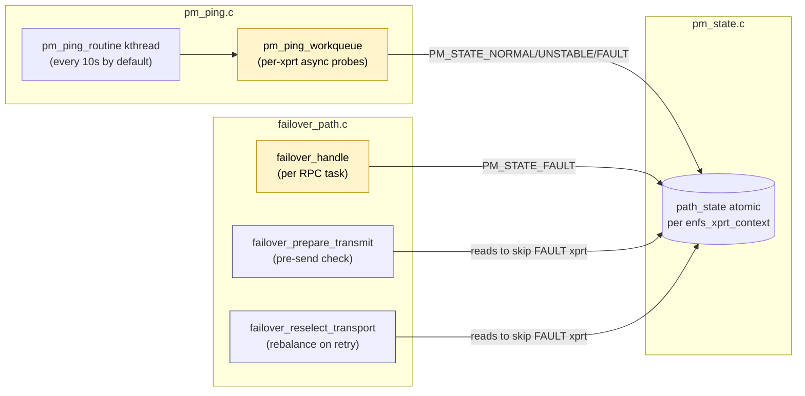
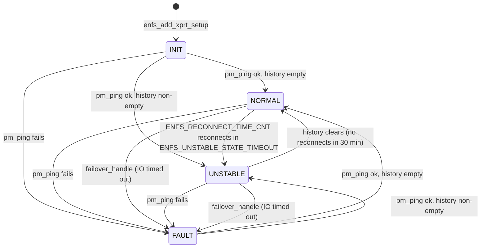
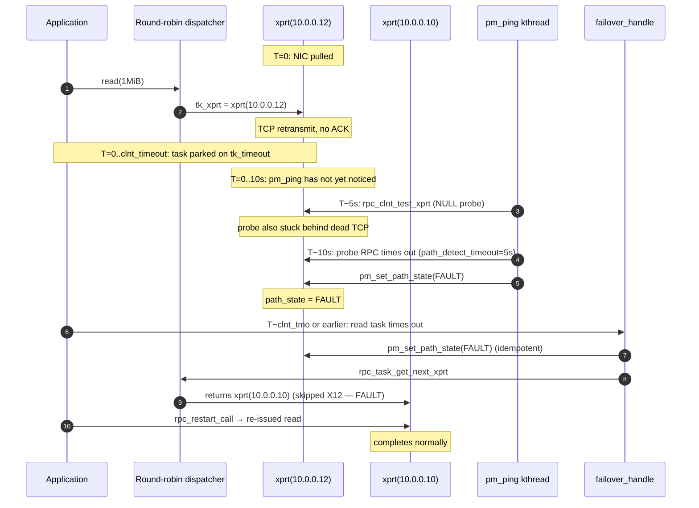

# Chapter 5 — The path manager: liveness, state, and failover

> **Where this fits.** Chapter 4 ended with a freshly-built multipath
> client: `cl_enfs == 1`, N transports attached to one
> `rpc_xprt_switch`, and the round-robin iter ops swapped in. So far
> nothing has actually *moved* a task from one xprt to another. This
> chapter covers the three files that detect and react to path
> failures:
>
> - `pm_ping.c` — periodic liveness probes
> - `pm_state.c` — the per-xprt PM state machine
> - `failover_path.c` — the per-RPC-task failover decisions
>
> Plus the timeout shortening that gives failover a chance to fire in
> the first place: `failover_time.c`.
>
> All four files are part of `enfs.ko`. None of them touch `sunrpc.ko`
> or `nfs.ko` directly — they react via the `rpc_multipath_ops` vtable
> registered at module init (chapter 4 §4.3). Locking interactions
> with the SunRPC scheduler are deferred to chapter 7.

## 5.1 The three actors

Think of the path manager as three loosely-coupled subsystems with
a shared piece of state — the `path_state` field on each
`enfs_xprt_context` (chapter 4 §4.4). Each subsystem reads and
writes this field, and it's the only synchronisation between them.



Two things flow only one way: **`pm_ping` is the only thing that
clears `PM_STATE_FAULT`** (by promoting the xprt back to NORMAL or
UNSTABLE), and **`failover_handle` is the only thing in the IO
path that sets `PM_STATE_FAULT`**. The dispatcher (chapter 4 §4.6)
is purely a reader — it never writes state.

## 5.2 The state machine

Five states, defined at `pm_state.h:12-18`:

```c
enum enfs_path_state {
    PM_STATE_INIT,        // freshly added; no probe yet
    PM_STATE_NORMAL,      // last probe succeeded, history is stable
    PM_STATE_UNSTABLE,    // recently reconnected; probationary
    PM_STATE_FAULT,       // last probe or last IO failed
    PM_STATE_UNDEFINED    // not a multipath xprt (no reserve_context)
};
```

`enfs_is_path_connected` (`pm_state.h:23`) classifies NORMAL and
UNSTABLE as "connected" — both are usable by the round-robin
dispatcher. FAULT is not.

Transitions:



The "reconnect history" is a small ring buffer of timestamps inside
the `enfs_xprt_context`, sized at `ENFS_RECONNECT_TIME_CNT + 1` = 4
slots (`enfs.h:37`, `:54-60`). Every time pm_ping observes a
changed `xprt->connect_cookie` (i.e. SunRPC opened a new socket
underneath), the cookie's timestamp is pushed onto the ring. If
the ring fills up *and* the oldest entry is younger than
`ENFS_UNSTABLE_STATE_TIMEOUT` (30 minutes — `enfs.h:36`), the path
is considered "thrashing" and stays UNSTABLE even when the
individual probe succeeds. The decision tree at `pm_ping.c:183-189`
spells it out:

```c
is_normal = curr_state == PM_STATE_INIT ||
            (is_empty   && curr_state == PM_STATE_UNSTABLE) ||
            (!is_full   && curr_state == PM_STATE_NORMAL);
if (is_normal)
    pm_set_path_state(xprt, PM_STATE_NORMAL);
else
    pm_set_path_state(xprt, PM_STATE_UNSTABLE);
```

In other words: a path is NORMAL only if its reconnect ring has
drained. `enfs_test_reconnect_time` (`pm_ping.c:196`, gated on
`CONFIG_ENFS_KUNIT_TEST`) walks through the four edge cases as a
unit test.

The authoritative writer is `pm_set_path_state(xprt, state)`
(`pm_state.c:74`). It's an `atomic_set` under an `xprt_get/put`
pair; the only side-effect besides the state mutation is a one-line
log at INFO level reporting the transition with the formatted
local/remote IPs (line 120-122). Chapter 7 covers the locking
properties — for now the takeaway is that state transitions are
RCU-safe and lock-free, and reads can race with writes (we
explicitly accept that — pm_ping running concurrently with
failover_handle setting FAULT can cause one redundant probe).

## 5.3 `pm_ping`: the liveness prober

### Init

`pm_ping_init` (`pm_ping.c:526`) is called as the first sub-init
from `init_enfs` (chapter 4 §4.2). It does two things:

1. `pm_ping_workqueue_init` (line 492) creates a
   `create_workqueue("pm_ping_workqueue")`. This is the workqueue
   that executes the per-xprt probe RPCs.
2. `pm_ping_start` (line 480) launches `pm_ping_timer_thread`, a
   bare kthread running `pm_ping_routine`.

### The routine

`pm_ping_routine` (line 462) is the dead-simple periodic loop:

```c
while (!kthread_should_stop()) {
    interval_ms = enfs_get_config_path_detect_interval() * 1000;
    if (enfs_get_config_multipath_state() == ENFS_MULTIPATH_ENABLE
        && enfs_timeout_ms(&start, interval_ms)) {
        start = ktime_get();
        pm_ping_loop_sunrpc_net();
    }
    enfs_msleep(1000);
}
```

Default interval: 10 seconds (`DEFAULT_PATH_DETECT_INTERVAL` at
`enfs_config.c:40`). Configurable via
`/etc/enfs/config.ini`'s `path_detect_interval=` knob between 5 and
300 seconds. The 1-second sleep inside the loop is a polling
granularity for the `kthread_should_stop()` check on module exit;
not the probe rate.

### What gets probed

`pm_ping_loop_sunrpc_net` (line 447) walks every netns via
`for_each_net_rcu`. For each one, it grabs the `sunrpc_net` and
calls `pm_ping_loop_rpclnt`, which walks `sn->all_clients` filtered
by `cl_enfs == 1` (line 436), and for each enfs client calls
`rpc_clnt_iterate_for_each_xprt(clnt, pm_ping_execute_xprt_test, ...)`.
That terminates at `pm_ping_add_work` (line 339), which queues a
work item onto `ping_execute_workq` if the per-xprt
`path_check_state` is `INIT` or `FINISH` and the
`ENFS_PM_PING_TMIE_OUT = 3` second cooldown has elapsed since the
last probe (line 367-370).

### What the probe IS

A `pm_ping_execute_work` (line 309) handler picks up the work item
and calls:

```c
ret = rpc_clnt_test_xprt(work_info->clnt, work_info->xprt,
                         &pm_ping_set_status_ops, NULL,
                         RPC_TASK_ASYNC | RPC_TASK_FIXED);
```

`rpc_clnt_test_xprt` (added by patch 0020 — implementation lives in
our patched `net/sunrpc/clnt.c`) runs an **RPC NULL probe** against
the targeted xprt. NULL probe = procedure 0 of the bound program;
empty arg, empty result, "are you there?". The `RPC_TASK_FIXED`
flag pins the probe to that exact xprt (it would otherwise re-pick
via the iterator and probe the wrong one); `RPC_TASK_ASYNC` makes
the call non-blocking.

The completion callback is `pm_ping_call_done` (line 274):

```c
static void pm_ping_call_done(struct rpc_task *task, void *data)
{
    struct rpc_xprt *xprt = task->tk_xprt;
    atomic_dec(&check_xprt_count);
    if (task->tk_status >= 0) {
        enfs_check_reconnect(xprt);              // promote NORMAL or UNSTABLE
    } else {
        set_xprt_close_wait(xprt);               // force socket teardown
        pm_set_path_state(xprt, PM_STATE_FAULT); // mark dead
    }
    pm_ping_set_path_check_state(xprt, PM_CHECK_FINISH);
    ...
}
```

So **a single failed NULL probe is enough to flip a path to FAULT**.
There is no "three strikes" threshold. The 3-second cooldown plus
the per-thread 10-second probe cadence means a flap-in-recovery
test (e.g. ifup/ifdown loop) can produce up to ~6
state changes per minute on each affected xprt.

The `set_xprt_close_wait` call (line 106) sets the
`XPRT_CLOSE_WAIT` bit on the SunRPC xprt, which causes the SunRPC
state machine to tear down and reconnect the underlying socket on
the next IO attempt. So after a probe fails:

- `path_state = FAULT` → dispatcher will skip this xprt
- `XPRT_CLOSE_WAIT` set → next IO attempt (probably the next pm_ping)
  reopens the socket
- If the reopen succeeds and the next NULL probe returns OK, the
  state goes back to NORMAL (or UNSTABLE if the reconnect ring has
  remembered enough churn).

### `path_check_state` — the secondary state field

There is a *second* per-xprt state field, `path_check_state`, with
its own enum (`pm_ping.h:11-17`):

```c
enum enfs_pm_check_state {
    PM_CHECK_INIT,      // never queued
    PM_CHECK_WAITING,   // queued, work not yet running
    PM_CHECK_CHECKING,  // RPC in flight
    PM_CHECK_FINISH,    // last probe finished
    PM_CHECK_UNDEFINE,
};
```

This is a workqueue-internal "is a probe currently in flight for
this xprt?" flag. It exists so `pm_ping_add_work` can dedupe (line
372): if a probe is already WAITING or CHECKING, don't queue
another one even if the cadence says we're due. Don't conflate it
with `path_state`; they live in different fields and have different
purposes.

## 5.4 `pm_set_path_state` — the only state-machine writer

The function is small (`pm_state.c:74-126`). It has three jobs:

1. Compare-and-set under `xprt_get/put` so the xprt can't disappear
   mid-write.
2. Skip the write if the state is already what we're asking for —
   this is what makes the log spam tolerable when many calls converge
   on the same state.
3. Format the local and remote IPs and emit a single INFO log line
   per genuine transition.

That's it. There are no callbacks, no notifier chain. Anything
that wants to *react* to a state change has to poll — and the only
poller is the dispatcher (`enfs_xprt_is_active` in
`enfs_roundrobin.c:26`).

The "what triggers each transition" question therefore reduces to
"who calls `pm_set_path_state` and with what argument". The full
list:

| caller | new state | when |
|---|---|---|
| `enfs_add_xprt_setup` (multipath.c:299) | INIT | xprt being added to a clnt |
| `set_main_xprt_ctx` (multipath.c:893) | NORMAL | the main xprt at mount time, bypasses INIT |
| `pm_ping_call_done` (pm_ping.c:285) | FAULT | NULL probe failed |
| `enfs_check_reconnect` (pm_ping.c:187/189) | NORMAL or UNSTABLE | NULL probe succeeded |
| `failover_handle` (failover_path.c:192) | FAULT | an IO RPC timed out |

## 5.5 `failover_init_task_req`: the per-task hook

Three of the `rpc_multipath_ops` vtable entries fire on every RPC
task. The most important is `init_task_req`, called by the patched
`call_reserveresult` path in our SunRPC `clnt.c`:

```c
ops = rpc_multipath_ops_get();
if (ops && ops->init_task_req)
    ops->init_task_req(task, req);
```

For us that lands in `failover_init_task_req`
(`failover_time.c:75`). The function does two things:

1. **Confirms this clnt is enfs-managed**, via
   `failover_is_enfs_clnt` (failover_com.h:9). That helper walks
   `cl_parent` to the root of the clnt tree (NFSv4 has parent/child
   clnts for the rootfh and per-volume cases) and checks `cl_enfs`
   on the root. This is why an NFSv4 sub-clnt of an enfs-tagged
   parent still gets the failover treatment.

2. **Shortens the RPC timeout** to `multipath_timeout` from the
   config (`enfs_get_config_multipath_timeout`, default 0). When the
   config knob is 0, we fall back to the clnt's own `cl_timeout->
   to_initval`. The shortening logic at line 53-58:

   ```c
   if (task->tk_timeout != 0)
       task->tk_timeout = task->tk_timeout < tmo ? task->tk_timeout : tmo;
   else
       task->tk_timeout = tmo;
   ```

   The point is: a stock NFS task has a multi-second timeout, possibly
   tens of seconds for a soft mount. With multipath, we want to give
   up *much* sooner so we can re-aim at a different path. For pm_ping
   tasks specifically (line 102-105), the timeout is set to
   `path_detect_timeout` (default 5s) instead.

`failover_init_task_req` does NOT redirect the task. It only touches
the timeout. The task's `tk_xprt` was already set by the dispatcher's
`xpi_next` call before we got here.

> **The pitfall the task description asks about:** "what if we
> redirect to a DOWN xprt?". This question applies to `failover_handle`
> and `failover_reselect_transport`, not `init_task_req`. We cover it
> in §5.7.

## 5.6 `failover_handle`: when an IO times out

`failover_handle` (`failover_path.c:183`) is called from our patched
SunRPC `call_status` / `call_decode` paths whenever an RPC task ends
in a timeout-style error. It runs on the RPC scheduler context (a
workqueue thread).

```c
void failover_handle(struct rpc_task *task)
{
    int ret = failover_check_task(task);              // 1: enfs-managed?
    if (ret != 0) return;
    pm_set_path_state(task->tk_xprt, PM_STATE_FAULT); // 2: mark this path dead
    policy = failover_get_retry_policy(task);         // 3: should we retry?
    failover_retry_path_by_policy(task, policy);      // 4: do it
}
```

Step 2 is the **only** site outside of pm_ping that sets FAULT. It
unconditionally marks the xprt the task was on as dead. The
intuition: if an IO timed out, either the path is dead or it's so
slow that we'd rather treat it as dead. Either way, the next pm_ping
cycle will sort it out.

Step 3 picks one of four policies (`enfs_failover_polic` enum at
line 20-25):

- `FAILOVER_NOACTION` — for tasks that are themselves probes
  (`pm_ping_is_test_xprt_task(task)` in some branches), or for
  `RPC_TASK_FIXED` tasks (which are pinned to a specific xprt and
  must not be re-aimed).
- `FAILOVER_RETRY` — restart the call immediately on a different
  xprt. Used for read-only NFSv3 ops and for any task that was
  never sent.
- `FAILOVER_RETRY_DELAY` — restart after 3 seconds. Used for
  NFSv3 mutating ops (CREATE, MKDIR, REMOVE, RMDIR, SYMLINK, LINK,
  SETATTR, WRITE — `failover_get_nfs3_retry_policy` at line 81-94)
  and for the equivalent NFSv4 ops. The delay is to give a
  partially-applied write a chance to either commit or fail
  observably on the original path before we double-write it.
- `FAILOVER_RETURN_TIMEOUT` — bail with `-ETIMEDOUT` if the task
  has been alive longer than `path_detect_timeout`. Used for ping
  tasks themselves so a probe doesn't get retried indefinitely.

The retry mechanic in `failover_retry_path` (line 27):

```c
static void failover_retry_path(struct rpc_task *task)
{
    int ret = rpc_restart_call(task);
    if (ret == 1) {
        xprt_release(task);
        rpc_init_task_retry_counters(task);
        rpc_task_release_transport(task);
        task->tk_xprt = rpc_task_get_next_xprt(task->tk_client);
    }
}
```

`rpc_restart_call` re-arms the task to go through `call_start` again
from the top. `xprt_release` drops the slot reservation on the old
(now FAULT) xprt. `rpc_task_release_transport` clears
`task->tk_xprt`. Then we ask the iterator for a fresh xprt via
`rpc_task_get_next_xprt` — which calls our `xpi_next` (chapter 4
§4.6), which already knows to skip FAULT xprts.

### The pitfall: what if the iterator returns a FAULT xprt?

The dispatcher's filter (`enfs_xprt_is_active`,
`enfs_roundrobin.c:26`) skips xprts that are not NORMAL or UNSTABLE,
so `rpc_task_get_next_xprt` normally returns a live xprt — or the
"main" xprt as a last-resort fallback (`enfs_lb_switch_get_main_xprt`,
line 119). Edge cases:

1. **All xprts FAULT.** The fallback returns the main xprt regardless
   of state (line 138). The task hits it, times out, comes back to
   `failover_handle`, retries — relying on pm_ping eventually finding
   one alive. The task's wallclock-based `tk_majortimeo` is not reset
   between retries, so eventually `call_status` returns `-ETIMEDOUT`
   on hard mounts or the soft-mount cap kicks in. Brittle; chapter 8
   covers it as a known wart.

2. **The picked xprt went FAULT between selection and send.** Race
   window. Caught by `failover_prepare_transmit` below; costs one
   wasted scheduler trip.

3. **`RPC_TASK_FIXED` tasks** (pm_ping probes) are pinned and policy
   is forced to `FAILOVER_NOACTION` (line 137). The probe completion
   records the result normally.

`failover_prepare_transmit` (line 225) is the second-chance check
that fires immediately before bytes go on the wire — catches case 2:

```c
bool failover_prepare_transmit(struct rpc_task *task)
{
    if (failover_is_task_use_fixed_path(task)) return true;
    if (pm_get_path_state(task->tk_xprt) == PM_STATE_FAULT) {
        task->tk_status = -ETIMEDOUT;
        return false;
    }
    return true;
}
```

If the picked xprt went FAULT between the dispatcher returning it
and the bytes-on-wire moment, we synthesise an immediate `-ETIMEDOUT`
and bounce the task back through `call_status`, which routes to
`failover_handle`, which picks again. The cost is one wasted
trip through the scheduler; correctness is preserved.

## 5.7 `failover_reselect_transport` and `reselect_xprt` — the v4 cousins

`failover_reselect_transport` (`failover_path.c:247`) is a
**v4-specific** path-rebalance hook. It runs from a different site
than `failover_handle` — it's invoked on the *next* RPC after a
clnt-level event, not on a timeout. The function is structured
into two halves:

```c
void failover_reselect_transport(struct rpc_task *task, struct rpc_clnt *clnt)
{
    if (task->tk_xprt && !failover_prepare_transmit(task)) {
        reselect_xprt(task);                   // (A) emergency: current xprt is FAULT
        return;
    }
    do { ... walk to root parent_clnt ... } while (parent_clnt);
    if (task->tk_xprt && clnt->cl_vers == 4 && parent_clnt &&
        parent_clnt->cl_enfs) {
        ...                                    // (B) v4: align cursor with parent
    }
}
```

Half (A) — `reselect_xprt` (line 241) — is identical to what
`failover_retry_path` would do minus the `rpc_restart_call`. It's a
mid-flight redirect: the task has already started, but the bytes
haven't gone out yet, and we want to put it on a different xprt.
This is reachable on v3 only via the `failover_prepare_transmit`
returning false branch.

Half (B) is the part that exists only because v4 has parent/child
rpc_clnt relationships. The parent clnt has its own `xpi_cursor`,
and we want a child task to honour the parent's cursor so that all
sub-clnts of one v4 mount fan out across the same set of xprts in
sync. The `smp_load_acquire` / `smp_store_release` dance at
line 267-270 publishes the parent's cursor to the child without a
lock. Because v4 multipath is unsupported in our build, this code
is dead in practice — but it's still there because the function is
called unconditionally and the v3 path through (A) is the only one
that fires.

`reselect_xprt` itself (line 241):

```c
static void reselect_xprt(struct rpc_task *task)
{
    rpc_task_release_transport(task);
    task->tk_xprt = rpc_task_get_next_xprt(task->tk_client);
}
```

Three places reroute a task in this module:

| function | when | what's different |
|---|---|---|
| `failover_retry_path` (line 27) | from `failover_handle`, post-timeout | re-arms via `rpc_restart_call`; resets retry counters; bumps cursor |
| `reselect_xprt` (line 241) | from `failover_reselect_transport` | bumps cursor only; no restart, no counter reset |
| `failover_reselect_transport` (line 247) | called from patched SunRPC pre-send for v4 | wrapper around the two above, plus v4 parent-cursor sync |

The ordering matters because `rpc_restart_call` resets the task to
its initial state (call_start). If you only need to re-aim, not
restart, `reselect_xprt` is correct. Mixing them up causes either
duplicate IO (call done twice) or stuck tasks (restarted with a
stale cursor).

## 5.8 The timeout shortening — `failover_time.c`

We've already seen `failover_init_task_req` (§5.5). The other
public function is `failover_adjust_task_timeout`
(`failover_time.c:25`), which is wired into the
`rpc_multipath_ops.adjust_task_timeout` slot (chapter 4 §4.3) and
is called from the patched SunRPC `call_status` retry decision.

Both functions consult the same helper (line 14):

```c
static unsigned long failover_get_mulitipath_timeout(struct rpc_clnt *clnt)
{
    unsigned long config_tmo = enfs_get_config_multipath_timeout() * HZ;
    unsigned long clnt_tmo = clnt->cl_timeout->to_initval;
    if (config_tmo == 0) return clnt_tmo;
    return config_tmo > clnt_tmo ? clnt_tmo : config_tmo;
}
```

Returns the smaller of the configured `multipath_timeout` and the
clnt's own initial timeout. Default config is 0 ⇒ use the clnt's
value, i.e. don't shorten anything. To enable aggressive failover
you put `multipath_timeout=2` (seconds) in `/etc/enfs/config.ini`.

For `path_detect_timeout` (default 5 seconds), the relevant constant
is at `enfs_config.c:41`. This is what bounds the wallclock cost of
detecting a dead path *if you're issuing IO over it* — a single IO
attempt times out after 5 seconds, `failover_handle` flips the path
to FAULT, the dispatcher avoids it, and the next pm_ping cycle (up
to 10 seconds later, default) confirms the death.

If no IO is issued over the failed path, the upper bound on detection
time is the pm_ping interval (10 s) plus the `ENFS_PM_PING_TMIE_OUT`
cooldown (3 s) plus the ping's own RPC timeout (also
`path_detect_timeout`, 5 s). So **a fully idle multipath mount detects
a dead path within roughly 18 seconds**; a busy mount detects it
within `multipath_timeout` if configured (down to a few seconds).

## 5.9 What happens to in-flight RPCs on a failing path

A task in flight when its xprt dies goes through this sequence:

1. Task parked on `tk_timeout`; xprt dies.
2. `tk_timeout` expires; SunRPC's `call_status` sees
   `-ETIMEDOUT` (or `-EHOSTDOWN`/`-EHOSTUNREACH`/etc).
3. The patched `call_status` calls
   `rpc_multipath_ops_failover_handle(task)` → `failover_handle`.
4. `failover_handle` flips the xprt to FAULT, then
   `failover_retry_path` runs `rpc_restart_call`, releases the old
   slot via `xprt_release`, clears `task->tk_xprt` via
   `rpc_task_release_transport`, and reassigns
   `task->tk_xprt = rpc_task_get_next_xprt(clnt)` — the iterator
   already skips FAULT.
5. `call_start` re-walks the RPC pipeline on the new xprt. The reply
   is delivered to the original waiter as if it had succeeded first
   time.

**Re-queued, not silently dropped** for retry-eligible tasks (read-only
v3 ops always; mutating ops with the 3-second delay). Non-eligible
tasks (`RPC_TASK_FIXED`, the NULL-probe tasks themselves) error out
normally. FAULT-marking does not abort anything in-flight; it just
prevents new tasks from being aimed at the dead xprt.

The per-write delay is the price of correctness: an NFSv3 WRITE that
already sent bytes might have been applied at the server even if we
missed the ack, so a blind re-send would risk a double-write. The
3-second pause gives the original transport time to either deliver
the late reply or definitively fail.

## 5.10 Worked example: 4 xprts, one NIC pulled

Setup:
- Mount: `mount -t nfs -o enfs_info='remoteaddrs=10.0.0.10~10.0.0.11~10.0.0.12~10.0.0.13' \
  10.0.0.10:/export /mnt`
- Default config (10 s probe interval, 5 s probe timeout, 0 s
  multipath_timeout ⇒ falls back to clnt timeout of typically
  60 s).
- Application is doing 1 MiB sequential reads — many in-flight
  tasks at any moment.
- `/proc/enfs/10.0.0.10_<id>/path` shows all four xprts in
  `Normal`.

At T=0, someone pulls the cable on the server's interface for
10.0.0.12.



Timeline, defaults assumed:

| time | event |
|---|---|
| T=0 | Cable pulled. TCP socket on X12 still appears OPEN until keep-alive or RST. |
| T=0..~5s | Dispatcher tasks aimed at X12 sit on `tk_timeout`; X10/11/13 complete normally. |
| T=~5..10s | `pm_ping` picks X12 for a probe; NULL probe times out at `path_detect_timeout=5s`. |
| T=~10s | `pm_ping_call_done` sets X12 to `PM_STATE_FAULT` and `XPRT_CLOSE_WAIT`; dispatcher skips X12. |
| T=clnt_tmo | Original tasks parked on X12 time out, route through `failover_handle`, get reissued on a live xprt. Application sees extra latency on those reads but no errors. |

With `multipath_timeout=2` configured, `failover_init_task_req`
shortens `tk_timeout` to 2 seconds, dropping worst-case
application-visible latency from clnt_tmo to ~2 s for the unlucky
tasks.

When the cable is restored, the next pm_ping cycle (within 10 s)
issues a NULL probe; it succeeds because the earlier
`XPRT_CLOSE_WAIT` triggered TCP teardown and SunRPC now reopens.
`enfs_check_reconnect` pushes a timestamp onto the reconnect ring
and transitions FAULT → NORMAL (or UNSTABLE if the ring is full
from prior flaps). The dispatcher resumes including X12. UNSTABLE
is still "connected"; the state exists purely so operators reading
`/proc/enfs/.../path` can see a flapping path.

---

**Next:** chapter 6 covers the NFSv3 EXTEND op (`NFS3PROC_EXTEND
= 22`) — the non-standard 23rd v3 procedure that enfs uses to
query Huawei storage arrays for their multipath topology. It's the
most controversial bit of patching in the series, and the one
that will not work against any non-Huawei server.
