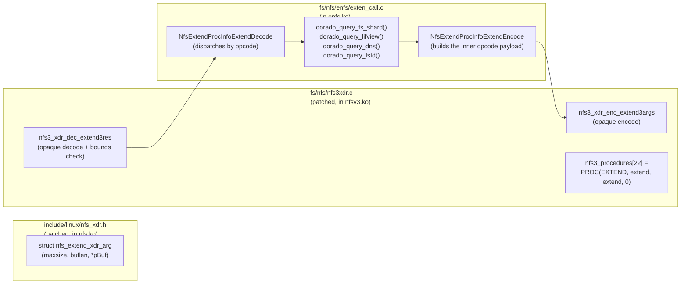

# Chapter 6 — The NFSv3 EXTEND op (`NFS3PROC_EXTEND = 22`)

> **Where this fits.** Chapters 4 and 5 covered the multipath core
> and the path-manager subsystem — both are vendor-neutral mechanisms
> that would work with any NFSv3 server. This chapter covers the one
> piece of enfs that **only works against Huawei storage arrays**: a
> 23rd NFSv3 procedure number, used by enfs to ask the server about
> its multipath topology. If you don't have a Huawei OceanStor
> Dorado box on the other end, you don't ever want to call into the
> code paths described here. The good news is that nothing in this
> file fires unless someone *explicitly* calls one of the
> `dorado_query_*` helpers — which the rest of enfs only does in
> code paths gated on a server-capability probe (chapter 4 §4.9).

## 6.1 The big picture

Standard NFSv3 has 22 procedures, numbered 0 through 21
(`NFS3PROC_NULL = 0` through `NFS3PROC_COMMIT = 21`). They live in
the public UAPI header `<uapi/linux/nfs3.h>` and are part of RFC
1813.

OpenEuler adds a 23rd: `NFS3PROC_EXTEND = 22`. It is **not**
standard. It is **not** registered with IANA. It is a Huawei
extension. The OpenEuler kernel ships it in their patched
`include/uapi/linux/nfs3.h` (we kept that file in
`vendor/openeuler/` for reference but do not build it).

The extension takes a single length-prefixed opaque payload, up to
`EXTEND_CMD_MAX_BUF_LEN = 819200` bytes (800 KiB —
`exten_call.c:588`). What's actually inside that payload is its own
mini-protocol dispatched on an opcode field encoded as the first
4 bytes (see §6.4 for the four opcodes enfs uses today).

Three pieces of the codebase implement it together:



In words:

- The **outer** XDR — "length-prefixed opaque buffer" — is what
  the patched `nfs3xdr.c` knows how to put on the wire. That layer
  doesn't care what's in the buffer.
- The **inner** payload — the opcode-dispatched mini-protocol — is
  enfs.ko's responsibility. enfs encodes it before handing it to
  the outer layer, decodes it after receiving the outer layer's
  reply.

That separation is what lets the patches to nfs3xdr.c be tiny
(50-ish lines) and self-contained — they're a generic opaque
carrier, not a knowledge of every Huawei-internal opcode.

## 6.2 Why we did NOT touch `<uapi/linux/nfs3.h>`

The OpenEuler tree adds `NFS3PROC_EXTEND` to
`include/uapi/linux/nfs3.h` directly. We don't, because UAPI
headers are exported to userspace by `make headers_install` and
packaged into `linux-libc-dev`. Modifying them would change the
ABI seen by every userspace program that includes `<linux/nfs3.h>`
on a host with our package installed — not acceptable for a DKMS
module that should be transparent at the userspace layer. A future
upstream extension that legitimately uses op 22 would also conflict
silently with our shim.

So we keep the change inside two non-UAPI scopes only:

1. `compat/enfs_compat.h` line 69-71:

   ```c
   #ifndef NFS3PROC_EXTEND
   #define NFS3PROC_EXTEND     22
   #endif
   ```

   That makes `NFS3PROC_EXTEND` visible to **enfs.ko's** translation
   units (the compat header is `-include`d everywhere by `Kbuild`
   line 30). The `#ifndef` guard is defensive: if a future Ubuntu
   kernel ever provides the symbol, the system definition wins.

2. The `nfs3xdr.c` patch (patches/ubuntu-7.0/0012, lines 38-43):

   ```c
   #if IS_ENABLED(CONFIG_ENFS)
   #include <linux/nfs_xdr.h>
   #define EXTEND_CMD_MAX_BUF_LEN 819200 /* 800K */
   #ifndef NFS3PROC_EXTEND
   #define NFS3PROC_EXTEND     22  /* enfs-extension; not in stock UAPI nfs3.h */
   #endif
   #endif
   ```

   This makes the symbol visible to that one file (which lives in
   `nfsv3.ko`).

The two definitions are deliberately identical. If they ever drift,
enfs.ko encodes for op 22 while nfsv3.ko's procedure table indexes
slot N — the RPC simply hits the wrong stub. The `#define` literal
is the same in both places to make the drift impossible to introduce
silently.

> **Compat shim cross-reference.** Chapter 9 covers
> `compat/enfs_compat.h` in detail. The `NFS3PROC_EXTEND` definition
> is one of the ~10 entries in that file; it earns the smallest amount
> of explanation because the OE source has been using the symbol
> verbatim since OLK-6.6 — there is no kernel-version drift to paper
> over. The shim exists purely to avoid touching the UAPI.

## 6.3 The two size macros

Patch 0012 also adds (`nfs3xdr.c` lines 51-53 and 61-63):

```c
#if IS_ENABLED(CONFIG_ENFS)
#define NFS3_extendargs_sz   (4 + XDR_QUADLEN(EXTEND_CMD_MAX_BUF_LEN))
#endif

#if IS_ENABLED(CONFIG_ENFS)
#define NFS3_extendres_sz    (1 + 4 + XDR_QUADLEN(EXTEND_CMD_MAX_BUF_LEN))
#endif
```

These are consumed by the `PROC(...)` macro further down the file
(`PROC(EXTEND, extend, extend, 0)`, line 2621 in our patched copy).
The macro expands to a `struct rpc_procinfo` whose `p_arglen` and
`p_replen` fields are set to `NFS3_extendargs_sz` and
`NFS3_extendres_sz` respectively.

What SunRPC does with those:

- `p_arglen` (in 32-bit XDR words) is the **upper bound** on the
  size of the encoded request body. SunRPC uses it to pre-allocate
  the send buffer in `rpc_alloc_iostats` and to size the slot
  reservation. If the actual encode produces fewer bytes (which it
  always does — 800 KiB is the worst case), the unused tail is just
  not transmitted.
- `p_replen` is the same for the reply.

The arithmetic:

- `4` is the 4 XDR words (16 bytes) of length-prefix-and-pad
  overhead. The opaque encoding is `length | bytes | pad-to-4`.
- `XDR_QUADLEN(819200)` is `(819200 + 3) / 4 = 204800` 32-bit words
  ⇒ exactly the 800 KiB payload, plus zero pad because 800 KiB is a
  multiple of 4.
- Plus `1` extra word in `_res_sz` for the NFS3 status word that
  precedes the payload in the reply.

So the worst-case request slot is roughly 800 KiB; same for the
reply. SunRPC's slot pool has to be sized to allow this, but most
EXTEND calls in practice carry a few hundred bytes of payload (e.g.
a single UUID query is ~50 bytes). The pre-allocation is wasteful
in the average case; reasonable in the worst case.

## 6.4 The XDR encode/decode pair

Both functions live in our patched `nfs3xdr.c` (added by patch
0012). They handle only the **outer** opaque carrier — they have
no knowledge of opcodes or inner formats.

### Encoder

```c
static void nfs3_xdr_enc_extend3args(struct rpc_rqst *req,
                                     struct xdr_stream *xdr,
                                     const void *data)
{
    const struct nfs_extend_xdr_arg *encArg = data;
    __be32 *p;

    WARN_ON_ONCE(encArg->buflen > EXTEND_CMD_MAX_BUF_LEN);
    p = xdr_reserve_space(xdr, 4 + encArg->buflen);
    xdr_encode_opaque(p, encArg->pBuf, encArg->buflen);
}
```

Walk-through:

1. `encArg` is the carrier struct (defined by patch 0008 — see
   §6.5). It has three fields: `maxsize` (set by the caller, used
   only on decode for bounds check), `buflen` (actual bytes to
   send), and `pBuf` (the opcode-dispatched payload that
   `exten_call.c` built).
2. `WARN_ON_ONCE` is a runtime sanity check — caller is supposed to
   fit within `EXTEND_CMD_MAX_BUF_LEN`. If they don't, the WARN
   fires once and we still try to encode (the kernel will splat
   later when the xdr_buf overflows).
3. `xdr_reserve_space(xdr, 4 + buflen)` reserves the bytes:
   `4` for the XDR length prefix plus `buflen` for the payload.
4. `xdr_encode_opaque` writes the length-prefixed bytes. It also
   handles the trailing zero-pad to the next 4-byte boundary
   automatically.

That's the entire encoder. It's a length-prefixed opaque write.

### Decoder

```c
static int nfs3_xdr_dec_extend3res(struct rpc_rqst *req,
                                   struct xdr_stream *xdr,
                                   void *result)
{
    enum nfs_stat status;
    int error;
    struct nfs_extend_xdr_arg *decArg = result;
    int length;
    __be32 *p;

    error = decode_nfsstat3(xdr, &status);
    if (unlikely(error)) goto out;
    if (status != NFS3_OK) goto out_default;

    memset(decArg->pBuf, '\0', decArg->maxsize);
    p = xdr_inline_decode(xdr, 4);
    if (unlikely(!p)) return -EIO;
    length = be32_to_cpup(p++);
    if (unlikely(length > decArg->maxsize)) {
        dprintk("NFS: extend response (%u) > max_size (%d)\n",
                length, decArg->maxsize);
        return -E2BIG;
    }
    p = xdr_inline_decode(xdr, length);
    if (unlikely(!p)) return -EIO;
    decArg->buflen = length;
    memcpy(decArg->pBuf, p, decArg->buflen);
    dprintk("NFS: extend response size (%u)\n", length);
out:
    return error;
out_default:
    return nfs_stat_to_errno(status);
}
```

Walk-through:

1. **NFS3 status word.** Every NFSv3 reply starts with a 4-byte
   `nfsstat3` enum. `decode_nfsstat3` is a stock helper. If the
   status is not `NFS3_OK` (zero), we map it to a kernel `-Exxx`
   errno via `nfs_stat_to_errno`. This is how the server tells us
   "I don't speak EXTEND" — typically `NFS3ERR_NOTSUPP` (returned
   by stock Linux nfsd for any unknown procedure).
2. **Pre-clear the buffer.** `memset(decArg->pBuf, 0, decArg->maxsize)`
   wipes the caller-provided buffer. This is a defensive measure —
   if a partial decode then errors out, the caller doesn't see
   stale data from a previous reply.
3. **Length prefix.** Read 4 bytes, byte-swap, that's the payload
   length.
4. **Bounds check against `decArg->maxsize`.** This is the critical
   check. `maxsize` is set by the caller of `dorado_extend_op`
   (always `EXTEND_CMD_MAX_BUF_LEN` in current usage). A
   server-side bug or hostile server that sends a length larger
   than this gets `-E2BIG` and is rejected here, before the bytes
   are copied. **No buffer overrun is possible** even if the
   server sends a 4 GiB length-prefix — `xdr_inline_decode` would
   itself fail to find that many bytes and return `NULL`.
5. **Copy into the caller's buffer.** Up to `length` bytes,
   `length` already bounded by `maxsize`. Caller learns the actual
   length via the updated `decArg->buflen`.

So the decoder's contract with its caller is:

- Returns 0: `decArg->pBuf` contains `decArg->buflen` valid bytes.
- Returns `-E2BIG`: server sent more than we'd accept. Caller's
  buffer was zeroed.
- Returns `nfs_stat_to_errno(status)`: server didn't return OK.
  Common values are `-ENOTSUPP` (server doesn't know EXTEND),
  `-EOPNOTSUPP`, `-EPERM`, etc.
- Returns `-EIO`: XDR underflow (truncated reply).

## 6.5 The carrier struct (`struct nfs_extend_xdr_arg`)

Added to `<linux/nfs_xdr.h>` by patch 0008:

```c
#if IS_ENABLED(CONFIG_ENFS)
struct nfs_extend_xdr_arg {
    int   maxsize;
    int   buflen;
    char *pBuf;
};
#endif
```

Three fields. Both nfs.ko (for the encoder/decoder) and enfs.ko
(for the callers) need to see it, hence its placement in
`<linux/nfs_xdr.h>` rather than in `nfs3xdr.c` itself.

It's simultaneously the request and reply struct. The
`exten_call.c` callers set up:

```c
struct rpc_message msg = {
    .rpc_proc = &nfs3_procedures[NFS3PROC_EXTEND],
    .rpc_argp = &xdr_arg,           // same struct
    .rpc_resp = &xdr_arg,           // same struct
};
```

(`exten_call.c:608-612`). On the way out, the encoder reads
`buflen` and `pBuf`. On the way back, the decoder writes `buflen`
(updates it to the reply length) and writes into `pBuf` (up to
`maxsize`). `maxsize` is read-only across the round-trip.

This dual-use pattern is unusual for NFS (most ops have separate
arg and res structs) but harmless. It works because the field
overlap is benign — what the encoder reads is not what the decoder
writes.

## 6.6 The caller side: `exten_call.c`

This is enfs.ko's interface to the EXTEND op. The file is large
(1000+ lines) but logically structured. Three layers from bottom
to top:

### Layer 1: the inner-payload encoder/decoder

`NfsExtendProcInfoExtendEncode` (line 58) builds the inner payload
in a temporary buffer:

```c
xdr_buf_init(&xdrBuf, pbuf, buflen);
xdr_init_encode(&xdrStream, &xdrBuf, NULL, NULL);

start = xdr_reserve_space(&xdrStream, 8);
*start++ = cpu_to_be32(pObj->opcode);    // first 4 bytes
*start++ = cpu_to_be32(pObj->version);   // next 4 bytes

if (opcode == NFS3_GET_FSINFO_OP)        { ...UUID payload... }
if (opcode == NFS3_GET_LIF_VIEW_OP)      { ...IP-list payload... }
if (opcode == NFS_ENFS_QUERY_DNS_OP)     { ...DNS-name payload... }
```

Every inner payload starts with `[opcode:4][version:4]`. The
opcode discriminates which of the four operations enfs supports
(enum at `exten_call.h:15-21`):

- `NFS3_GET_FSINFO_OP = 0` — "what's the shard layout for this
  file's FS?", takes a UUID.
- `NFS3_GET_LIF_VIEW_OP = 1` — "what controllers are behind this
  list of IPs?", takes an IP list.
- `NFS_ENFS_QUERY_DNS_OP = 2` — "resolve this hostname through
  the array's DNS view, give me back the IPs *and* their controller
  IDs". Used in place of an external DNS lookup so the paths and
  their topology arrive in the same answer.
- `NFS3_GET_LS_VERSION_OP = 3` — "what's the version vector for
  each LSID (logical-storage-id) in the cluster?".

The decoder side is `NfsExtendProcInfoExtendDecode` (line 545)
which reads the opcode and version off the buffer and dispatches
through `g_decodeFuncByOpCode[opcode]` (line 37-42) and
`g_decodeFuncByVersion[version]` (line 44-56). This double dispatch
is how enfs handles backwards-compat with older OE servers — a
v0 server returns slightly different bytes than a v1 server, and
the version table picks the right decoder.

### Layer 2: the synchronous and pin-to-xprt wrappers

`dorado_extend_op` (line 640):

```c
int dorado_extend_op(struct rpc_clnt *clnt, char *buf, int *buflen)
{
    int status;
    struct nfs_extend_xdr_arg xdr_arg = { 0 };
    struct rpc_message msg = {
        .rpc_proc = &nfs3_procedures[NFS3PROC_EXTEND],
        .rpc_argp = &xdr_arg,
        .rpc_resp = &xdr_arg,
    };
    xdr_arg.buflen  = *buflen;
    xdr_arg.pBuf    = buf;
    xdr_arg.maxsize = EXTEND_CMD_MAX_BUF_LEN;

    status = rpc_call_sync(clnt, &msg,
                           RPC_TASK_SOFT | RPC_TASK_TIMEOUT |
                           RPC_TASK_SOFTCONN);
    *buflen = xdr_arg.buflen;
    return status;
}
```

A blocking send-and-wait. Goes through the round-robin dispatcher
like any other RPC, so the call may go out any of the live xprts.
If the answer is "what does the cluster look like?" you generally
don't care which controller answers; this is fine.

`dorado_extend_route` (line 601) is the same idea but pinned to a
specific xprt (`task_setup_data.rpc_xprt = xprt`). Used by
`dorado_query_lifview` because "tell me about controller X" wants
to be sent *to* the IP that belongs to that controller, not to a
random one.

Both use `RPC_TASK_SOFT | RPC_TASK_TIMEOUT | RPC_TASK_SOFTCONN`:

- `RPC_TASK_SOFT` — return errors to caller instead of indefinitely
  retrying. Critical: if the server doesn't speak EXTEND, we want
  the error, not a hang.
- `RPC_TASK_TIMEOUT` — apply the timeout from `cl_timeout`.
- `RPC_TASK_SOFTCONN` — give up immediately on connect failures.

### Layer 3: the four typed query functions

These are what the rest of enfs actually calls:

| function | line | input | output |
|---|---|---|---|
| `dorado_query_fs_shard` | 679 | NFS file UUID | `struct enfs_shard_view *` — list of `(lsid, cpu_id)` tuples describing where this FS's shards live |
| `dorado_query_lifview` | 804 | IP address list | `struct enfs_lif_port_info[]` — for each IP: `(workStatus, lsId, wwn, cpuId)` |
| `dorado_query_dns` | 974 | DNS name | `struct enfs_dns_query_ip_info_single[]` — list of `(ip, lsid, cpuId)` |
| `dorado_query_lsId` | 744 | (none) | `struct enfs_get_ls_version_rsp *` — version vector per LSID |

Each one wraps the encode/`dorado_extend_op`/decode dance. They
allocate the 800 KiB working buffer with `kmalloc(EXTEND_CMD_MAX_BUF_LEN, GFP_KERNEL)`
which is a substantial allocation — kernel memory pressure under
heavy enfs use can show up here.

## 6.7 What happens against a stock Linux nfsd

The honest answer: it doesn't work, and the failure mode is benign.

Stock Linux `nfsd` defines `nfsd3_procedures[]` with 22 entries
(0 NULL through 21 COMMIT). Procedure 22 is past `vs_nproc`, so
the SunRPC server rejects the call before nfsd sees it — typically
with `PROG_MISMATCH` / `PROC_UNAVAIL` on the wire, mapped client-side
to `-EOPNOTSUPP`. `dorado_extend_op` returns the error, the caller
logs and gives up. The mount itself is unaffected; only the
EXTEND-specific feature paths (shard-aware routing, server-side
DNS, controller-affinity placement) degrade to "no extra info,
fall back to round-robin". Intentional graceful degradation.

**Practical guidance for non-Huawei deployments:**

- Do not enable `multipath_select_policy=shardview` in
  `/etc/enfs/config.ini`. With round-robin (the default), enfs
  never calls into `dorado_query_*` for IO routing.
- The server-capability prober (`enfs_lookup_cache.c`, chapter
  4 §4.9) does call EXTEND-adjacent code, but uses an enfs-private
  RPC program number (not NFS_PROGRAM), so against a non-Huawei
  server it just gets `PROG_UNAVAIL` and gives up — no harm done.
- Do not enable `dns_auto_multipath_resolution=1` — this triggers
  the server-side DNS path (`dorado_query_dns`).

In other words: the multipath round-robin failover described in
chapters 4 and 5 works against any NFSv3 server. The EXTEND-using
features are Huawei-only enhancements layered on top.

## 6.8 The compat risk that "lives forever"

The patch 0008 commit message flags this honestly:

> NOTE: this struct enables a non-standard extension to the NFSv3
> wire format. Standard NFSv3 servers that don't speak the
> OpenEuler extension will reject calls that carry it.

To restate: the **wire format itself is non-standard**. We're
sending a procedure number (22) that the IETF NFSv3 spec does not
define. As long as enfs.ko only emits procedure 22 in response to
explicit `dorado_query_*` calls — which only fire when shardview
mode is enabled or when the server-cap probe runs — non-Huawei
servers see exactly the same NFSv3 traffic they would have seen
without enfs. The procedure number doesn't show up "by accident"
in an ordinary `read`/`write`/`getattr` workload.

But the patch is in the kernel. Anyone who installs `enfs-dkms`
and then accidentally enables shardview (or runs the prober
deliberately) will send op-22 traffic to whatever NFS server they
mount. A WireShark capture from such a session will show
unrecognised procedure numbers and may confuse anyone analysing
the trace later. Document this in your operations runbook.

## 6.9 Summary

What we patched in:

- `<linux/nfs_xdr.h>` — added `struct nfs_extend_xdr_arg` (patch
  0008). Three-field carrier shared between nfs.ko's encoder/decoder
  and enfs.ko's callers.
- `fs/nfs/nfs3xdr.c` — added `nfs3_xdr_enc_extend3args` and
  `nfs3_xdr_dec_extend3res` plus the `PROC(EXTEND, ...)` table
  entry (patch 0012). Outer length-prefixed-opaque carrier;
  knows nothing about opcodes.
- `compat/enfs_compat.h` — defined `NFS3PROC_EXTEND = 22` for the
  enfs.ko build (chapter 9).

What we deliberately did NOT touch:

- `<uapi/linux/nfs3.h>` — that's a UAPI header; modifying it would
  affect every userspace consumer on the system.

What lives in enfs.ko:

- `exten_call.c` — the inner-payload codec, four typed query
  helpers (`dorado_query_fs_shard`, `_lifview`, `_dns`, `_lsId`),
  and the `dorado_extend_op` / `dorado_extend_route` send-side
  wrappers.

When does it fire:

- Only when the server-capability prober runs (default off in our
  build because shard.o is stubbed — chapter 9), or when shardview
  routing mode is explicitly enabled in `/etc/enfs/config.ini`.
- Server is expected to be a Huawei OceanStor Dorado appliance.
  Stock Linux nfsd returns `PROG_MISMATCH` / `-EOPNOTSUPP`, which
  enfs treats as "feature unavailable, fall back" — no functional
  damage.

> Caveat I couldn't pin down from source alone: the exact error
> code returned by stock Linux nfsd for an unknown NFSv3 procedure
> number — I described it as "typically `RPC_PROC_UNAVAIL` →
> `-EOPNOTSUPP` client-side". Verifying against a stock Ubuntu 26.04
> nfsd with a wireshark capture is on the v1 to-do list. The
> functional claim ("nothing breaks") holds either way.

---

**Next:** chapter 7 picks up the locking and concurrency story —
how the per-xprt context, the per-clnt cursor, and the
`rpc_xprt_switch` are kept consistent across the dispatcher,
pm_ping, failover_handle, and live-remount paths simultaneously.
