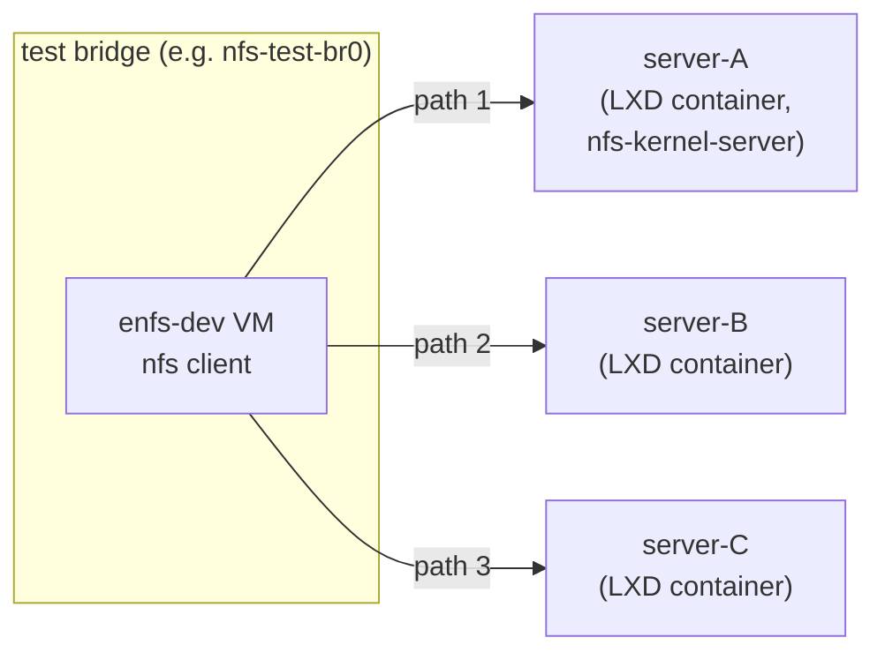

# Testing plan

Three tiers, ordered from cheapest/fastest to most realistic.


## Tier 1 — KUnit unit tests

**Status:** OpenEuler already ships the framework. See
`vendor/openeuler/fs/nfs/enfs/enfs_test.c` and the
`config ENFS_KUNIT_TEST` Kconfig in
`vendor/openeuler/fs/nfs/Kconfig`.

**What it tests:** logic that doesn't need real I/O — timers, the
state machine that decides "this transport is unhealthy", the mount
option parser, path-list management, the round-robin selector.

**Runs:** on every commit, in CI. Either:
- a User-Mode-Linux kernel with `make ARCH=um kunit_defconfig &&
  ./tools/testing/kunit/kunit.py run --kernel_args=...`, or
- inside the test VM via the `kunit_tool` script invoked over ssh.

**Cost:** seconds.

**Coverage gaps:** doesn't catch RPC-layer regressions, doesn't
exercise the `enfs_adapter` hook sites in `nfs.ko`/`sunrpc.ko`,
doesn't catch real wire-format issues.

**Work to do:** OE only ships one KUnit test (`enfs_test_reconnect_time`).
Expand to ~20-30 tests covering: parser accept/reject matrix, path
selector under N transports with M failures, DNS process scheduling,
remount add/remove correctness.

## Tier 2 — BATS module integration tests

**Framework:** [bats-core](https://github.com/bats-core/bats-core)
(`apt install bats`). Each test is a bash function with a name; BATS
runs them, captures output, and reports pass/fail in TAP format.

**What it tests** (single host, the `enfs-dev` VM):
- module load order: `modprobe sunrpc → nfs → enfs` is clean,
  `dmesg` has no warnings.
- module unload order: reverse, also clean.
- `modinfo enfs` reports the expected version string.
- mount option parser: positive cases (valid `enfs_info=` strings
  accepted) and negative cases (invalid syntax produces `EINVAL`
  with the documented errcode from `enfs_errcode.h`).
- procfs interface: `/proc/enfs/<mount>/paths` exists, lists
  configured paths, accepts adds/removes.
- `dkms-install` → `dkms-uninstall` round-trip leaves the system
  with stock `nfs.ko` loaded again.

**Runs:** on every PR.

**Cost:** <60 s (no NFS server needed).

**Layout:**
```
tests/
├── bats-helpers/
│   ├── load.bash         # common setup
│   └── kernel.bash       # modprobe / dmesg helpers
└── bats/
    ├── 01-load.bats
    ├── 02-modinfo.bats
    ├── 03-parser-accept.bats
    ├── 04-parser-reject.bats
    ├── 05-procfs.bats
    └── 99-dkms-roundtrip.bats
```

## Tier 3 — End-to-end NFS multipath

**Topology** (driven from the build host with shell scripts; could
move to Ansible later):



LXD is already running on the build host (we saw `lxdbr0` and
`lxdbr1`); use a dedicated bridge so test traffic doesn't pollute
production. The servers run plain `nfs-kernel-server` with a small
shared export.

**Scenarios:**

| # | Scenario | Pass criterion |
|---|---|---|
| 1 | Round-robin distribution | 1000 small reads → tcpdump-counted RPC reqs split ~33/33/33 across servers (±5%) |
| 2 | Failover on hard kill | `nft drop` server-A traffic mid-test → IO continues, recovery time within configured timeout |
| 3 | Failover on slow path | tc netem 500ms+1% loss on one link → traffic shifts to faster paths |
| 4 | Runtime path add | mount with 1 path; write to `/proc/.../paths` to add a 2nd; tcpdump confirms 2-path split |
| 5 | Runtime path remove | inverse of #4 |
| 6 | DNS rebind | mount with hostname; flip DNS A record; trigger DNS process; new addr added to set |
| 7 | Server vanish + return | full LXC stop on server-A, then start; client recovers within timeout |
| 8 | NFSv3 + NFSv4 | rerun #1, #2, #4 for both protocol versions (the `nfs3xdr.c` patches mean v3 has its own path) |
| 9 | Concurrency | `fio` 256 outstanding async reads while #2 fires — no client hang |

**Runs:** nightly, on tag, on demand.

**Cost:** ~30 minutes for full matrix. Each LXC container ~30 s to
provision; tests run in seconds; teardown ~5 s.

**Layout:**
```
tests/
└── e2e/
    ├── lib/
    │   ├── lxc.sh              # provision/teardown servers
    │   ├── nfs-server.sh       # configure exports
    │   ├── traffic.sh          # tcpdump counters
    │   └── fault.sh            # nft drop / tc netem helpers
    ├── 01-roundrobin.sh
    ├── 02-failover-hard.sh
    ├── 03-failover-slow.sh
    ├── 04-path-add.sh
    ├── 05-path-remove.sh
    ├── 06-dns-rebind.sh
    ├── 07-server-restart.sh
    ├── 08-v3-v4-matrix.sh
    └── 09-concurrency.sh
```

## Test data + fixtures

- `tests/fixtures/exports/` — small directory tree shared via NFS
  (a few KB, one file per size bucket: 4K, 1M, 64M).
- `tests/fixtures/dns/` — coredns-format zone files used to flip
  hostnames during scenario #6.

## What we won't write (yet)

- Performance regression tracking — meaningful only after the
  module is stable. Defer to `bench/` directory and `fio` jobs once
  we have a baseline.
- Stress tests with `xfstests` against an enfs mount — same reason.
  Mark as a v1.0 release blocker.
- Fuzz testing of the mount option parser — small win, easy to add
  later via `syzkaller` or AFL on the parser as a userspace harness.

## Test prerequisites checklist (per host)

```bash
# enfs-dev VM (tier 2 + tier 3 client):
sudo apt install bats nfs-common fio tcpdump nftables iproute2

# build host (tier 3 server containers, run in LXD):
lxc storage create enfs-test dir source=/var/snap/lxd/common/lxd/storage-pools/enfs-test
lxc network create nfs-test-br0
# server containers created on demand by tests/e2e/lib/lxc.sh
```
