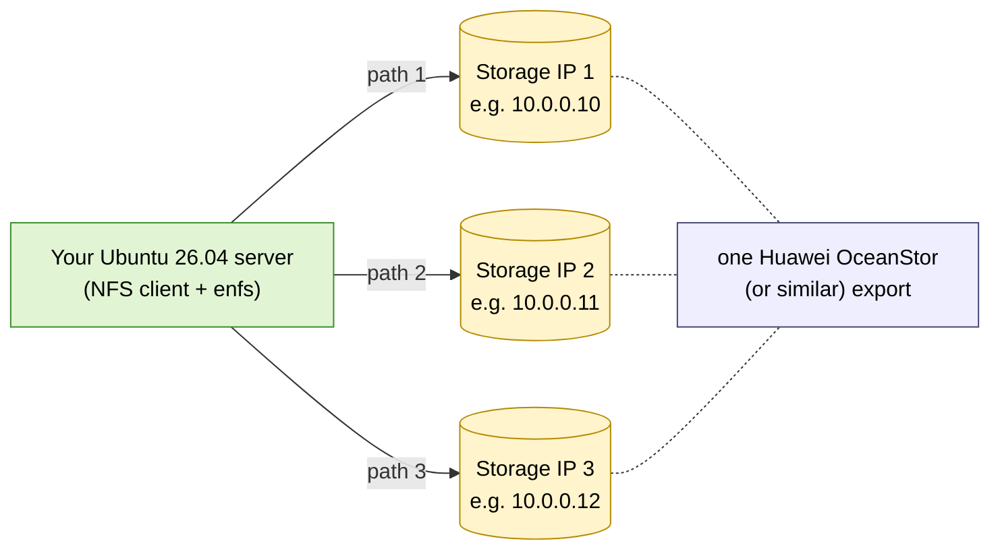

# Quickstart — fresh Ubuntu 26.04 → mounted enfs share

Five commands. One reboot. About three minutes.

## What you'll end up with



One mount; reads and writes round-robin across all the storage IPs.

## The five commands


Run as `root` or with `sudo`.

```bash
# 1. Build deps
apt update && apt install -y dkms build-essential linux-headers-generic nfs-common

# 2. Install the package (substitute the actual file you downloaded)
dpkg -i enfs-dkms_0.1.0-1_amd64.deb

# 3. Blacklist nfsd (the kernel NFS *server*) so it doesn't pin the
#    stock sunrpc.ko at boot and prevent our patched copy from loading.
#    Skip this step if you actually need to RUN an NFS server on this host.
echo 'blacklist nfsd' > /etc/modprobe.d/zz-no-nfsd.conf

# 4. Reboot so the new modules load fresh
reboot

# 5. (after reboot) Mount your storage with multipath
mkdir -p /mnt/storage
mount -t enfs \
      -o vers=3,nolock,remoteaddrs=10.0.0.10~10.0.0.11~10.0.0.12 \
      10.0.0.10:/your_export /mnt/storage
```

That's it. Replace the three IPs (`10.0.0.10~11~12`) with your storage's
front-end NFS addresses, separated by **`~`** (tilde, not comma). Replace
`/your_export` with the export path your storage admin gave you.

> **Why `-t enfs` and not `-t nfs`?** Using `enfs` as the type makes
> multipath intent visible in `/proc/mounts` and `/etc/fstab` — anyone
> looking at the mount table can tell at a glance that this mount uses
> the multipath stack. `mount -t nfs -o remoteaddrs=...` also works (for
> back-compat) but is harder to spot. See issue #20 for context.
>
> **Why `vers=3,nolock`?** v0 of this package supports NFSv3 and disables
> NLM file locking. v1 will lift both restrictions. If you need NFSv4 or
> file locking *today*, see [05-troubleshooting.md](05-troubleshooting.md).

## Verify it worked

```bash
# Did all paths come up?
sudo cat /proc/enfs/*/path
# Expected output: one line per IP, all "Normal" + "CONNECTED|BOUND"
# id    local_addr      remote_addr     path_state  xprt_state
# 0     <your-ip>       10.0.0.10       Normal      CONNECTED|BOUND
# 1                     10.0.0.11       Normal      CONNECTED|BOUND
# 2                     10.0.0.12       Normal      CONNECTED|BOUND

# Are reads round-robin? (run a workload, then watch per-server traffic)
sudo tcpdump -nn -i any -c 200 'src port 2049' \
  | awk '{print $3}' | cut -d. -f1-4 | sort | uniq -c
# Expected: counts within ~10% of each other across all your storage IPs.
```

If the path table only lists *one* line, jump to
[05-troubleshooting.md → "Mount works but only one server gets traffic"](05-troubleshooting.md).

## Mount on every boot

Add to `/etc/fstab`:

```text
10.0.0.10:/your_export  /mnt/storage  enfs  vers=3,nolock,remoteaddrs=10.0.0.10~10.0.0.11~10.0.0.12,_netdev  0  0
```

The `_netdev` flag tells systemd to wait until the network is up.

## Removing it

```bash
umount /mnt/storage
apt purge enfs-dkms          # restores stock NFS modules
rm /etc/modprobe.d/zz-no-nfsd.conf   # if you set it
reboot
```

## Where to next

- [01-overview.md](01-overview.md) — what enfs actually does (multipath, failover, runtime path edits)
- [03-mount-syntax.md](03-mount-syntax.md) — full `remoteaddrs=` / `localaddrs=` reference
- [04-operations.md](04-operations.md) — adding/removing paths at runtime, watching with `tcpdump`
- [05-troubleshooting.md](05-troubleshooting.md) — the things that go wrong and how to fix them
- [06-uninstall.md](06-uninstall.md) — clean rollback
- [02-installation.md](02-installation.md) — long-form install reference (build from source, signed packages, kernel-update behaviour)
