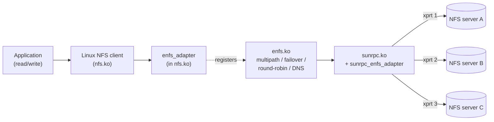

# enfs Overview

`enfs` ("Enhanced NFS") is a Linux NFS-client extension that lets a
single mount point use **several network paths** to its backing
storage at once. It was developed in the OpenEuler kernel tree and is
provided here as a DKMS package for **Ubuntu 26.04 LTS**.

This page is the executive summary: what the module does, when you
should reach for it, and when you should not.

## What it is

`enfs` ships as a small extra kernel module (`enfs.ko`) plus modified
copies of `nfs.ko` and `sunrpc.ko` that include hook points for the
extra module to plug into. From userspace, the only visible change is
a handful of new mount options and a `/proc/enfs/` directory.

A single mount point holds a **switch** of RPC transports. The switch
is the multipath set; each transport in the switch is one
local-IP-to-server-IP pairing. The dispatcher picks the next live
transport for every RPC, so a long-running read or write spreads
naturally across all configured paths.

## Runtime features

`enfs` provides five features that the in-tree NFS client does not:

1. **Multipath mounts** — a single NFS mount uses several server
   addresses, several local source addresses, or both. Each path is
   its own RPC transport (TCP connection).
2. **Round-robin RPC dispatch** — RPCs are spread across the active
   transports in the switch, evenly by default.
3. **Transport failover** — when a transport stops responding,
   traffic moves to the others without unmounting; when the dead path
   recovers, it rejoins the rotation.
4. **Live remount** — the path list is mutable. Add or remove server
   IPs at runtime through `/proc/enfs/<id>/` or via `mount -o remount`
   without unmounting the share.
5. **DNS rebind** — re-resolve the server hostname on demand and
   merge the new addresses into the multipath set. Useful when storage
   moves behind a cluster DNS record.

See [04-operations.md](04-operations.md) for the runtime control
surface and [03-mount-syntax.md](03-mount-syntax.md) for how to set
the initial path list.

## When to use enfs

Reach for enfs when **at least one** of these is true:

- **High-throughput NFS reads / writes against a multi-NIC storage
  target.** A single TCP connection is bottlenecked by one CPU's
  softirq path, by a single NIC queue, and by a single TCP congestion
  window. Spreading a workload across N transports gives you N
  congestion windows and N receive queues. In practice you see
  near-linear scaling up to the number of NICs on the server.
- **No-downtime path-set changes.** If your storage layout changes
  (NIC added, NIC drained for maintenance, server brought into or out
  of an HA pair), enfs lets you edit the path list of a live mount
  rather than unmounting and remounting. Open file handles survive.
- **Faster failover than `timeo=`-driven reconnect.** The stock NFS
  client treats a stuck TCP transport as a major timeout event and
  takes seconds to retransmit. enfs marks the transport dead and
  re-dispatches the in-flight RPC to a sibling transport in the
  switch.

## When NOT to use enfs

- **Single-server NFS with one NIC.** There is nothing to multipath
  across; you gain complexity for no throughput benefit.
- **NFSv4 mounts.** This port currently builds and exercises only
  NFSv3 multipath. NFSv4 support is upstream in the OpenEuler tree
  and is on the roadmap, but the v0 release is **v3 only**. Mount
  with `vers=3,nolock`.
- **Root-on-NFS systems.** Installing the DKMS package replaces
  `nfs.ko` and `sunrpc.ko` and the install path will tear down a live
  root-NFS mount during `depmod` / `update-initramfs`. Don't run this
  on a diskless client booted from NFS.
- **Strict-kernel-ABI environments** (FIPS-locked, secure-boot
  module-signing enforced) where adding out-of-tree modules is
  disallowed by policy. enfs is delivered as DKMS-built modules; if
  you cannot load unsigned out-of-tree modules, you cannot use this
  package.

## What this documentation covers

| File | Topic |
|------|-------|
| [02-installation.md](02-installation.md) | Install from `.deb` or from source; verify; load |
| [03-mount-syntax.md](03-mount-syntax.md) | `remoteaddrs=`, `localaddrs=`, `enfs_info=` reference |
| [04-operations.md](04-operations.md) | `/proc/enfs/`, sysfs, live remount, DNS, tcpdump |
| [05-troubleshooting.md](05-troubleshooting.md) | Symptom -> cause -> fix table |
| [06-uninstall.md](06-uninstall.md) | Clean rollback to stock NFS |

If you are a kernel developer and want to know how enfs is built,
read `docs/ARCHITECTURE.md` and `docs/PORTING-NOTES.md` instead.
