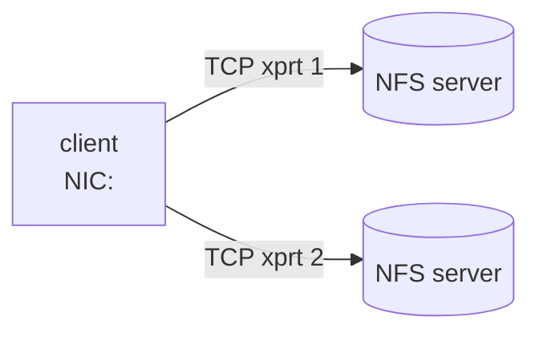
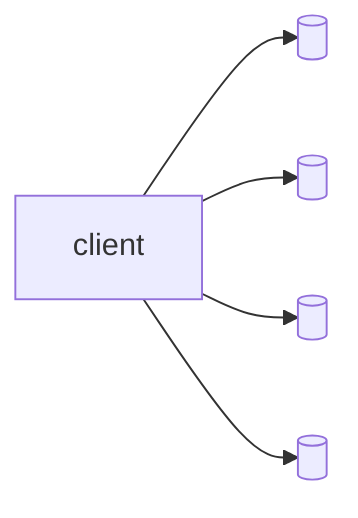
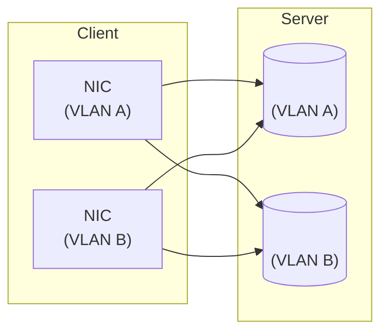

# Mount Syntax Reference

This page is the full reference for the mount options that **enfs**
adds on top of the standard `nfs(5)` option set. Everything documented
in `nfs(5)` (`vers=`, `proto=`, `rsize=`, `wsize=`, `hard`, `nolock`,
`timeo=`, `retrans=`, ...) still applies — the options below are
additive.

## TL;DR

```bash
sudo mount -t enfs \
    -o vers=3,nolock,remoteaddrs=<NFS_SERVER_1>~<NFS_SERVER_2>,localaddrs=<LOCAL_NIC_1>~<LOCAL_NIC_2> \
    <NFS_SERVER_1>:/<EXPORT> <MOUNT_POINT>
```

The mount succeeds if at least one `(localaddr, remoteaddr)` pair can
establish a TCP connection and reach the same backing export.

## Filesystem type: `enfs` vs `nfs`

Both `mount -t enfs` and `mount -t nfs` work and produce the same
behavior. `enfs` is preferred because:

- `/proc/mounts` and `/etc/fstab` make the multipath nature visible
  at a glance — no need to inspect the option string.
- Monitoring / inventory tools can filter by type to find multipath
  mounts.
- The dependency on the `enfs-dkms` package is documented in the
  mount line itself.

The kernel registers `enfs` as a separate filesystem type whose mount
path is identical to `nfs`. You can switch a fstab entry between the
two types without re-mounting; the resulting superblock is
byte-identical. See issue #20.

## Options reference

### `remoteaddrs=A~B~C`

A `~`-separated list of **remote (server-side) IP addresses** that
back the same NFS export. These are added to the mount's transport
switch as additional RPC transports. The address that appears in the
positional `server:/export` argument is also implicitly part of the
set, so the example above ends up with two transports.

- Tilde (`~`), not comma — comma is reserved for separating mount
  options.
- IPv4 only in v0. (IPv6 round-trips through the parser; live testing
  is on the v0.2 roadmap.)
- Hostnames are accepted but resolved **once** at mount time. Use the
  DNS-rebind operation in [04-operations.md](04-operations.md) to
  re-resolve later.
- Each address must point at the same physical export with the same
  `fsid` — see "Address-list constraints" below.

### `localaddrs=X~Y`

A `~`-separated list of **local (client-side) source IPs** that the
multipath dispatcher should bind outgoing transports to. If omitted,
the kernel picks a source address per transport using the routing
table (typically a single source per server, defeating the point of
multipath if your client has more NICs than that).

The cartesian product of `localaddrs` × `remoteaddrs` (less invalid
combinations the routing table rejects) becomes the transport set.
Two locals × three remotes is up to six transports.

### `enfs_info=...`

Single-string equivalent of the two options above. Useful when you
have to fit a multipath mount through a tool that mangles `=` or `,`
inside option values.

```text
-o enfs_info='remoteaddrs=<NFS_SERVER_1>~<NFS_SERVER_2>,localaddrs=<LOCAL_NIC_1>'
```

The string between the quotes is parsed by the same code that handles
`remoteaddrs=` / `localaddrs=` directly. Use one or the other; using
both is undefined.

### `slookupcache=` and `alookupcache=`

Reserved option names that the parser accepts but the v0 release does
not act on. They are present so that `/etc/fstab` lines copied from
OpenEuler hosts mount cleanly here. Treat them as no-ops; do not rely
on them having any effect until a future release documents otherwise.

## Worked examples

### Two-server, one-NIC client (the hello-world)

A client with one NIC, two NFS servers (or one server with two
service IPs) backing the same export.



```bash
sudo mount -t enfs \
    -o vers=3,nolock,remoteaddrs=<NFS_SERVER_1>~<NFS_SERVER_2> \
    <NFS_SERVER_1>:/<EXPORT> <MOUNT_POINT>
```

`/proc/enfs/<id>/path` will show two rows. Read traffic round-robins
across the two transports; expect roughly 50/50 split as measured by
`tcpdump` on each server's interface.

### Four-server, one-NIC client (scale-out target)

Four storage heads in front of the same backing volume.



```bash
sudo mount -t enfs \
    -o vers=3,nolock,remoteaddrs=<NFS_SERVER_1>~<NFS_SERVER_2>~<NFS_SERVER_3>~<NFS_SERVER_4> \
    <NFS_SERVER_1>:/<EXPORT> <MOUNT_POINT>
```

Round-robin spreads RPCs evenly across all four transports. If one
storage head goes down, the failover state machine drops it from
rotation within a few seconds and the workload continues on the
remaining three.

### Mixed-NIC: two client NICs × two server IPs

The most common high-throughput layout. The client has two NICs on
two separate VLANs / subnets; each NIC has line-of-sight to both
server IPs (often via an L3 fabric).



```bash
sudo mount -t enfs \
    -o vers=3,nolock,remoteaddrs=<NFS_SERVER_1>~<NFS_SERVER_2>,localaddrs=<LOCAL_NIC_1>~<LOCAL_NIC_2> \
    <NFS_SERVER_1>:/<EXPORT> <MOUNT_POINT>
```

The dispatcher will form up to four transports. Each transport pins
to one source NIC, so per-NIC bandwidth tops out at the NIC's line
rate; aggregate bandwidth is the sum across all live transports. This
is where you see meaningful scale-out vs. single-path NFS.

## Address-list constraints

The dispatcher trusts the operator on **two** invariants. Violating
either causes silent data corruption or `ESTALE` storms; both are
checked at mount time only as best-effort.

### All `remoteaddrs` must back the same export

Every IP in `remoteaddrs=` must export the same filesystem with the
same NFS `fsid` and the same root file handle. In practice this
means:

- Same physical backing storage (same block device, same `zpool`,
  same Lustre mount, ...).
- Same export options on the server side (`fsid=`, `no_root_squash`,
  `subtree_check`, ...).
- Same root inode number visible to NFS.

If the servers disagree, you will see "Stale file handle" errors
moments after the mount succeeds: the dispatcher hands a file handle
issued by server A to server B and B refuses it. See
[05-troubleshooting.md](05-troubleshooting.md).

For HA pairs that share storage, this is automatic. For independent
servers that happen to host a copy of the same data (e.g. rsync'd
mirrors), this is **not** safe — enfs is not a replication layer.

### Path count cap

The transport switch has a fixed upper bound on the number of
transports it will hold per mount. The current ceiling is generous
(tens of paths) but is **not unbounded** — it is sized for "a handful
of NICs times a handful of server IPs", not for indexing every storage
endpoint in a data centre. If you are about to configure more than
ten paths per mount, you almost certainly want a different topology
(e.g. one mount per logical storage group).

The exact cap is set by the `enfs.ko` build and is logged at module
load time:

```bash
dmesg | grep -i 'enfs.*max'
```

Exceeding it returns `EINVAL` from `mount()` with a message in
`dmesg`.

## What to do next

Once your mount is up, see [04-operations.md](04-operations.md) to
inspect live state, edit the path list at runtime, watch traffic
spread with `tcpdump`, and trigger a DNS rebind.
