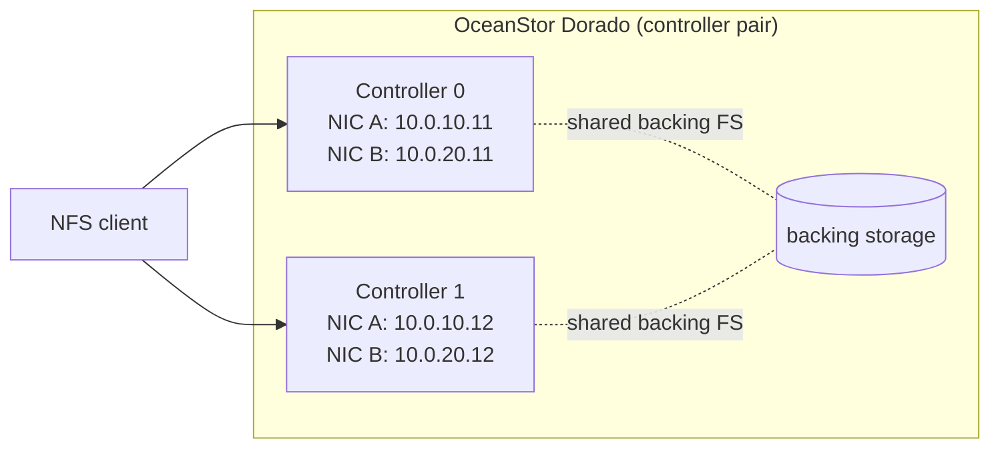
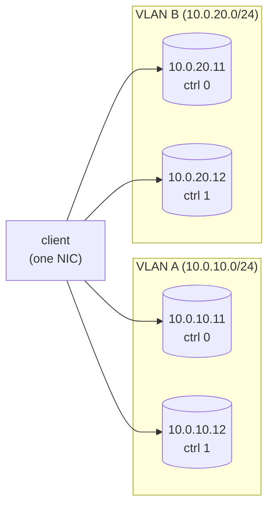
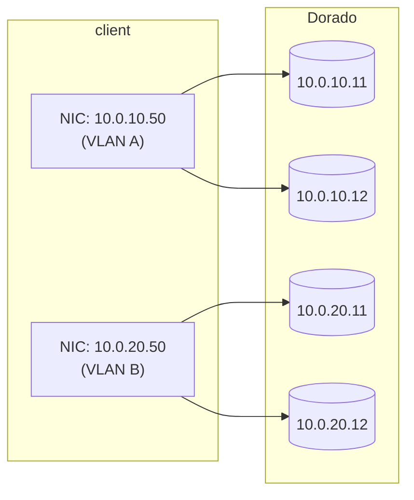

# enfs against Huawei storage (Dorado, OceanStor)

`enfs` was originally built inside the OpenEuler kernel by Huawei to talk
to Huawei's own NFS storage — the OceanStor Dorado all-flash family
(V3, V6) and the OceanStor Pacific distributed/unified line. Each of
these arrays exposes **multiple front-end NICs per controller** and
typically a **pair (or more) of controllers** behind a shared backing
filesystem. enfs is the piece that lets a single Linux NFS mount fan
out across all of those endpoints at once instead of pinning to one.

This page is the user-facing guide for that combination. It assumes
you have already worked through
[00-quickstart.md](00-quickstart.md) and
[03-mount-syntax.md](03-mount-syntax.md). The runtime control surface
referenced throughout (`/proc/enfs/`, `dmesg`, sysfs) is documented in
[04-operations.md](04-operations.md).

> **Honesty caveat.** The Huawei DeviceManager / OceanStor BCManager /
> iSM family of management UIs is large and ships in many firmware
> versions. The exact menu paths and field labels move around. Where
> this guide describes a UI workflow, treat the **concept** as
> authoritative ("you must enable the NFS service and authorise this
> client IP on this share") and translate it to whichever UI version
> you are running.

---

## 1. Why enfs + Dorado / OceanStor in particular

### What the array gives you

A typical Dorado deployment looks like this:



Both controllers can serve the same export at the same time (the
backing filesystem and its `fsid` are shared). The array publishes
several front-end IPs — typically two per controller, on two separate
front-end VLANs — and each of those IPs is independently routable from
the client. Pacific scales this further: more controllers, more LIFs.

### What single-IP NFS gives you

If you just write `mount -t nfs 10.0.10.11:/share /mnt`, you get
exactly one TCP connection to one controller's one NIC. You will see:

- one NIC's worth of throughput, regardless of how many the array has;
- a controller failover that takes as long as VRRP / ALUA on the array
  side decides it should (typically tens of seconds), during which
  the client's RPCs hang;
- no benefit from the array's spare front-end ports until the active
  one breaks.

### What LACP / NIC bonding gives you (and where it falls short)

A bond across two client NICs is fine for *aggregate* host throughput
but does not help a single NFS mount: the standard L4 hash on a
two-tuple-hashed bond pins a given (src-ip, src-port, dst-ip,
dst-port) flow to exactly one slave. NFS over TCP **is** a single
flow, so you get one slave's worth of bandwidth. Layer 3+4 hashing
helps only when the kernel happens to pick lucky source ports, which
is not something you want to depend on for storage.

### What enfs gives you on top

enfs adds a transport switch in front of the kernel NFS client. A
single mount holds *N* TCP connections to *N* (local, remote) IP
pairs. For NFSv3, RPCs round-robin across the live ones; if a path
goes silent the dispatcher routes the next RPC to a surviving path
and quietly retries the in-flight one (see §8). The application sees
one `/mnt/whatever`, no symlinks, no autofs, no per-application
config.

For NFSv4 the picture is more nuanced — see §5.

---

## 2. Pre-flight checklist on the array

Before you touch the client, verify the following on the array side.
Names below are conceptual; substitute your firmware's wording.

1. **NFS service is enabled.** In DeviceManager (or BCManager / iSM,
   depending on your line), under the file-services section, the NFS
   protocol must be running. Both NFSv3 and NFSv4.x are supported by
   modern Dorado firmware; v3 is on by default, v4 sometimes is not.
2. **A file system / namespace exists**, with the export path you
   intend to mount.
3. **The export's client ACL permits your client's IP.** Typically a
   per-share "Add Client" / "Authorize Client" dialog. The ACL must
   permit *every* source IP that enfs will dispatch from — i.e. every
   address you will list in `localaddrs=` (see §6), or every address
   the kernel may pick if you do not pin one. The simplest approach
   for a first mount is to authorise the client's whole subnet, prove
   it works, then tighten.
4. **Multiple front-end IPs are reachable from the client.** From the
   client, before mounting:

   ```bash
   for ip in 10.0.10.11 10.0.10.12 10.0.20.11 10.0.20.12; do
       echo -n "$ip: "
       timeout 2 bash -c "</dev/tcp/$ip/2049" \
           && echo "tcp/2049 open" || echo "unreachable"
   done
   ```

   If any of these fail, fix the network/ACL before going further.
   enfs will happily start with a partial set, but you will spend the
   rest of your day wondering why aggregate throughput is half of what
   you expected.
5. **VRRP / floating-IP state is understood.** Some Dorado deployments
   front the two controllers with VRRP-managed VIPs that move on
   controller failure. enfs's path failover is *independent* of (and
   layered on top of) VRRP. You almost always want to point enfs at
   the **fixed** per-controller IPs, not the VIPs — see §10.
6. **You know the export's `fsid`.** All addresses you give enfs must
   back the same export with the same `fsid`. For an HA pair sharing
   one filesystem this is automatic; for two independent arrays
   serving "the same data" by replication it is **not** safe. enfs is
   not a replication layer.

---

## 3. Discovering the array's NFS endpoints

Once the array side is sane, enumerate the endpoints from the client.

### 3.1 List exports via `showmount`

```bash
showmount -e 10.0.10.11
# Export list for 10.0.10.11:
# /dorado/share01  10.0.0.0/16
# /dorado/share02  *
```

Repeat against each known controller IP. They should agree on the
exports they advertise; if controller 0 lists `/dorado/share01` but
controller 1 does not, you have a configuration drift on the array
side and you must not put both IPs into one `remoteaddrs=` for that
share.

### 3.2 Confirm the NFS service profile

```bash
rpcinfo -p 10.0.10.11 | grep -E 'nfs|mount'
# 100003    3   tcp   2049  nfs
# 100003    4   tcp   2049  nfs
# 100005    3   tcp    635  mountd
```

Make sure NFSv3 (or v4, depending on your plan) is actually advertised
on TCP. enfs does not support UDP; the `proto=tcp` mount option is
implicit in everything that follows.

### 3.3 Enumerate the front-end NICs from the array UI

In DeviceManager, the front-end NIC inventory lives somewhere under
"Services > Storage Network" or "Provisioning > Settings > Front-End
Ports" (the exact path depends on firmware version — verify against
yours). For each controller you should be able to read off:

- the controller's hardware identity,
- each enabled front-end Ethernet port,
- the IP, netmask and VLAN bound to each port,
- whether that IP is a fixed per-NIC address or a floating VIP.

Write the **fixed per-NIC addresses** down. Those are what go into
`remoteaddrs=`.

For Pacific (distributed) deployments the same idea applies but with
more LIFs per node and a node count > 2; the principle holds — list
the per-LIF addresses, ignore the cluster VIPs unless you have a
specific reason to use them.

---

## 4. Mount syntax for Dorado / OceanStor

The mount option that does the work is `remoteaddrs=`, a `~`-separated
list. Worked examples below. Substitute your real IPs and export path.

### 4.1 Single controller, two NICs (the simplest case)

A single Dorado controller exposing the same share on two front-end
NICs in two VLANs.

```bash
sudo mount -t nfs \
  -o nolock,vers=3,proto=tcp,\
remoteaddrs=10.0.10.11~10.0.20.11 \
  10.0.10.11:/dorado-share /mnt/dorado
```

Useful when only one controller is in service (the other is in
maintenance, or the array is single-head). Doubles the read bandwidth
versus a single-IP mount and survives one of the two NICs failing.

### 4.2 Dual-controller, single front-end network

Both controllers, one front-end VLAN. The classic 2-up Dorado with
clients on a flat L2.

```bash
sudo mount -t nfs \
  -o nolock,vers=3,proto=tcp,\
remoteaddrs=10.0.10.11~10.0.10.12 \
  10.0.10.11:/dorado-share /mnt/dorado
```

Round-robin spreads RPCs 50/50 across the two controllers. If one
controller goes down, the second keeps serving — see §8.

### 4.3 Dual-controller, dual front-end network (recommended layout)

Two controllers, two front-end VLANs, one IP per (controller, VLAN)
combination = four target IPs per share.

```bash
sudo mount -t nfs \
  -o nolock,vers=3,proto=tcp,\
remoteaddrs=10.0.10.11~10.0.10.12~10.0.20.11~10.0.20.12 \
  10.0.10.11:/dorado-share /mnt/dorado
```



If the client also has two NICs, see §6 for `localaddrs=` to fan out
on the client side as well.

### 4.4 OceanStor Pacific (more nodes)

For a Pacific cluster with N nodes, list one per-node LIF per node:

```bash
sudo mount -t nfs \
  -o nolock,vers=3,proto=tcp,\
remoteaddrs=10.0.30.11~10.0.30.12~10.0.30.13~10.0.30.14~10.0.30.15~10.0.30.16 \
  10.0.30.11:/pacific-namespace /mnt/pacific
```

The transport switch has a generous upper bound — `enfs.ko` defaults
to a per-mount cap that is easily large enough for typical
deployments. The hard ceiling baked into the source is
`MAX_SUPPORTED_REMOTE_IP_COUNT = 1024`, with a default operating
bound of 32 paths per mount (`DEFAULT_SUPPORTED_REMOTE_IP_COUNT`,
tunable via `link_count_per_mount` in `/etc/enfs/config.ini`); see
`vendor/openeuler/fs/nfs/enfs/enfs.h`. In practice past about a dozen
paths per single mount you almost always want to split the workload
across multiple mounts instead.

### 4.5 Persisting the mount in `/etc/fstab`

```text
10.0.10.11:/dorado-share  /mnt/dorado  nfs  \
  nolock,vers=3,proto=tcp,_netdev,\
remoteaddrs=10.0.10.11~10.0.10.12~10.0.20.11~10.0.20.12  0  0
```

`_netdev` makes systemd wait for the network. The line is one logical
line; the backslash-newlines above are for readability only and
should not be present in the actual `/etc/fstab` entry.

---

## 5. NFSv3 vs NFSv4 on Dorado

Dorado supports both NFSv3 and NFSv4.x; enfs is willing to operate on
either, but the **load-balancing behaviour is not the same** and that
shapes which one you should pick.

### 5.1 NFSv3 — true per-RPC round-robin

For a v3 mount, `enfs.ko` installs the round-robin iterator
(`enfs_xprt_iter_roundrobin` in
`vendor/openeuler/fs/nfs/enfs/enfs_roundrobin.c`). Each new RPC walks
to the next active transport, with a tiebreaker that prefers the
transport with the shortest pending queue. This is the configuration
that gives you the dramatic, easy-to-demonstrate "watch four NICs go
brrrr in parallel" behaviour.

Use NFSv3 with `nolock` when:

- the workload is read-heavy or write-heavy from a single client (no
  cross-client coordination needed for the data being written);
- you want maximum aggregate throughput from one mount;
- you do not need byte-range locks or open-file delegations.

This is the v0 sweet spot.

### 5.2 NFSv4 — singular dispatch with failover

For NFSv4, enfs installs `enfs_xprt_iter_singular` instead. A v4
mount uses **one** transport at a time and only walks to a different
one if the current one fails. The other paths in the switch act as
warm standbys. You still get path failover; you do not get per-RPC
load spreading on a single mount.

This is a deliberate choice in the upstream code: NFSv4 has session
state (delegations, open stateids, byte-range locks) that is awkward
to scatter across transports without a real session-trunking
implementation. Until enfs grows full v4.1 trunking awareness, the
safe default is "pick one path, fall over to another on failure".

Use NFSv4.x when:

- you need byte-range locks or share-mode locks across clients;
- you want delegations for cache friendliness;
- the workload is many clients each doing modest IO, not one client
  pushing line rate (in which case the per-mount throughput limit
  matters less).

You can still get aggregate throughput across multiple v4 mounts —
each mount picks an independent path on initial dispatch — it is just
that a single v4 mount won't fan out by itself.

### 5.3 The `EXTEND` opcode (NFSv3 procedure 22)

The Huawei kernel adds a private NFSv3 procedure number — `EXTEND`
(opcode 22, see the `PROC(EXTEND, ...)` entry at the end of the v3
procedure table in `vendor/openeuler/fs/nfs/nfs3xdr.c`). It is used
by enfs to query Dorado-specific things at the protocol level: shard
view, LIF inventory, DNS view, LS version (see
`vendor/openeuler/fs/nfs/enfs/exten_call.c`).

Stock Dorado firmware accepts `EXTEND` and answers correctly. Stock
Linux NFS servers (and most non-Huawei NFS servers) will reject it
with `NFS3ERR_NOTSUPP` or `PROC_UNAVAIL`. enfs treats that as
informational and falls back to its generic path management — but you
will see one-shot warnings in `dmesg` early in the mount's life. If
you are mounting a non-Huawei NFS server with enfs and you see those
warnings, they are expected and harmless; the multipath itself still
works.

---

## 6. `localaddrs=` for client-side multipath

If the **client** has multiple NICs that can each reach the array,
you almost certainly want enfs to use both. By default the kernel
picks one source IP per transport using the routing table — which on
a typical multi-NIC host means every transport ends up bound to the
same source NIC, defeating the point.

`localaddrs=` pins the source side. The dispatcher then forms the
cartesian product of client NICs and server IPs:

```bash
sudo mount -t nfs \
  -o nolock,vers=3,proto=tcp,\
localaddrs=10.0.10.50~10.0.20.50,\
remoteaddrs=10.0.10.11~10.0.10.12~10.0.20.11~10.0.20.12 \
  10.0.10.11:/dorado-share /mnt/dorado
```



Notes:

- The kernel routing table still has the final say. Pairs that the
  routing table refuses (e.g. binding a 10.0.10.x source to a
  10.0.20.x destination, when that is not routable) are silently
  dropped from the transport set at mount time. Inspect the result
  with `cat /proc/enfs/<id>/path`.
- Total transports = up to `len(localaddrs) × len(remoteaddrs)` minus
  the dropped pairs. For the example above, four pairs survive: A→A,
  A→B (if routable through A), B→A (similarly), B→B.
- You almost always want one local NIC per VLAN, not one per IP. Two
  IPs on the same NIC give the dispatcher two transports that share
  one NIC's queue and provide no extra bandwidth.

For the broader option semantics, see
[03-mount-syntax.md](03-mount-syntax.md#localaddrsxy).

---

## 7. Verifying load distribution

There are two questions to answer:

1. Did all the paths come up?
2. Is traffic actually spreading across them?

### 7.1 Did all the paths come up?

```bash
cat /proc/enfs/0/path
```

You want one row per `(local, remote)` transport, with `path_state`
in `Normal` and `xprt_state` in `CONNECTED|BOUND`. Anything else and
that transport will not receive RPCs until it recovers. See
[04-operations.md → /proc/enfs/<id>/path](04-operations.md#procenfsidpath)
for the column meanings and remediation.

The sysfs view of the underlying transport switch is useful as a
sanity check:

```bash
cat /sys/kernel/sunrpc/xprt-switches/switch-0/xprt_switch_info
# num_xprts=4 num_active=4 queue_len=0
```

`num_xprts == num_active` means all paths are healthy from sunrpc's
point of view; `queue_len` should hover near zero on a healthy mount.

### 7.2 Is traffic actually spreading?

Run a sustained read on the mount:

```bash
dd if=/mnt/dorado/largefile of=/dev/null bs=1M count=4096 status=progress
```

In another shell, count packets per server IP from the client side:

```bash
sudo tcpdump -nn -i any -c 2000 'tcp and src port 2049' \
  | awk '{print $3}' | cut -d. -f1-4 | sort | uniq -c | sort -rn
```

Expected for the four-IP example:

```
   503 10.0.10.11
   500 10.0.10.12
   498 10.0.20.11
   499 10.0.20.12
```

Within ~10% across the live transports is healthy. Anything more
skewed (one IP getting 90%, the others ~3% each) means the others
were in `Fault` or `Unstable` for part of the run. Cross-check
`/proc/enfs/0/path` and `dmesg`.

The corresponding test on each Dorado controller is the same idea
flipped: `tcpdump` on the controller's management host (or via a
mirror port) and count packets bound *to* the client.

---

## 8. Failover behaviour

Failover lives in two places in the source:

- `vendor/openeuler/fs/nfs/enfs/pm_ping.c` — a kernel thread that
  periodically issues a ping (a small RPC) on every transport to
  determine liveness.
- `vendor/openeuler/fs/nfs/enfs/failover_path.c` — the policy applied
  to in-flight RPCs when their transport breaks.

### 8.1 The ping cadence

A single kernel thread (`pm_ping_routine`) wakes every second
(`enfs_msleep(1000)` at the bottom of `pm_ping_routine`) and, every
`path_detect_interval` seconds, walks every enfs-managed transport
and queues a test RPC. Defaults from
`vendor/openeuler/fs/nfs/enfs/enfs_config.c`:

| Setting | Default | Range | Purpose |
|---|---|---|---|
| `path_detect_interval` | 10 s | 5–300 s | gap between liveness sweeps |
| `path_detect_timeout` | 5 s | 1–60 s | per-ping RPC timeout |
| `multipath_timeout` | 0 | 0–60 s | per-IO timeout cap (0 = inherit `mount` `timeo=`) |

Override by writing `/etc/enfs/config.ini` (key=value, one per line)
on the client. The config file is re-read whenever its mtime changes.

Note: there is also a constant `ENFS_PM_PING_TMIE_OUT = 3` (seconds)
in `enfs_config.h` that controls per-xprt ping rate-limiting in
`pm_ping_add_work` — a transport whose `lastTime` was within 3 s is
skipped on this sweep. So in steady state, expect a ping per
transport roughly every `max(3, path_detect_interval)` seconds.

### 8.2 The path state machine

A transport's `path_state` (visible in `/proc/enfs/<id>/path`) is one
of (from `pm_state.h`):

- `PM_STATE_INIT` — never been pinged successfully yet.
- `PM_STATE_NORMAL` — healthy; eligible for round-robin dispatch.
- `PM_STATE_UNSTABLE` — has reconnected too many times in too short a
  window (3 reconnects within
  `ENFS_UNSTABLE_STATE_TIMEOUT = 30 minutes`, see `enfs.h` and
  `enfs_check_reconnect()` in `pm_ping.c`); still eligible for
  dispatch but marked.
- `PM_STATE_FAULT` — last ping or last in-flight RPC failed; **not**
  eligible for dispatch until recovered.
- `PM_STATE_UNDEFINED` — not an enfs-managed xprt.

`enfs_xprt_is_active()` (in `enfs_roundrobin.c`) treats `NORMAL` and
`UNSTABLE` as dispatch-eligible; `FAULT` is not.

### 8.3 What happens on a controller / NIC drop

When a Dorado controller is rebooted, fails over, or has its NIC
drop:

1. **Detection.** Some in-flight RPC on that path times out (using
   the per-task timeout adjusted by `failover_adjust_task_timeout()`
   in `failover_time.c`). The next ping sweep also fails.
2. **State change.** `failover_handle()` marks the path
   `PM_STATE_FAULT`. `pm_ping_call_done()` sets
   `XPRT_CLOSE_WAIT` so the underlying TCP transport is torn down.
3. **In-flight RPCs.** The failed RPC is retried on a different path
   per the NFSv3 / NFSv4 policy table in
   `failover_get_nfs3_retry_policy()` /
   `failover_get_nfs4_retry_policy()`:

   | Operation kind | Policy |
   |---|---|
   | Read, lookup, getattr, etc. | `FAILOVER_RETRY` (re-dispatch immediately on a new xprt) |
   | Write, create, mkdir, remove, rename, setattr, etc. | `FAILOVER_RETRY_DELAY` (re-dispatch after a 3-second delay to let the array settle) |
   | Tasks marked `RPC_TASK_FIXED` (admin / ping tasks) | `FAILOVER_NOACTION` (do not migrate) |
   | The ping itself | `FAILOVER_RETURN_TIMEOUT` (give up after `path_detect_timeout`) |

4. **New dispatch.** Subsequent RPCs skip the faulted path; round-robin
   simply walks past it.
5. **Recovery.** The ping thread continues to probe the dead path. As
   soon as TCP comes back, the next successful ping pushes the path
   back to `PM_STATE_NORMAL` (or `PM_STATE_UNSTABLE` if it has been
   flapping) and round-robin starts using it again.

### 8.4 Time scales to expect

For the user-visible "how long does a controller failover hurt me?"
question:

- **TCP-level detection** (NIC physically goes down, kernel sees
  RST/FIN or TCP keepalive expiry): typically sub-second to a few
  seconds depending on the failure mode.
- **Application-visible stall** for a single RPC that was on the dead
  path: bounded by `path_detect_timeout` (5 s default) plus the 3 s
  retry delay for write-class operations, so on the order of **5–10
  seconds worst case** for one in-flight write at the moment of
  failure. Reads recover faster (no delay).
- **Time to fully exclude the dead path from rotation**: bounded by
  one `path_detect_interval` (10 s default).
- **Mount hangs forever**: should not happen *if at least one path is
  alive*. If the mount appears to hang indefinitely after a
  controller failure, every path is in `PM_STATE_FAULT` — see §11.

### 8.5 What `dmesg` should show

On a clean controller failover you typically see:

```text
nfs: server 10.0.10.12 not responding, still trying
enfs: path 10.0.10.50 -> 10.0.10.12 entered fault
enfs: path 10.0.10.50 -> 10.0.10.12 reconnected, state normal
nfs: server 10.0.10.12 OK
```

The ordering will vary; the important thing is that you see the
"entered fault" / "reconnected" pair *and* that traffic continues
during the gap.

---

## 9. Tuning for Dorado

Defaults work, but for a Dorado-class array a few knobs are worth
turning.

### 9.1 `rsize` / `wsize`

Dorado handles 1 MiB NFS RPCs cleanly and reaches its best per-RPC
efficiency there. The Linux NFS client *will* negotiate a smaller
size if the server's `FSINFO` reply suggests it, so do not assume —
verify after mount:

```bash
mount | grep /mnt/dorado
# look for rsize=1048576,wsize=1048576
```

If you got smaller (e.g. 524288), force it explicitly:

```bash
sudo mount -t nfs \
  -o nolock,vers=3,proto=tcp,rsize=1048576,wsize=1048576,\
remoteaddrs=10.0.10.11~10.0.10.12~10.0.20.11~10.0.20.12 \
  10.0.10.11:/dorado-share /mnt/dorado
```

### 9.2 `timeo` and `retrans` vs enfs's ping cadence

`timeo=` (deciseconds) is the standard NFS client timeout per RPC
attempt; `retrans=` is the retry count before giving up. With enfs in
play, an RPC that times out on one path is migrated to another
**before** `retrans` runs out, so you generally want:

- `timeo=` short enough that a stuck path is noticed promptly
  (typical: `timeo=600` = 60 s) — but not so short that brief
  congestion triggers spurious failovers;
- `retrans=` left at its default (3) — enfs's path migration covers
  the "this server is gone" case, retrans covers "this single RPC was
  unlucky".

Note that `multipath_timeout` (in `/etc/enfs/config.ini`, default 0)
caps `timeo=` further when set; 0 means "use the mount's `timeo=` as
is", which is what you want unless you have a reason to override.

### 9.3 TCP keepalive

The client kernel's `net.ipv4.tcp_keepalive_time` (default 7200 s =
2 h) is far too long for a storage transport. If the array silently
drops a TCP connection (state mismatch after a controller reboot,
etc.), you do not want the client to wait two hours to notice. Lower
it system-wide:

```bash
sudo sysctl -w net.ipv4.tcp_keepalive_time=60
sudo sysctl -w net.ipv4.tcp_keepalive_intvl=10
sudo sysctl -w net.ipv4.tcp_keepalive_probes=6
```

This is independent of enfs (it is plain TCP) but it interacts with
enfs's failover: a faster TCP-level "this connection is dead" speeds
up the path being marked `FAULT`.

### 9.4 Number of paths per mount

More paths is not always better:

- Below the count of array front-end NICs that can really do
  independent work: you are leaving bandwidth on the table.
- At exactly that count: you are at the sweet spot.
- Past it: you are paying memory + a slightly longer round-robin walk
  for no extra throughput, and you are giving the dispatcher more
  state machines to keep alive.

For a typical 2-controller × 2-NIC Dorado, four paths is right. For a
Pacific cluster, one per node LIF.

---

## 10. Limitations and gotchas

### 10.1 VRRP-managed VIPs vs enfs path failover

Many Dorado deployments expose floating VIPs that VRRP migrates
between controllers on failure. If you put VRRP-managed VIPs into
`remoteaddrs=`, you end up with **two failover mechanisms running at
the same time** — the array moving the VIP, and enfs marking the
path Fault and routing around it. The interaction is correct (eventual
consistency wins) but the behaviour is hard to reason about and the
recovery time is the union of both, not the minimum.

The clean choice is: pick one. Either

- **enfs is in charge.** Configure each front-end IP as a fixed
  per-NIC address on the array; do not use VRRP for the IPs that
  appear in `remoteaddrs=`. enfs handles failover. This is
  recommended.
- **VRRP is in charge.** Use a single VIP per controller pair in
  `remoteaddrs=`; you lose enfs's per-NIC fan-out but keep the
  array-side semantics you may already have documented elsewhere.

The exact way to declare a NIC's IP as "fixed, do not VRRP" depends
on your firmware (look for "service IP" vs "logical IP" / "floating
IP" in DeviceManager).

### 10.2 Not supported by enfs (out of scope)

- **NFS over RDMA.** enfs's transport switch is TCP-only in this
  release. RDMA-backed transports are not exercised; do not assume
  they work.
- **pNFS.** enfs is a multipath layer on top of single-server NFS; it
  is not a pNFS data-server stitcher. If your Dorado is configured
  for pNFS, disable that mode for shares you intend to mount through
  enfs.
- **Snapshots, replication, quotas.** All array-side. enfs does not
  see them, does not interact with them, does not need to know.

### 10.3 Stale handle if `remoteaddrs` mixes shares

If you accidentally list IPs from two arrays that *both* export
something at `/dorado-share` but back it with different filesystems,
the mount will succeed and then you will get `ESTALE` storms. enfs
trusts the operator on this — it cannot tell the difference at mount
time. See
[03-mount-syntax.md → Address-list constraints](03-mount-syntax.md#address-list-constraints).

### 10.4 v0 limits

This release ships with `nolock` strongly recommended and NFSv3 as
the well-tested path. The shims for v4 and for NLM locking are in
place but are not the v0 sweet spot. v1 is expected to relax both;
until then, if you need byte-range locking on a Dorado share, use a
plain (non-multipath) v4 mount or wait.

---

## 11. Troubleshooting playbook (Dorado-specific)

The general troubleshooting playbook is
[05-troubleshooting.md](05-troubleshooting.md). The entries below are
the ones that commonly hit Dorado deployments specifically.

### 11.1 Mount hangs with one or more controller IPs

**Symptom.** `mount -t nfs ...` hangs for a long time before either
succeeding or returning `Connection timed out`.

**Likely cause.** One of the `remoteaddrs=` IPs is not actually
reachable (firewall, ACL, controller down, VLAN typo). The kernel
client tries each in turn before giving up.

**Fix.**

```bash
# Pre-check before mounting:
for ip in 10.0.10.11 10.0.10.12 10.0.20.11 10.0.20.12; do
    timeout 3 bash -c "</dev/tcp/$ip/2049" \
      && echo "$ip ok" || echo "$ip BLOCKED"
done
```

Drop the blocked IPs from `remoteaddrs=` for now; fix them on the
array side; add them back at runtime with
`echo 'add_remote 10.0.20.12' | sudo tee /proc/enfs/0/path`.

### 11.2 Mount succeeds but throughput is one-NIC's worth

**Symptom.** `mount` returns 0, `dd` from the mount tops out at
roughly the line rate of one NIC, regardless of how many IPs are in
`remoteaddrs=`.

**Diagnose.**

```bash
cat /proc/enfs/0/path
# How many rows do you actually see?
```

- **One row** → see [05-troubleshooting.md "Mount works but only one
  server gets traffic"](05-troubleshooting.md#mount-succeeds-but-only-one-server-gets-traffic).
  Almost always: the patched `nfs.ko` did not load.
- **All rows present, all `Normal`+`CONNECTED`** → check that you are
  using NFSv3 (`mount | grep dorado` should show `vers=3`). NFSv4
  uses singular dispatch (§5.2), which is correct behaviour, not a
  bug.
- **All rows present, several in `Fault`** → see §11.4 below.

### 11.3 Permission denied / ACL refusing a particular source IP

**Symptom.** `mount` reports `Operation not permitted` or
`access denied by server`, or a particular path stays in `INIT` and
never reaches `Normal`.

**Cause.** The Dorado share's client ACL does not include the
relevant client source IP. Common when you specified `localaddrs=` and
only one of those source IPs is on the array's allow list.

**Fix.** Add every source IP that enfs may use to the share's client
allow list in DeviceManager. The conservative way to verify the set
is to look at `/proc/enfs/<id>/path` and grab the `local_addr` column
— those are exactly the IPs the array will see.

### 11.4 Path flapping between Normal and Fault

**Symptom.** `watch -n 1 'cat /proc/enfs/0/path'` shows a path
oscillating, with `dmesg` reporting repeated reconnects.

**Cause.** Usually:

- The Dorado-side NIC is throwing CRC errors (cable, optic, switch
  port). Check the array's port stats in DeviceManager.
- An intermediate switch is dropping a particular VLAN under load.
- The client's `net.ipv4.tcp_keepalive_*` is too aggressive after the
  tuning in §9.3 — back it off.

After three reconnects within `ENFS_UNSTABLE_STATE_TIMEOUT` (30
minutes by default, see `enfs.h`), enfs marks the path
`PM_STATE_UNSTABLE`. It still dispatches to it; the marker is a
heads-up, not a quarantine.

### 11.5 Mount hangs forever after controller failover

**Symptom.** A controller is taken down for maintenance and the mount
goes unresponsive instead of routing around the dead controller.

**Diagnose.**

```bash
cat /proc/enfs/0/path
# If every row is in Fault state, no path is dispatchable.
```

**Likely causes.**

- VRRP also moved the VIP at the same time and now multiple
  `remoteaddrs=` entries resolve to addresses on the surviving
  controller — but only one of those NICs is actually up. This is
  the §10.1 case.
- The client lost L2 connectivity to *every* listed remote IP
  (top-of-rack switch, single cable, etc.) — not actually a Dorado
  problem.
- The mount was set up with `hard` (the Linux NFS default) and every
  path is `Fault`. Hard mounts wait forever by design. Use `soft` if
  you want IO to error out instead — but be aware of the data-loss
  caveats of `soft` on writes.

**Fix.** Restore at least one path; the dispatcher will pick it up on
the next ping (within `path_detect_interval`).

### 11.6 `EXTEND` warnings in `dmesg` against a non-Huawei server

**Symptom.** `dmesg` shows messages about NFS proc 22 / `EXTEND`
returning errors when mounting a non-Huawei NFS server.

**Cause.** Normal. enfs probes for Dorado-specific extensions on
mount; non-Huawei servers reject the probe. The mount works regardless;
you just don't get the Dorado-specific path optimisations.

**Fix.** None needed. If the noise bothers you, raise the kernel log
level for the `nfs` facility.

---

## 12. See also

- [00-quickstart.md](00-quickstart.md) — five-command happy path.
- [01-overview.md](01-overview.md) — what enfs is and is not.
- [03-mount-syntax.md](03-mount-syntax.md) — full reference for
  `remoteaddrs=` / `localaddrs=` / `enfs_info=`.
- [04-operations.md](04-operations.md) — `/proc/enfs/`, sysfs, live
  remount, `tcpdump` recipe.
- [05-troubleshooting.md](05-troubleshooting.md) — general
  symptom-driven runbook.
- Source: `vendor/openeuler/fs/nfs/enfs/` (in particular
  `pm_ping.c`, `failover_path.c`, `enfs_roundrobin.c`, `enfs_config.c`,
  `enfs.h`) — the timing constants, default values, and state-machine
  transitions cited in this document all come straight from those
  files. If something in this guide disagrees with the source, the
  source wins.
